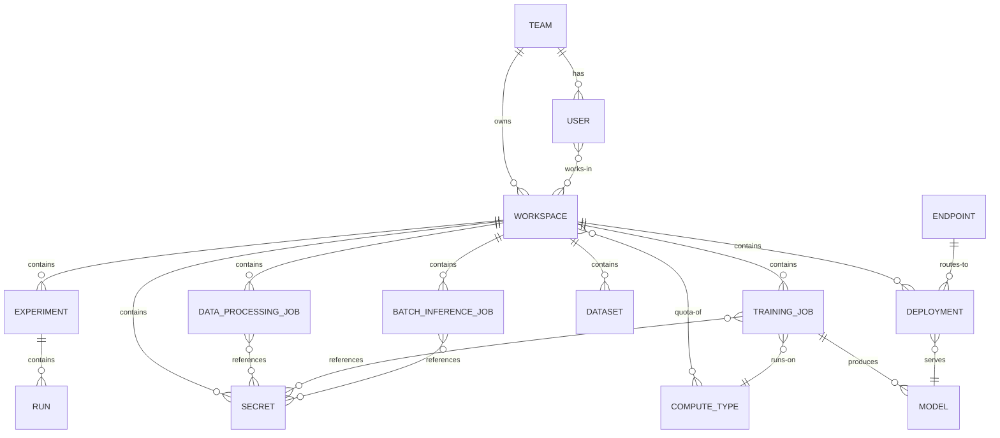

# Architecture

> Status: planned (no code yet; captures the intended architecture).

## Components

| Component | Responsibility |
|---|---|
| CLI | User-facing command surface for all ML operations |
| API server | Processes and dispatches user requests to the appropriate infrastructure; makes placement decisions |
| Job scheduler | Schedules training and batch inference jobs on compute |
| Model registry | Stores and versions model checkpoints/artifacts |
| Dataset catalog | Catalogs and indexes datasets |
| Data transfer tools | Copy data from source A to destination B |

## Topology

Client-server: the CLI (client) talks to a central API server, which dispatches to Kubernetes and cloud APIs.

## Data Flows

### Training job (end to end)

1. User submits a training job from the CLI.
2. Platform pulls data from data sources.
3. Data is pushed to the training cluster local storage.
4. Training runs; checkpoints are saved to the cluster local storage.
5. Final checkpoint(s) are pushed to persistent storage for models (model registry).

## Domain Entities

| Entity | Notes |
|---|---|
| Team | Organizational unit |
| User | Person; member of a team |
| Workspace | Unit of isolation for user work |
| Dataset | Cataloged data source |
| Model | Registered model artifact/version |
| Endpoint | Online inference deployment target |
| Experiment | Tracked training run grouping |
| Run | Tracked run within an experiment, with metrics |
| Data processing job | Executes data processing on compute |
| Training job | Executes training on compute |
| Batch inference job | Executes batch inference on compute |
| Deployment | Serves a model for inference (for example, online inference) |
| Secret | Workspace-scoped credential referenced by jobs |
| Compute type | Machine type with GPUs, memory, and quota |

## Entity Diagram

Entity names use underscores where the Domain Entities table has spaces (for example, `TRAINING_JOB` is "Training job").

Cardinalities are initial assumptions since the platform is still in the planned stage.

## Relationships

- A Team has Users.
- A Team owns Workspaces.
- A User works in Workspaces.
- A Workspace contains Experiments, Data processing jobs, Training jobs, Batch inference jobs, Deployments, Datasets, and Secrets.
- A Workspace has a quota of Compute types.
- An Experiment contains Runs with their metrics.
- Jobs reference Secrets for credentials.
- A Training job runs on a Compute type.
- A Training job produces a Model in the model registry.
- A Deployment serves a Model.
- An Endpoint routes to Deployments for online inference.
