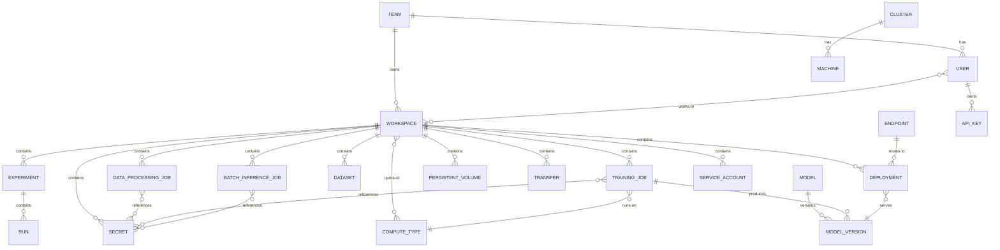

# Architecture

> Status: planned (no source packages yet; grounded in the FEAT-p1 CLI plan and the FEAT-p2 API server plan).

## Components

| Component | Responsibility |
|---|---|
| CLI (`mlx`) | User-facing command surface for all ML operations (cyclopts) |
| CLI profiles | Named client configuration (server URL, credentials, selected workspace) stored under the platform config directory |
| API contract | Versioned OpenAPI 3 document plus gRPC protos; the interface the CLI codes against |
| API server | FastAPI REST server plus a gRPC log-streaming service; processes and dispatches user requests; makes placement decisions |
| Job scheduler | Places training and batch inference jobs on compute against workspace quota; reconciles Kubernetes state with the database on startup |
| Model registry | Stores and versions model artifacts, with lineage to the producing job |
| Dataset catalog | Catalogs and indexes datasets |
| Data transfer execution | Copies data from a source to a destination location, with progress and resume |
| Artifact storage | S3-compatible object storage for checkpoints and model artifacts (MinIO in development) |
| PostgreSQL | Persists all durable state; server pods hold none |

## Topology

Client-server: the CLI (client) talks to a central API server over REST per the OpenAPI 3 contract, with gRPC reserved for log streaming.
The server dispatches to Kubernetes (jobs and serving deployments) and persists to PostgreSQL and artifact storage.
Server pods are stateless; a reconciliation loop matches Kubernetes state to database state on startup.

## Data Flows

### Training job (end to end)

1. User submits a training job from the CLI (`mlx job submit`).
2. The API server persists the job; the scheduler places it against workspace compute quota.
3. Data is pulled from data sources and pushed to the training cluster local storage.
4. Training runs on Kubernetes; checkpoints are tracked to artifact storage.
5. The final checkpoint is registered as a model version in the model registry, with lineage to the training job.

### Batch inference job (end to end)

1. User submits a batch inference job referencing a registered model version and an input dataset.
2. The scheduler dispatches the job; the model scores the dataset on compute.
3. The output is registered as a dataset in the catalog on success.

### Online inference (deployment)

1. User deploys a model version from the CLI (`mlx deploy create`).
2. The server creates a serving deployment on Kubernetes and provisions an endpoint for it.
3. Updating the served model rolls out a new version without dropping the endpoint; stopping releases resources.

### Data transfer

1. User requests a copy from a source to a destination location (`mlx data copy`).
2. The server executes the transfer with progress reporting and resume checkpoints.

## Domain Entities

| Entity | Notes |
|---|---|
| Team | Organizational unit |
| User | Person; member of a team |
| Workspace | Unit of isolation for user work; the creator becomes its first admin, and deletion refuses while it still contains resources |
| Workspace membership | User's membership in a workspace, with a role |
| Dataset | Cataloged data source |
| Model | Registered model; a family of versions |
| Model version | Versioned model artifact with a location and lineage to the producing job |
| Endpoint | Online inference deployment target |
| Experiment | Tracked training run grouping |
| Run | Tracked run within an experiment, with metrics |
| Data processing job | Executes data processing on compute |
| Training job | Executes training on compute |
| Batch inference job | Executes batch inference on compute |
| Deployment | Serves a model version for inference (for example, online inference) |
| Secret | Workspace-scoped credential referenced by jobs |
| API key | Named credential for programmatic access (CI, automation); value shown only once at creation |
| Service account | Non-human identity scoped to a workspace |
| Compute type | Machine type with GPUs, memory, and quota |
| Persistent volume | Workspace-scoped storage for staging and checkpoints |
| Transfer | Data copy from a source to a destination, with progress and resume state |
| Cluster | Kubernetes cluster the platform runs on, with region and health; provisioned asynchronously from a spec (registration returns before provisioning finishes) |
| Machine | Machine within a cluster, with state and allocation |

All three job types share one lifecycle: queued, running, succeeded, failed, cancelled.
Whether they persist as one typed table or one table per type is decided in FEAT-p2 (database Phase 3).

Deployments have their own server-owned lifecycle: creating, serving, updating (model rollout in flight, endpoint keeps serving), stopped, failed.
The CLI renders these states verbatim (open on read) and never adjudicates races; where client and server views could drift, the FEAT-p2 state machine wins.

## Entity Diagram

Entity names use underscores where the Domain Entities table has spaces (for example, `TRAINING_JOB` is "Training job").

Cardinalities are initial assumptions since the platform is still in the planned stage.

## Relationships

- A Team has Users.
- A Team owns Workspaces.
- A User works in Workspaces, with a role (admin or member; the creator is the first admin).
- A Workspace contains Experiments, Data processing jobs, Training jobs, Batch inference jobs, Deployments, Datasets, Secrets, Persistent volumes, and Transfers.
- A Workspace has a quota of Compute types.
- An Experiment contains Runs with their metrics.
- Jobs reference Secrets for credentials.
- A Training job runs on a Compute type.
- A Training job produces Model versions in the model registry.
- A Deployment serves exactly one Model version.
- An Endpoint routes to Deployments for online inference.
- A Cluster has Machines.
- A User owns API keys; a Workspace contains Service accounts for non-human access.

## Key Server-Side Interfaces

| Interface | Purpose |
|---|---|
| ComputeBackend | Abstracts compute targets (submit, status, cancel); Kubernetes in v1, an in-process fake for development and tests |
| ArtifactStorage | Abstracts artifact storage; S3-compatible, with MinIO for development |

Both interfaces exist so the undecided cloud provider and storage backend choices do not block implementation.
