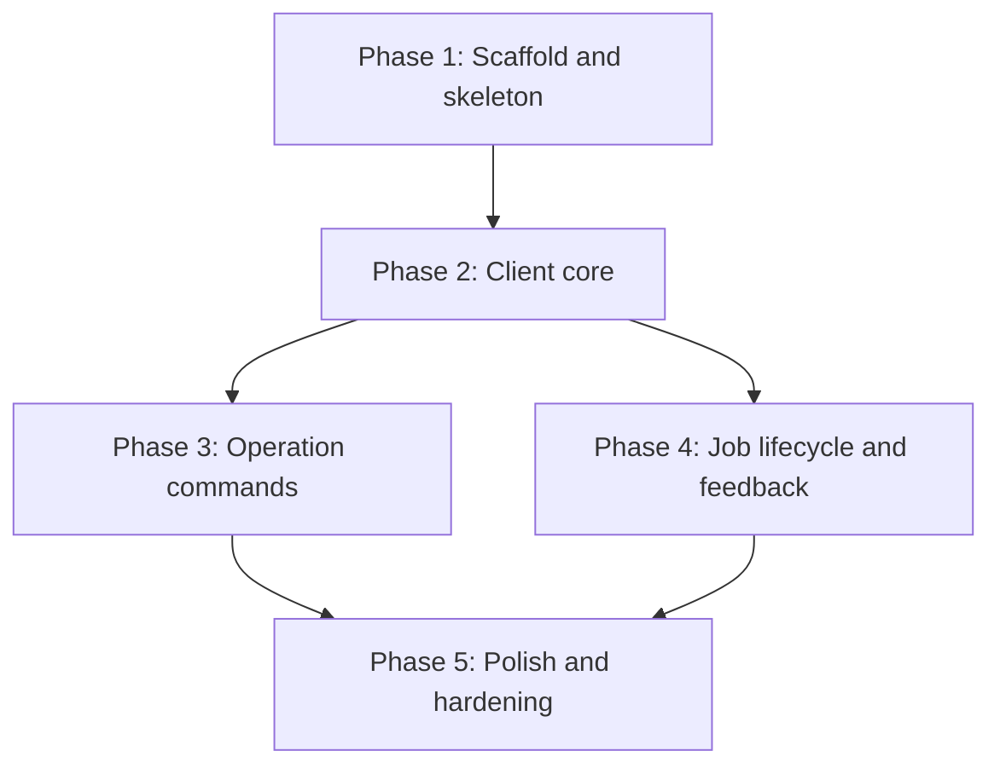

# Implementation Plan: Unified ML CLI

## Goal

Deliver the unified ML CLI (FEAT-p1): one command surface through which MLEs accomplish data processing, data transfer, training, batch inference, and online inference deployment against the API server.
This plan defines the CLI API (the command surface users invoke) and the phases that build it.

## CLI API

### Invocation and global options

Binary name: `mlx` (reserved: `ml` collides with common aliases).

```
mlx [global options] <command group> <subcommand> [arguments]
```

| Global option | Effect |
|---|---|
| `--profile <name>` | Use a named configuration profile (FR-16) |
| `--json` | Emit a single JSON document to stdout and nothing else (FR-12) |
| `--verbose` | Informational logging to stderr, never stdout (NFR-3) |
| `--version` | Print version and exit |
| `--help` | Per-command help (NFR-1) |

Exit codes: 0 success, 1 usage error, 2 authentication failure, 3 server error, 4 cancelled by user.

### Command groups

The five operation families (FR-1) plus the cross-cutting `auth`, `workspace`, `job`, and `model` groups.

```
mlx auth login|logout|status
mlx user list|get
mlx workspace list|select|get
mlx workspace member list|add|remove
mlx dataset create|list|get|delete
mlx data copy
mlx secret set|list|delete
mlx compute list|get
mlx quota list|get
mlx volume create|list|get|delete
mlx infra cluster create|list|get|update
mlx infra machine list|get
mlx job submit|list|get|logs|cancel
mlx batch submit|list|get|logs|cancel
mlx experiment create|list|get
mlx deploy create|list|get|update|stop
mlx model register|list|get
mlx completion bash|zsh|fish
```

### Command reference

Grouped by command hierarchy.

#### `mlx auth` (FR-2)

| Subcommand | Arguments | Notes |
|---|---|---|
| `login` | `[--token] [--server <url>]` | Prompts when interactive; validates against the API server |
| `logout` | | Clears stored credentials |
| `status` | | Shows current identity, server, and profile |

#### `mlx user` (FR-23)

| Subcommand | Arguments | Notes |
|---|---|---|
| `list` | | Users visible to the caller, with team membership |
| `get <id-or-email>` | | One user's details (identity, teams, workspaces) |

#### `mlx workspace` (FR-3, FR-24)

| Subcommand | Arguments | Notes |
|---|---|---|
| `list` | | Lists workspaces the user can access |
| `select <name>` | | Persists the selection in the active profile |
| `get` | | Prints the active workspace |
| `member list` | | Members of the active workspace with roles |
| `member add <user>` | `[--role <role>]` | Adds a user to the active workspace (default role: member) |
| `member remove <user>` | | Removes a user from the active workspace |

#### `mlx dataset` (FR-20)

| Subcommand | Arguments | Notes |
|---|---|---|
| `create` | `<spec-file>` | Registers a dataset in the catalog from a spec (location, format, description); validates locally first |
| `list` | | Lists datasets in the workspace |
| `get <name>` | | One dataset's details (location, format, version) |
| `delete <name>` | | Removes a dataset from the catalog |

#### `mlx data` (FR-5, FR-13)

| Subcommand | Arguments | Notes |
|---|---|---|
| `copy` | `<source> <destination> [--resume]` | Copies a dataset; `--resume` continues an interrupted copy |

#### `mlx secret` (FR-17)

| Subcommand | Arguments | Notes |
|---|---|---|
| `set <name>` | `--from-literal <value> \| --from-file <path>` | Stores a credential in the workspace for jobs to reference |
| `list` | | Lists secret names only, never values (NFR-3) |
| `delete <name>` | | Removes a secret from the workspace |

#### `mlx compute` (FR-18)

| Subcommand | Arguments | Notes |
|---|---|---|
| `list` | | Machine types available to the workspace |
| `get <type>` | | One machine type's details (GPUs, memory); quota limits live in `quota get` |

#### `mlx quota` (FR-21)

| Subcommand | Arguments | Notes |
|---|---|---|
| `list` | | Quotas for the workspace or team (compute, GPU, storage), with used vs. total |
| `get <resource>` | | One resource's quota details and current utilization |

#### `mlx volume` (FR-25)

| Subcommand | Arguments | Notes |
|---|---|---|
| `create` | `<name> --size <size> [--storage-class <class>] [--cluster <name>]` | Provisions a persistent volume for workspace storage (e.g., dataset staging, checkpoints) |
| `list` | | Volumes in the workspace with size and state |
| `get <name>` | | One volume's details (size, storage class, cluster, mount point, state) |
| `delete <name>` | | Releases the volume; data is not recoverable |

#### `mlx infra` (FR-22)

| Subcommand | Arguments | Notes |
|---|---|---|
| `list` | | Clusters available to the platform, with region and health |
| `get <name>` | | One cluster's details (version, capacity, capabilities) |
| `update <name>` | `[--add-machine-type <type>] [--remove-machine-type <type>] [--autoscaler-max <n>]` | Modifies a cluster's machine type offerings and autoscaling ceiling |
| `machine list` | `[--cluster <name>]` | Machines across clusters (or one cluster) with state and allocation |
| `machine get <id>` | | One machine's details (type, cluster, state, allocation, health) |

#### `mlx job` (FR-4, FR-6, FR-8, FR-11, FR-14)

| Subcommand | Arguments | Notes |
|---|---|---|
| `submit` | `<spec-file>` | Submits a job whose type (data processing, training, or batch inference) is declared by the spec; validates locally first; returns a job id |
| `list` | `[--type <type>] [--state <state>]` | All jobs with id, type, state |
| `get <id>` | | One job's current state |
| `logs <id>` | `[--follow]` | Streams logs; `--follow` keeps the stream open |
| `cancel <id>` | | Requests cancellation |

#### `mlx batch` (FR-8, FR-11, FR-14)

| Subcommand | Arguments | Notes |
|---|---|---|
| `submit` | `<spec-file>` | Submits a batch inference job; equivalent to `job submit` with a batch inference spec; validates locally first; returns a job id |
| `list` | `[--state <state>]` | Batch inference jobs only; same output as `job list --type batch-inference` |
| `get <id>` | | One batch job's current state |
| `logs <id>` | `[--follow]` | Streams a batch job's logs |
| `cancel <id>` | | Cancels a batch job |

#### `mlx experiment` (FR-19)

| Subcommand | Arguments | Notes |
|---|---|---|
| `create` | `<spec-file>` | Creates an experiment in the workspace (name, description); training runs attach to it by name |
| `list` | | Lists experiments in the workspace |
| `get <name>` | | One experiment's runs and their metrics |

#### `mlx deploy` (FR-9, FR-10)

| Subcommand | Arguments | Notes |
|---|---|---|
| `create` | `<model>:<version> [--endpoint-name <name>] [--replicas <n>] [--min-replicas <n>] [--max-replicas <n>]` | Deploys for online inference; prints the endpoint reference; `--replicas` fixes a static count, min/max set autoscaling bounds |
| `list` | | Lists deployments with state |
| `get <name>` | | Inspects one deployment |
| `update <name>` | `[--model <model>:<version>] [--replicas <n>] [--min-replicas <n>] [--max-replicas <n>]` | Updates the served model version, a static replica count, and/or the autoscaling bounds (min/max scale) of the deployment |
| `stop <name>` | | Stops the deployment |

#### `mlx model` (FR-7)

| Subcommand | Arguments | Notes |
|---|---|---|
| `register` | `<artifact-path> --name <name> [--version <v>]` | Registers an externally trained model artifact in the registry so it can be deployed or used for batch inference |
| `list` | | Lists registered models |
| `get <name>` | | Versions and artifact locations |

#### `mlx completion` (FR-15)

| Subcommand | Arguments | Notes |
|---|---|---|
| `<shell>` | | Emits a shell completion script (bash, zsh, fish) |

### Output conventions

- Human mode: tables or key-value blocks; progress to stderr.
- JSON mode (`--json`): one valid JSON document on stdout, nothing else (FR-12).
- Errors: message, likely cause, suggested fix, one per line (NFR-1).

## Phases

### Phase 1: Scaffold and skeleton

**Goal:** Installable package with the full command tree, help, config, and profiles, commands stubbed.
**Effort:** 3 person-days
**Depends on:** None

**Deliverables:**
- [ ] uv-managed Python package with src layout and `mlx` entry point (cyclopts)
- [ ] All command groups and subcommands registered with help text; bodies stubbed (FR-1)
- [ ] Config file, named profiles, `--profile` resolution (FR-16)
- [ ] Toolchain gates wired: `ruff check`, `ruff format --check`, `ty check`, `pytest` (NFR-6)
- [ ] GHA workflow running the four gates

### Phase 2: Client core

**Goal:** Authentication, server communication, workspace scoping, and output modes working end to end against a contract stub.
**Effort:** 4 person-days
**Depends on:** Phase 1

**Deliverables:**
- [ ] `auth login/logout/status` with token storage and expiry handling (FR-2)
- [ ] API client with retry and backoff; clear unreachable-server error (NFR-2)
- [ ] Workspace select/get/list scoping all requests (FR-3)
- [ ] `user list/get` (FR-23)
- [ ] `workspace member list/add/remove` (FR-24)
- [ ] `--json` output mode plumbed through every command (FR-12)
- [ ] Contract-conformant stub server used by tests (validates assumption 1)

### Phase 3: Operation commands

**Goal:** Every operation family submits and inspects real requests.
**Effort:** 5 person-days
**Depends on:** Phase 2

**Deliverables:**
- [ ] `job submit` with local spec validation for data processing, training, and batch inference specs, with actionable spec errors (FR-4, FR-6, FR-8)
- [ ] `batch submit` as the batch-inference fast path over the same submission machinery (FR-8)
- [ ] `experiment create/list/get` showing runs and metrics (FR-19)
- [ ] `secret set/list/delete`, values never printed (FR-17, NFR-3)
- [ ] `compute list/get` (FR-18)
- [ ] `quota list/get` (FR-21)
- [ ] `volume create/list/get/delete` (FR-25)
- [ ] `infra cluster create/list/get/update` and `infra machine list/get` (FR-22)
- [ ] `dataset create/list/get/delete` (FR-20)
- [ ] `data copy` with progress and `--resume` (FR-5, FR-13)
- [ ] `deploy create/list/get/update/stop` (FR-9, FR-10)
- [ ] `model register/list/get` (FR-7)

### Phase 4: Job lifecycle and feedback

**Goal:** Users can track everything they submitted.
**Effort:** 3 person-days
**Depends on:** Phase 2 (parallel with Phase 3)

**Deliverables:**
- [ ] `job list/get` with filters (FR-11)
- [ ] `batch list/get/logs/cancel` mirroring the job lifecycle commands for batch jobs (FR-11, FR-14)
- [ ] `job logs` with `--follow` streaming (FR-11)
- [ ] `job cancel` (FR-14)
- [ ] Exit code scheme implemented across all commands

### Phase 5: Polish and hardening

**Goal:** NFR gates green, completions, no credential leaks.
**Effort:** 3 person-days
**Depends on:** Phases 3 and 4

**Deliverables:**
- [ ] `completion` command for bash, zsh, fish (FR-15)
- [ ] Error message audit: cause plus fix on every failure path (NFR-1)
- [ ] Credential redaction in logs and verbose output (NFR-3)
- [ ] Startup time budget verified: interactive commands under 500 ms warm (NFR-4)
- [ ] Full pytest coverage of the command surface; four gates green (NFR-6)

## Phase Dependencies



Phases 3 and 4 run in parallel after Phase 2.

## Milestones

| Milestone | Phase | Success Criteria |
|---|---|---|
| M1: Command tree usable | Phase 1 | `mlx --help` lists all groups; profiles work; gates green in CI |
| M2: Talks to a server | Phase 2 | Auth, workspace, JSON mode pass acceptance criteria against the stub |
| M3: All operations submit | Phase 3 | FR-4 through FR-10 acceptance criteria pass |
| M4: Jobs observable | Phase 4 | FR-11 and FR-14 acceptance criteria pass |
| M5: v1 shippable | Phase 5 | All NFR acceptance criteria pass; full suite green |

## Dependencies

| Dependency | Type | Owner | Risk if Delayed |
|---|---|---|---|
| API server contract (what the CLI codes against) | External | ml-platform implementors | Blocks Phase 2; the whole plan idles (assumption 1) |
| Auth mechanism decision | External | ml-platform implementors | Blocks Phase 2 auth deliverables |
| Stub server for tests | Internal | This feature | Blocks automated acceptance testing from Phase 2 on |

## Risk Register

| Risk | Likelihood | Impact | Mitigation |
|---|---|---|---|
| No API server or contract exists to target (assumption 1) | High | High | Resolve open question 1 before Phase 2; stub server keeps tests running meanwhile |
| Auth mechanism unknown (token vs SSO vs mTLS) | High | Medium | Decide before Phase 2; client core isolates auth behind one interface |
| Resumable transfers need backend support the server does not offer | Medium | Medium | Confirm transfer protocol during specification; fall back to non-resumable copy with clear errors |
| cyclopts hits a limitation (streaming output, completions) | Low | Medium | Spike completions in Phase 1; argparse shim is the fallback |

## Assumptions

- A runnable API server target (real or stub) exists for v1, tracked as assumption 1 (`.sdlc/knowledge/assumptions/1-cli-target-server.md`).
- Token-based auth is the initial mechanism; SSO/mTLS are additive (open question 2).
- Binary name `mlx` is acceptable.

## Timeline

No calendar committed yet (team capacity unknown); duration-only.

| Phase | Duration |
|---|---|
| Phase 1: Scaffold and skeleton | 3 days |
| Phase 2: Client core | 4 days |
| Phase 3: Operation commands | 5 days |
| Phase 4: Job lifecycle and feedback | 3 days |
| Phase 5: Polish and hardening | 3 days |
| Total (with Phases 3 and 4 parallel) | ~15 working days |
