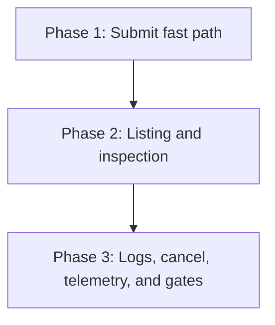

# Implementation Plan: mlx batch command

## Goal

Deliver the `mlx batch` command group (`submit`, `list`, `get`, `logs`, `cancel`) per specification.md, as a thin facade over job machinery owned elsewhere: no schema, validator, or protocol logic of its own (NFR-7), telemetry per telemetry.md, and no lifecycle document (the job lifecycle is server-owned and shared; see the lifecycle skip rationale in this run's outputs).
This plan is the batch slice of FEAT-p1 Phase 3 (submit) and Phase 4 (lifecycle mirrors); the command surface is settled by the seeded spec and the FEAT-p1 command reference and is not restated here.
Plan structure: unified (`plan.md`), chosen per the create-plan skill's non-interactive default; the feature is one cohesive client-side concern, too small to split.

## Phases

### Phase 1: Submit fast path

**Goal:** `batch submit` validates, preflights, submits, and renders a job id end to end against the contract stub.
**Effort:** 1 person-day
**Depends on:** FEAT-p1 Phases 1 and 2 (scaffold, client core: jobs client, session resolution, output modes); FEAT-p9's shared validator and submission service seam

**Deliverables:**
- [ ] Facade wiring: `batch` group registered in cyclopts with the five subcommands stubbed and per-command help (FR-1 surface, NFR-1)
- [ ] Local validation restricted to the batch-inference branch via the FEAT-p9-owned validator; non-`batch-inference` `type` exits 1 naming the actual type and suggesting `job submit` (FR-1, FR-2)
- [ ] Submission through the shared submission service: preflight of model `name:version` and input datasets, `POST` with fresh-per-invocation `Idempotency-Key` reused across in-invocation retries (FR-3, FR-4)
- [ ] Exit-code mapping per specification.md (unknown reference exits 1 with a listing hint; unreachable exits 3 after backoff) and `error:` plus `hint:` message format (NFR-1, NFR-2)
- [ ] Human and `--json` output for submit (`{"job_id": ...}`); parsed spec never logged (NFR-3, specification Technical Decisions)
- [ ] Stub extension covering submit, preflight 404, and idempotent replay, reconciled with FEAT-p2's `api.yaml` when it lands

### Phase 2: Listing and inspection

**Goal:** `batch list` and `batch get` pass their acceptance criteria and stay output-equivalent to the `job` counterparts.
**Effort:** 1 person-day
**Depends on:** Phase 1

**Deliverables:**
- [ ] `batch list` over the jobs client with `type=batch-inference` fixed; id, name, state columns; unknown states render verbatim (FR-5)
- [ ] Cursor-following to exhaustion matching `job list` per FEAT-p9's landed model (no user-facing paging flags), with the JSON document as the complete array of job summaries (FR-5, settles review-specification Open Question 1)
- [ ] `--state` filtering with local validation against the known state set, exiting 1 with the accepted list on unknown values (FR-6)
- [ ] `batch get` rendering the job summary including `output.dataset` and `output.location` when present; unknown id exits 1 naming it (FR-7)
- [ ] Equivalence test: `batch list` output equals `job list --type batch-inference` for the same paging parameters (FR-5, FR-9)

### Phase 3: Logs, cancel, telemetry, and gates

**Goal:** All remaining acceptance criteria pass, telemetry events fire behind the opt-out gate, and the toolchain gates are green.
**Effort:** 1 person-day
**Depends on:** Phase 2

**Deliverables:**
- [ ] `batch logs` over the jobs client's stream: stored lines for terminal jobs, `--follow` appending until terminal or Ctrl-C (exit 0), and `--follow --json` rejected as a usage error matching `job logs` (FR-8, FR-12; specification Technical Decisions)
- [ ] `batch cancel`: accepted cancellation plus 409 terminal-state error naming the current state (FR-10, FR-11)
- [ ] Telemetry per telemetry.md: all seven events with the shared anonymous properties, behind FEAT-p3's opt-out gate and local buffer; no spec content or resource names in any payload
- [ ] pytest coverage of the argument surface plus gherkin-derived scenarios for every FR and NFR acceptance criterion (NFR-6)
- [ ] No-fork check: a schema mutation in the FEAT-p9-owned module flips both the `job submit` and `batch submit` suites (NFR-7)

## Phase Dependencies

Strictly linear: each phase's stub behaviors and submitted jobs are the next phase's test fixtures.

## Milestones

| Milestone | Phase | Success Criteria |
|---|---|---|
| M1: Fast path submits | Phase 1 | FR-1 to FR-4 acceptance criteria pass against the stub; resubmission exits 0 with a job id |
| M2: Batch observable | Phase 2 | FR-5 to FR-7 and FR-9 acceptance criteria pass; equivalence test green with shared paging flags |
| M3: Feature done | Phase 3 | All requirements.md acceptance criteria pass; telemetry events verified in the local buffer; ruff, format, ty, and pytest gates green |

## Dependencies

| Dependency | Type | Owner | Risk if Delayed |
|---|---|---|---|
| FEAT-p1 Phase 1 scaffold and Phase 2 client core (jobs client, session resolution, `--json` plumbing, stub server) | Internal | FEAT-p1 implementors | Blocks Phase 1 here entirely |
| FEAT-p9 shared machinery (its landed specification fixes schema sharing as a single validation module this feature imports, plus the submission service and the exhaustive listing model) | Internal | FEAT-p9 implementors | Phase 1 codes against the landed seam; interface divergence means rework confined to the facade wiring; listing-model divergence would trip the M2 equivalence test |
| FEAT-p2 job contract (`api.yaml`: paths, error codes, `Idempotency-Key` replay, log-stream transport) | External | FEAT-p2 implementors | Drift absorbed by the jobs client and stub; reconcile before integration |
| Telemetry destination decision | External | Platform maintainers | Non-blocking: events buffer locally per FEAT-p3's plan, nothing is sent |

## Risk Register

| Risk | Likelihood | Impact | Mitigation |
|---|---|---|---|
| FEAT-p9's validation-module interface differs from the assumed seam (specification landed; interface detail remains) | Medium | Medium | Facade holds zero schema or protocol logic, so the seam is the only contact point; reconcile at FEAT-p9's review before M1 |
| FEAT-p2 contract drift on job endpoints or log-stream transport (gRPC versus SSE) | Medium | Medium | Jobs client behind the interface FEAT-p1 Phase 2 built; stub mirrors the expected shape; drift rework stays out of this feature |
| Listing behavior diverges between `job list` and `batch list` (exhaustion, filters, output shape) | Medium | Medium | Model adopted verbatim from FEAT-p9's landed specification; the M2 equivalence test is the tripwire |
| Nightly-style repeated submissions create duplicate jobs if idempotency replay is misunderstood | Low | Medium | Key derivation decision recorded in specification.md (fresh per invocation, reused within); tested via the resubmission scenario |

## Assumptions

- FEAT-p1 Phases 1 and 2 land before Phase 1 here starts (scaffold, jobs client, session resolution, output modes, stub).
- FEAT-p9's validator and submission service are reusable modules with a stable seam; the concurrent specification settles the exact interface, and this plan codes against the split named in specification.md's Architecture table.
- The stub implements `Idempotency-Key` replay semantics closely enough to test the resubmission scenario; FEAT-p1 assumption 1 (`.sdlc/knowledge/assumptions/1-cli-target-server.md`) already tracks the stub-versus-server question.
- Promotion of these assumptions into `.sdlc/knowledge/` records is outside this run's write scope (feature directory only); if the pipeline owner wants them formalized, run `/create-assumption` after this run.

## Timeline

No calendar committed (team capacity unknown); duration-only.

| Phase | Duration |
|---|---|
| Phase 1: Submit fast path | 1 day |
| Phase 2: Listing and inspection | 1 day |
| Phase 3: Logs, cancel, telemetry, and gates | 1 day |
| Total | ~3 working days |

Budget fit, unlike the auth slice: FEAT-p1 Phase 3 already budgets `batch submit` as one of its 12 deliverables and Phase 4 budgets the lifecycle mirrors, so this slice's ~3 person-days spread across two already-funded phases (roughly 1 of Phase 3's 5 days, 2 of Phase 4's 3 days).
The Phase 4 share is tight (the mirrors share those 3 days with `job list/get`, `job logs --follow`, and `job cancel`); if Phase 4 slips, telemetry instrumentation here is the first deferrable item, matching the descope candidate named in the FEAT-p3 plan.
