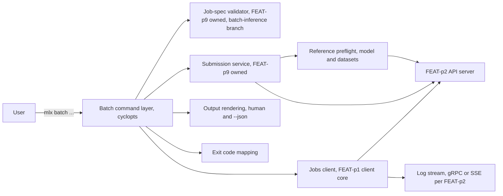
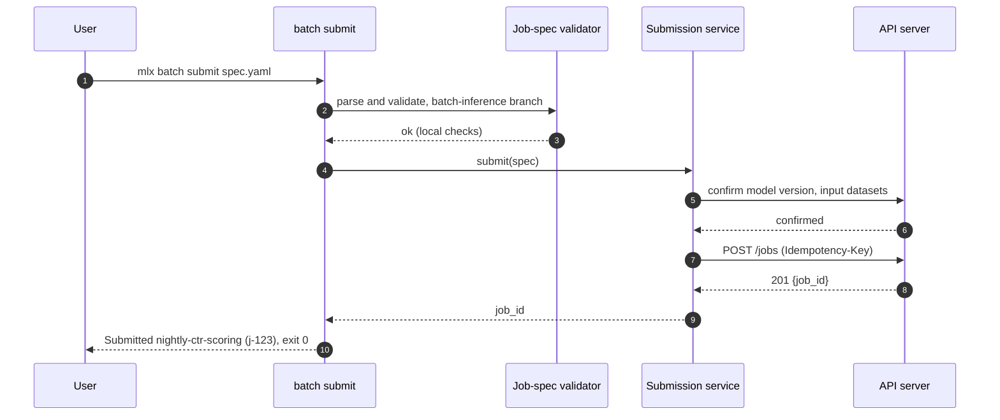
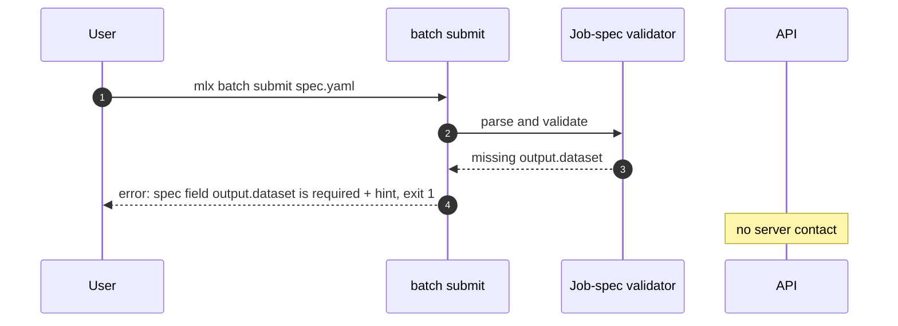
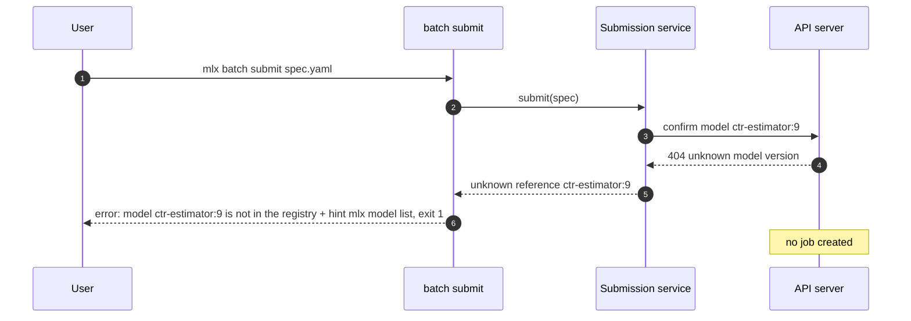
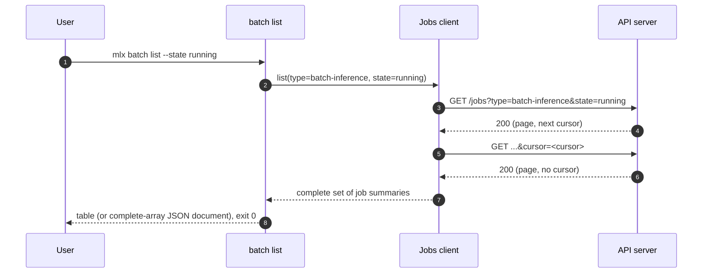
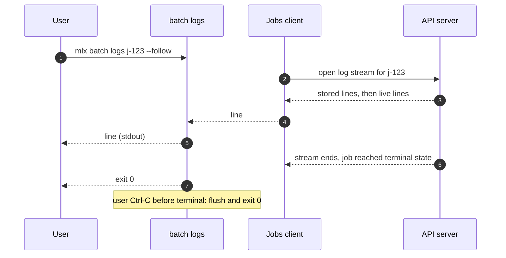
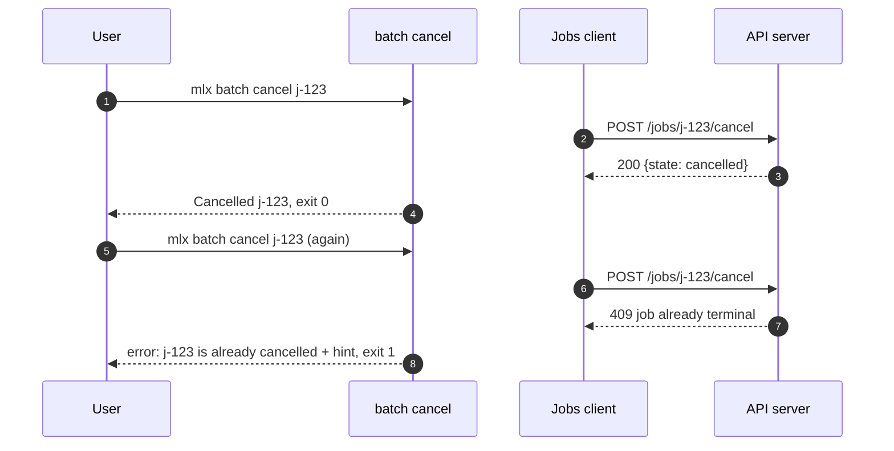

# Specification: mlx batch command

## Overview

The `mlx batch` group is a thin facade over job machinery owned elsewhere: the shared job-spec validator and submission path owned by FEAT-p9, and the jobs read client owned by the FEAT-p1 client core.
The design goal is that the batch-inference fast path adds zero schema and zero protocol logic of its own (NFR-7): it fixes the job type to `batch-inference`, delegates, and renders.
Every decision the seeded spec left open (pagination flags, output-dataset surfacing, terminal-log behavior, exit codes for server-confirmed references, idempotency-key derivation) is settled here.

## Architecture

| Component | Responsibility | Owner |
|---|---|---|
| Batch command layer | Argument parsing, type restriction, output rendering, exit codes; contains no schema or protocol logic | This feature |
| Job-spec validator | YAML parse, common-field checks, per-type branch validation; `batch submit` restricts to the `batch-inference` branch and rejects other `type` values locally | FEAT-p9 |
| Submission service | Preflight of model `name:version` and dataset references, submission with `Idempotency-Key`, job-id return | FEAT-p9 |
| Jobs client | REST calls with retry and backoff, cursor pagination, job listing filtered by type and state, cancellation, log streaming | FEAT-p1 client core |
| Session resolution | Bearer token and active-workspace scoping on every request | FEAT-p3 |

## Data Models

### Batch inference spec (consumed; owned by FEAT-p9)

The submitted YAML document is the `type: batch-inference` branch of the job spec, defined normatively in FEAT-p9.
Recap of the branch; the FEAT-p9 table is authoritative:

| Field | Type | Required | Constraints |
|---|---|---|---|
| name | string | Yes | Kebab-case, shown in listings |
| type | string | Yes | Must be `batch-inference` here; other values are rejected locally (FR-2) |
| compute.type | string | Yes | A type from `mlx compute list` |
| compute.count | integer | No | Defaults to 1 |
| model | string | Yes | `name:version` of a registered model |
| inputs[].dataset | string | Yes (each input) | Dataset catalog name scored by the model |
| output.dataset | string | Yes | Output dataset name registered on success |
| output.location | string | No | Explicit destination URI; generated when omitted |
| description | string | No | Free-form |
| secrets | string list | No | Secret names; values never appear anywhere |
| env | string map | No | Environment variables for the job; values never printed |

### Job summary (consumed; owned by FEAT-p2)

| Field | Type | Constraints | Description |
|---|---|---|---|
| id | string | not null | Job identifier, same ids as the `job` commands |
| name | string | not null | From the spec |
| type | string | not null | Always `batch-inference` in this group's listings |
| state | string | not null | queued, running, succeeded, failed, cancelled |
| created_at | RFC 3339 | not null | Submission time |
| updated_at | RFC 3339 | not null | Last state change |
| output.dataset | string | nullable | Output dataset name once registration succeeded (rendered by `batch get` when present) |
| output.location | string | nullable | Output dataset location once known |
| error.message | string | nullable | Failure reason when state is failed |

Forward compatibility: the CLI ignores fields it does not recognize in the job summary and in submitted specs, and renders unknown `state` values verbatim in listings (a future server-side state degrades to display, never to a parse failure).
Only the `--state` flag is validated against the locally known state set.

### Rendered output models

| Command | Human mode | JSON mode (`--json`) |
|---|---|---|
| `batch submit` | `Submitted <name> (<id>)` on stdout | `{"job_id": "<id>"}` |
| `batch list` | Table: id, name, state | Complete array of job summaries (cursor followed to exhaustion, matching `job list`) |
| `batch list --state s` | Same table, filtered | Same document, filtered |
| `batch get` | Key-value block of the job summary | One job summary object |
| `batch logs` (no follow) | Log text to stdout | `{"logs": [<line>], "truncated": <bool>}` |
| `batch logs --follow` | Appended log text to stdout | Usage error (exit 1): the single-document contract cannot hold for an open stream; matches `job logs` (FEAT-p9 decision) |
| `batch cancel` | `Cancelled <id>` on stdout | `{"job_id": "<id>", "state": "<state>"}` |

## API Contracts

This feature defines no API surface; `api.yaml` is therefore not written here.
The group consumes job endpoints of the FEAT-p2 contract, whose normative definition lives with FEAT-p2 (`api.yaml` there); paths below are the expected shapes per the FEAT-p2 conventions (workspace-scoped, cursor-paginated lists, `Idempotency-Key` on submission).

| Method | Path (expected) | Purpose |
|---|---|---|
| POST | /workspaces/{workspace}/jobs | Submit the validated spec; `Idempotency-Key` header present |
| GET | /workspaces/{workspace}/jobs?type=batch-inference&state=&cursor= | List batch jobs, filtered; cursor followed to exhaustion |
| GET | /workspaces/{workspace}/jobs/{id} | One job's current state |
| GET (stream) | /workspaces/{workspace}/jobs/{id}/logs | Log stream; transport (gRPC or SSE) owned by FEAT-p2; `--follow` keeps it open |
| POST | /workspaces/{workspace}/jobs/{id}/cancel | Request cancellation |

Error codes consumed and their CLI mapping:

| Status | Meaning in batch terms | CLI behavior |
|---|---|---|
| 200/201 | Submitted, listed, fetched, cancelled | Print result, exit 0 |
| 400/404/409 on preflight or submit | Unknown model version, unknown dataset, or spec rejected | `error:` naming the reference, exit 1 |
| 404 on get/logs/cancel | No job with that id | `error:` naming the unknown id, exit 1 |
| 409 on cancel | Job already terminal | `error:` naming the job's current state, exit 1 |
| 401 | Session rejected | Exit 2, no indefinite retry |
| 5xx / connection error | Transient or unreachable | Retry with backoff, then exit 3 |

Pagination: `batch list` follows the server's cursor to exhaustion before rendering, exactly as `job list` does per FEAT-p9's landed specification; no user-facing paging flags exist, and the JSON document is the complete array of job summaries.
FR-5's same-paging-parameters clause is satisfied vacuously (both commands are exhaustive), and there is no flag surface for the two groups to drift on.

## Sequences

### Submit (happy path)

### Submit (local validation failure)

### Submit (unknown model reference)

### List (exhaustive, equivalence)

### Logs (follow until terminal)

### Cancel (running, then terminal)

## Technical Decisions

| Decision | Choice | Rationale |
|---|---|---|
| Facade over job machinery | `batch submit` calls the same validator branch and submission service as `job submit`; `batch list` calls job listing with `type=batch-inference` fixed; `get`/`logs`/`cancel` share handlers with their `job` counterparts | NFR-7: no forked schema, validator, or protocol logic; equivalence (FR-5, FR-9) holds by construction, not by discipline |
| Type restriction is local and first | A spec whose `type` is not `batch-inference` exits 1 before any server call, naming the actual type and suggesting `job submit` (FR-2) | The fast path must not silently accept what belongs to the general path; failing locally is instant and offline-safe |
| Pagination model | Transparent cursor-following to exhaustion; no user-facing flags; the JSON document is the complete array | Adopted from FEAT-p9's landed specification so FR-5's equivalence holds by construction; settles Open Question 1 with zero flag surface to keep aligned |
| Idempotency key | Fresh UUID v4 per invocation, reused across that invocation's in-invocation retries | Nightly scoring resubmits the same spec intentionally and must get a new job; a content-derived key would replay yesterday's job; in-invocation retry reuse keeps network-retry duplicates impossible (satisfies FR-4's resubmission scenario) |
| Exit code for server-confirmed unknown references | Exit 1 with the reference named and a listing hint | The root cause is user input even though the server detects it; exit 3 would mislead scripts into retrying |
| Output dataset on success | `batch get` renders `output.dataset` and `output.location` when present, tolerates absence | Settles Open Question 2; closes the fast path's loop (architecture registers the output on success); absence-tolerance keeps pre-registration states renderable |
| Logs on an already-terminal job | Stored lines, then normal exit 0 (both with and without `--follow`) | Settles Open Question 3; consistent with FR-8's "until terminal" reading; no error for a well-formed request |
| `--json` on `batch logs --follow` | Usage error (exit 1) naming the single-document contract | An open stream cannot produce exactly one document; rejecting matches `job logs` (FEAT-p9 resolved its Open Question 2 the same way), keeps FR-12 exactly satisfiable, and leaves the two groups consistent |
| Ctrl-C during `--follow` | Flush and exit 0 | Interruption is a designed outcome of following (FR-8), not a user cancellation of an interactive flow; exit 4 stays reserved for prompt-style cancellation |
| State rendering versus `--state` validation | Unknown `state` values render verbatim in listings; the `--state` flag validates locally against the known set and exits 1 otherwise | Forward compatibility for future server-side states without weakening FR-6's fast local feedback |
| Parsed-spec logging | The parsed spec object is never logged; verbose mode logs field names and validation outcomes only, and the same structlog redaction family as FEAT-p3 masks any `env` and `secrets` payloads | NFR-3: submitted specs carry secret references and env values, so diagnostics must describe the validation, not replay the content |

## Risks and Unknowns

1. FEAT-p9's specification has landed and fixes schema sharing as a single validation module this feature imports (confirming NFR-7's direction); the residual risk is module-interface detail surfacing during implementation, to be reconciled in FEAT-p9's review.
2. The FEAT-p2 job endpoints (paths, error codes, log-stream transport: gRPC versus SSE) are not yet normative; the jobs client must be reconciled against FEAT-p2's `api.yaml` before integration, with drift confined to that client and the stub.
3. Equivalence drift watch: if either `job list` or `batch list` later exposes paging flags or non-exhaustive defaults, FR-5's clause re-activates; the M2 equivalence test is the tripwire.

## Out of Scope

- Defining or forking the batch-inference spec schema (owned by FEAT-p9).
- Defining the server-side job contract, endpoints, and log-stream transport (owned by FEAT-p2).
- Placement, dispatch, quota enforcement, and output-dataset registration semantics (server-side).
- The job lifecycle definition (shared across all job types; see lifecycle considerations under FEAT-p2 and FEAT-p9).
- A `--name` filter on `batch list` (Open Question 4; deferred as an additive future flag).
- Experiment attachment (training-only concern, FEAT-p9).
