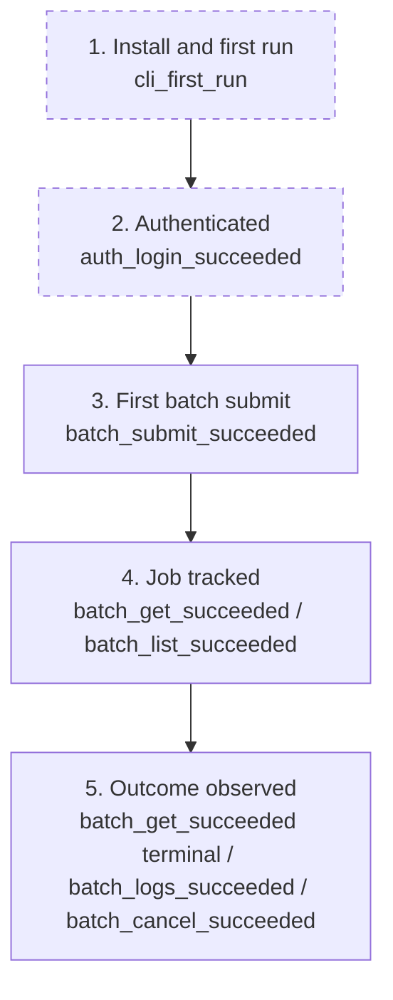

# Telemetry: mlx batch command

## Overview

Batch inference is one of the five operation families the platform exists for, so this plan instruments the batch fast path to answer three questions: are users finding `mlx batch` (adoption), do submissions succeed (spec ergonomics and reference accuracy), and do users track their jobs to a terminal outcome (feedback loop).
Events are anonymous and opt-out per the conventions FEAT-p3 established: no token, no identity, no server URL, and additionally no spec content and no resource names (model, dataset, and job names stay out).

## Success Metrics

| Metric | Target | Measurement Method | Timeframe |
|---|---|---|---|
| Time to first batch submit | Median under 1 hour from `cli_first_run` to first `batch_submit_succeeded` per install_id, among installs that ever submit | Funnel over `cli_first_run` and `batch_submit_succeeded` | First 7 days after each release |
| Submit success rate | 90% or higher | `batch_submit_succeeded` / (`batch_submit_succeeded` + `batch_submit_failed`) | Weekly |
| Submit failure mix | No single `reason` above 60% of `batch_submit_failed` | Group `batch_submit_failed` by `reason` | Weekly |
| Fast-path preference | 70% or higher of batch-inference listing invocations go through `batch list` rather than `job list --type batch-inference` | Ratio of `batch_list_succeeded` to (batch listing events via both groups) | Weekly |
| Tracking loop closure | 60% or higher of succeeded `batch_submit_succeeded` installs also emit `batch_get_succeeded` or `batch_list_succeeded` within 24 hours | Join submit and tracking events per install_id | Weekly |

## User Funnel

Steps 1 and 2 are dashed because their marking events are owned by FEAT-p3 (onboarding and auth).
Step 5 cannot be split by outcome from the event stream alone (terminal observation is inferred from timing), so its entry event is any of the three tracking outcomes.

| Step | Event | Entry Criteria | Exit Criteria |
|---|---|---|---|
| 1. Install and first run | `cli_first_run` | Fresh install_id created | The user authenticates |
| 2. Authenticated | `auth_login_succeeded` | First successful login for the install_id | The user submits any operation |
| 3. First batch submit | `batch_submit_succeeded` | First accepted batch spec for the install_id | The user lists or inspects the job |
| 4. Job tracked | `batch_get_succeeded` / `batch_list_succeeded` | First successful tracking command after the submit | The job reaches a terminal state the user observes |
| 5. Outcome observed | `batch_get_succeeded` (terminal timing), `batch_logs_succeeded`, `batch_cancel_succeeded` | Any tracking outcome event within the window | End of funnel |

## Analytics Events

All events carry `source: "cli"`, the anonymous `install_id`, and `cli_version`; those shared properties are listed once here and not repeated per event.
No event carries the spec file path, spec content, job name, model reference, dataset names, or workspace identity.

### batch_submit_succeeded

**Trigger:** The server accepts the batch inference spec and returns a job id.
**Location:** `batch submit` command handler, after the job id is rendered.

| Property | Type | Required | Description |
|---|---|---|---|
| input_count | number | Yes | Number of `inputs[]` entries in the submitted spec |
| has_explicit_output_location | boolean | Yes | Whether the spec set `output.location` |
| compute_count | number | Yes | Requested `compute.count` (defaults recorded as 1) |
| json_mode | boolean | Yes | Whether the command ran with `--json` (FR-12 adoption signal) |
| duration_ms | number | Yes | Wall time from command start to rendered job id |

### batch_submit_failed

**Trigger:** A submit attempt ends without a job id.
**Location:** `batch submit` error paths.

| Property | Type | Required | Description |
|---|---|---|---|
| reason | string | Yes | `usage` (local validation or wrong type), `unknown-reference` (preflight rejection), `server` (5xx after retries), or `unreachable` (exit 3) |
| stage | string | Yes | `local-validation`, `preflight`, or `submit` (where the attempt stopped) |
| duration_ms | number | Yes | Wall time from command start to failure |

### batch_list_succeeded

**Trigger:** A listing renders successfully.
**Location:** `batch list` command handler.

| Property | Type | Required | Description |
|---|---|---|---|
| state_filtered | boolean | Yes | Whether `--state` was supplied |
| result_count | number | Yes | Jobs rendered after cursor-following to exhaustion |
| pages_fetched | number | Yes | Cursor pages fetched to exhaustion (transparency check on the FEAT-p9 listing model) |
| json_mode | boolean | Yes | Whether the command ran with `--json` (FR-12 adoption signal) |

### batch_get_succeeded

**Trigger:** One job's state renders successfully.
**Location:** `batch get` command handler.

| Property | Type | Required | Description |
|---|---|---|---|
| state | string | Yes | The job's state as rendered (queued, running, succeeded, failed, cancelled) |
| json_mode | boolean | Yes | Whether the command ran with `--json` (FR-12 adoption signal) |
| duration_ms | number | Yes | Wall time of the command |

### batch_logs_succeeded

**Trigger:** A logs invocation ends (stream closed, or stored logs printed).
**Location:** `batch logs` command handler.

| Property | Type | Required | Description |
|---|---|---|---|
| followed | boolean | Yes | Whether `--follow` was used |
| ended_by | string | Yes | `terminal` (job finished), `interrupt` (Ctrl-C), or `stored` (no follow, already terminal) |

### batch_cancel_succeeded

**Trigger:** Cancellation is accepted.
**Location:** `batch cancel` command handler.

| Property | Type | Required | Description |
|---|---|---|
| prior_state | string | Yes | The job's state at cancellation (queued or running) |

### batch_cancel_failed

**Trigger:** A cancel attempt is rejected or fails.
**Location:** `batch cancel` error paths.

| Property | Type | Required | Description |
|---|---|---|---|
| reason | string | Yes | `terminal` (409), `unknown-id` (404), `server`, or `unreachable` |

## Counter Metrics

| Metric | Concern | Threshold |
|---|---|---|
| Local-validation share of submit failures | Spec ergonomics: users repeatedly failing schema checks (NFR-1 message quality) | Above 30% of `batch_submit_failed` in a week |
| Unknown-reference share of submit failures | Discoverability: users guessing model or dataset names | Above 40% of `batch_submit_failed` in a week |
| Cancel-on-terminal share | Feedback loop: users cancelling jobs that already finished (tracking gap or UI confusion) | Above 20% of cancel attempts in a week |
| Job-tracking commands per submitted job | Runaway polling (scripts polling `batch get` in tight loops) | Above 50 tracking events per job per day sustained over a week |

## Telemetry Requirements

| Requirement | Type | Notes |
|---|---|---|
| Reuse FEAT-p3 telemetry infrastructure | Infrastructure | Same opt-out gate (`MLX_TELEMETRY=off` or config), same local-file buffer, same deferred destination decision; no new pipeline for this group |
| Anonymous by construction | Event | The batch events list no spec content and no resource names; the structlog redaction family masks any `env` or `secrets` payload before events form |
| Bounded properties | Event | All properties are primitives (string, number, boolean); no arrays or nested objects, so events stay queryable |
| State values pass through open-enum | Event | `state` and `prior_state` record the server's string verbatim so a future state does not break event parsing |

## Dashboards and Alerts

- **Dashboard:** "Batch fast path" (to be created when a destination exists): submit funnel (`cli_first_run` to `batch_submit_succeeded`), success rate and failure mix by reason, fast-path preference ratio, tracking-loop closure, counter metrics.
- **Alerts:** local-validation share above 30% for a week (spec ergonomics regression); unknown-reference share above 40% (discoverability or registry drift); runaway polling threshold breached (support-load risk).

## Out of Scope

- Server-side job metrics (queue depth, placement latency, dispatch failures): FEAT-p2's observability scope.
- Dataset-level or model-level usage analytics: resource names are deliberately absent, so per-model usage cannot be computed from these events.
- Cross-machine or cross-user correlation: install_id is per machine, inherited from FEAT-p3's design.
- Any telemetry without the FEAT-p3 opt-out gate, or carrying token, identity, server URL, spec content, or resource names.
