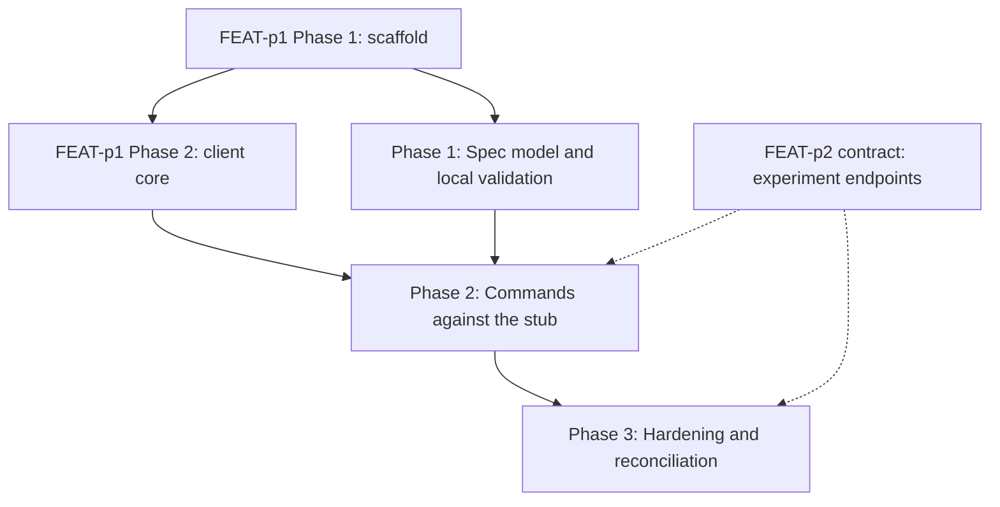

# Implementation Plan: mlx experiment command

## Goal

Deliver the `mlx experiment` command group (create, list, get) inside the unified CLI, implementing FEAT-p1-FR-19 to the letter of `requirements.md`, `cli-design.md`, and `specification.md`.
The plan is unified (`plan.md`, not a split `plan/` set): the work spans a single concern (one CLI command group composing the shared client core), so a split would add files without adding clarity.
It is the delegated slice of FEAT-p1's Phase 3 experiment deliverable and inherits that plan's constraints (stub server until FEAT-p2 lands).

Optional design artifacts were evaluated and skipped for this group:

- No `lifecycle.md`: experiments pass through no client-visible states or transitions (no update or delete commands, no retention or expiry), and run states belong to the shared job lifecycle (FEAT-p9, FEAT-p2).
- No `telemetry.md`: no `goals.md` metric consumes experiment events (operation coverage is audited by checklist; onboarding telemetry is owned by FEAT-p3 and FEAT-p8); revisit if an iteration-quality goal appears.
- No `observability.md`: the group is a client with no service surface; server-side experiment endpoints are FEAT-p2's observability scope, and CLI diagnostics go to stderr via `--verbose` (FEAT-p1).

## Phases

### Phase 1: Spec model and local validation

**Goal:** The spec-file format is fully specified in code and every validation rule from the specification is enforced with actionable errors, with no server involvement.
**Effort:** 1 person-day
**Depends on:** FEAT-p1 Phase 1 (scaffold with the stubbed `experiment` group)

**Deliverables:**
- [ ] Typed spec model (name, description) with the deterministic validation order from the specification (parse, name presence, name pattern, description single-line rule)
- [ ] Validation errors naming the field, likely cause, and fix; exit 1 on every validation failure; no server call
- [ ] Edge rules implemented: single-line description enforcement, unknown fields ignored with a warning
- [ ] Unit tests covering every validation acceptance criterion (FR-4) plus the edge rules

### Phase 2: Commands against the stub

**Goal:** All three subcommands work end to end against the contract-conformant stub, with the error mapping and both output modes complete.
**Effort:** 2 person-days
**Depends on:** Phase 1; FEAT-p1 Phase 2 (client core: auth token, workspace scoping, retry with backoff, JSON mode)

**Deliverables:**
- [ ] `experiment create`: POST with `Idempotency-Key`, reports the created name, 409 surfaced as the duplicate-name conflict error (FR-1, FR-5)
- [ ] `experiment list`: cursor-following pagination to exhaustion, human table (name, one-line description), empty listing rendered without error (FR-2)
- [ ] `experiment get`: details plus run listing with identifiers and metrics, zero-run experiment rendered without error, 404 error naming the missing experiment (FR-3, FR-5)
- [ ] Error mapping table implemented (400 to exit 1, 401 to exit 2, 404 and 409 to exit 1, 5xx and unreachable retried then exit 3)
- [ ] `--json` output mode for all three subcommands (single JSON document, nothing else; `description` key omitted when absent; runs as `[{id, metrics}]`)
- [ ] Stub experiment endpoints (create, list with cursor, get with nested runs and metrics) added to the contract-conformant stub
- [ ] Acceptance criteria from `requirements.md` mapped to pytest scenarios passing against the stub

### Phase 3: Hardening and reconciliation

**Goal:** NFR acceptance criteria pass, the toolchain gates are green, and the client view is reconciled with the published FEAT-p2 experiment contract.
**Effort:** 1 person-day
**Depends on:** Phase 2

**Deliverables:**
- [ ] Error-message audit: cause plus fix on every failure path (NFR-1)
- [ ] Render budget verified: `list` and `get` render in under 500 ms warm (NFR-3)
- [ ] Argument-surface coverage complete for all three subcommands (NFR-4)
- [ ] `uv run ruff check .`, `uv run ruff format --check .`, `uv run ty check .`, and `uv run pytest` all green (NFR-4)
- [ ] Reconcile the consumer view (paths, run `id` semantics, metric value types, run pagination) with the published FEAT-p2 experiment schemas, or record the remaining gap
- [ ] Empty-listing and zero-run behaviors verified end to end against the stub

## Phase Dependencies

Solid edges are hard sequencing; dashed edges are external dependencies (the stub stands in for FEAT-p2 until the contract and server land).
Phase 1 needs only the scaffold, so it can start as soon as FEAT-p1 Phase 1 completes and run while the client core is still being built.

## Milestones

| Milestone | Phase | Success Criteria |
|---|---|---|
| M1: Validation correct locally | Phase 1 | Every FR-4 acceptance criterion passes with no server participant |
| M2: Full group on the stub | Phase 2 | All FR-1 through FR-5 acceptance criteria pass against the stub |
| M3: Shippable slice | Phase 3 | All NFR acceptance criteria pass; four toolchain gates green |

## Dependencies

| Dependency | Type | Owner | Risk if Delayed |
|---|---|---|---|
| FEAT-p1 Phase 1 scaffold (command tree with stubbed `experiment` group) | External | FEAT-p1 implementors | Blocks Phase 1 |
| FEAT-p1 Phase 2 client core (auth, workspace, retry, JSON mode) | External | FEAT-p1 implementors | Blocks Phase 2; Phase 1 proceeds meanwhile |
| FEAT-p2 experiment contract (endpoints, run and metrics schemas, error model, pagination) | External | FEAT-p2 implementors | Phase 2 codes against the stub; Phase 3 reconciliation slips or records a gap |
| Stub server experiment endpoints | Internal | This feature | Blocks automated acceptance testing in Phase 2 |

## Risk Register

| Risk | Likelihood | Impact | Mitigation |
|---|---|---|---|
| Client core (FEAT-p1 Phase 2) lands late | Medium | High | Phase 1 is pure local validation with no client dependency; it absorbs the slip |
| FEAT-p2 publishes experiment schemas that differ from this feature's consumer view (run `id` semantics, metric types) | Medium | Medium | Consumer view cites the normative owner; Phase 3 reconciliation deliverable catches drift; the get handler treats runs and metrics as tolerant shapes (unknown fields ignored, opaque metrics map) |
| OQ3 resolves to paginated nested runs instead of a single response | Medium | Low | Change is isolated in the `get` handler (reuse the `list` cursor-following code) |
| OQ2 (unknown name at submit) resolves to auto-create | Low | Low | This group needs no change; the FEAT-p9 error expectations change on their side |
| Run records richer than assumed (state, timestamps) break rendering | Low | Low | Unknown run fields are ignored by design; JSON mode emits only `id` and `metrics` |
| Stub drifts from the real contract | Medium | Medium | Stub assertions derive from the specification's consumer view; Phase 3 reconciles against the published contract |

## Assumptions

- The FEAT-p1 client core (auth, workspace scoping, retry, JSON mode) is available before Phase 2 starts.
- The consumer-side contract view in `specification.md` matches what FEAT-p2 publishes for the experiment endpoints (the stub encodes this view).
- The three recorded defaults hold: metrics from server run records only, fail on unknown experiment name at submit time (owned with FEAT-p9), single-response runs on `get`.
- Workspaces hold a handful of experiments and each experiment a handful of runs, so cursor-following stays within one or two round trips in practice.

Note: per this run's write scope (feature directory only), these assumptions were not promoted to `.sdlc/knowledge/assumptions/`; the second and third are candidates when that path is writable (the stub-target dependency is already covered by parent assumption 1).

## Timeline

No calendar committed (team capacity unknown); duration-only.

| Phase | Duration |
|---|---|
| Phase 1: Spec model and local validation | 1 day |
| Phase 2: Commands against the stub | 2 days |
| Phase 3: Hardening and reconciliation | 1 day |
| Total | ~4 working days |
