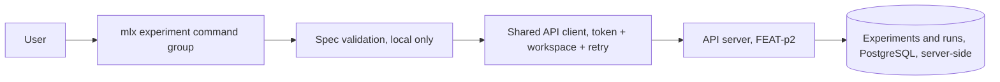
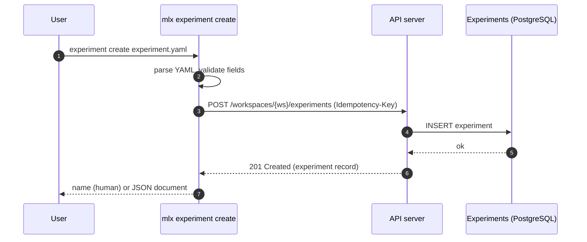
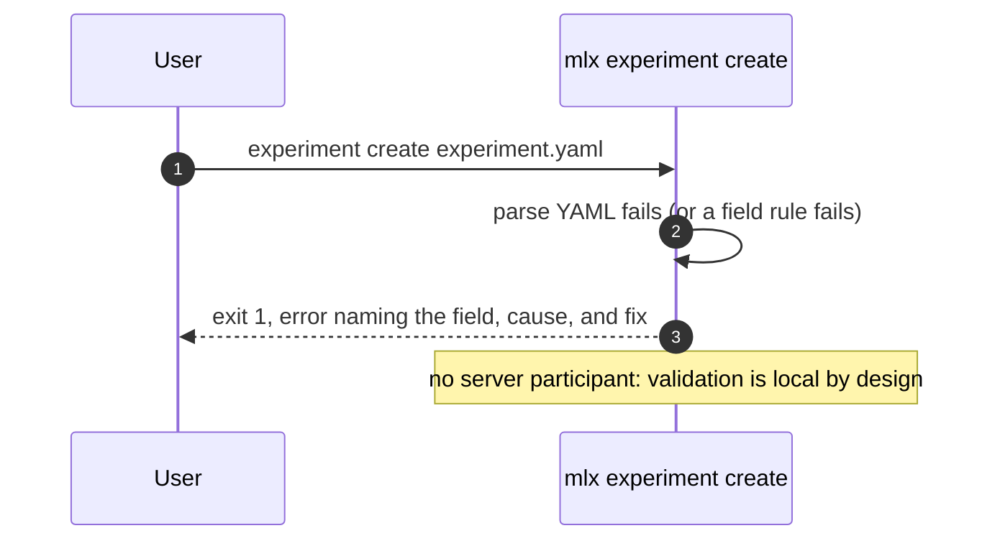
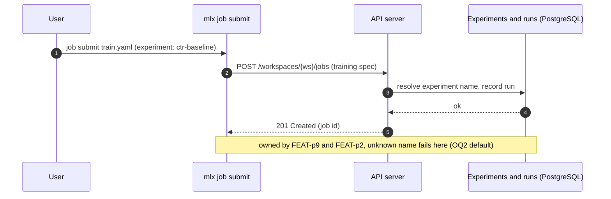
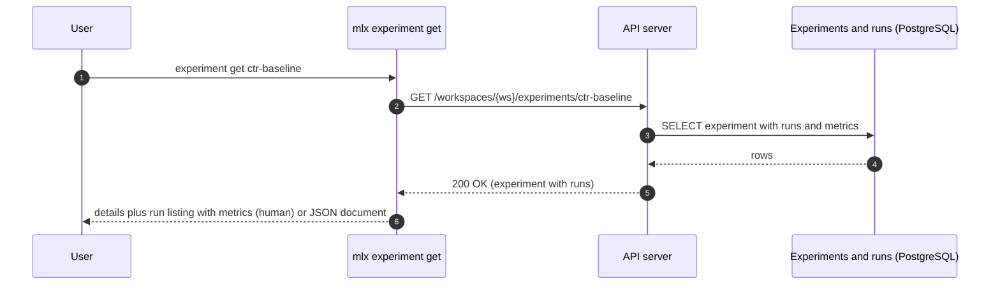
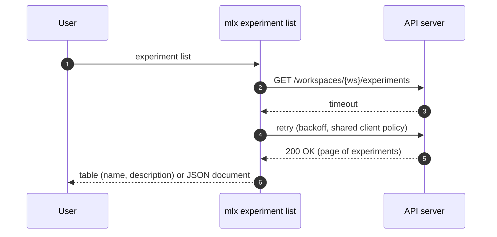

# Specification: mlx experiment command

## Overview

The `experiment` group is a cyclopts command group inside the `mlx` CLI package: three subcommands (`create`, `list`, `get`) backed by a local spec-validation module and the shared API client (auth token, workspace scoping, retry) from the FEAT-p1 client core.
The CLI is a pure consumer of the experiment endpoints owned by the FEAT-p2 contract; this specification fixes the client-side contract view, the spec-file format, and the error and output behavior of each subcommand.

## Architecture

The command group adds no new layers; it composes the FEAT-p1 client core with an experiment-specific validation module and command handlers.
Runs enter an experiment server-side when a training job referencing the experiment name is dispatched (FEAT-p9 attach-by-name); this group only reads them back.

## Data Models

### Experiment spec file (input, owned by this feature)

One YAML file per `experiment create` invocation.

| Field | Type | Required | Constraints | Description |
|---|---|---|---|---|
| name | string | Yes | Kebab-case (`^[a-z0-9]+(-[a-z0-9]+)*$`), unique in the workspace (uniqueness confirmed server-side) | User-visible experiment identifier that training specs reference |
| description | string | No | Single line; a value containing newlines is rejected with an actionable error | One line shown in listings |

Unknown fields in the spec file are ignored with a warning, never rejected (forward compatibility).
Validation order is fixed so the first failure is deterministic: YAML parse, then name presence, then name pattern, then description single-line rule.
Every validation failure exits 1 with an error naming the field and the fix, and no server call is made.

### Experiment record (client view; resource owned by FEAT-p2)

| Field | Type | Constraints | Description |
|---|---|---|---|
| name | string | Kebab-case, unique per workspace | Experiment identifier |
| description | string, optional | Single line | Shown in listings; the key is omitted when absent in JSON output |

The client tolerates unknown response fields (a future `created_at`, for example) and ignores them rather than failing.

### Run record (client view; resource owned by FEAT-p2, created via FEAT-p9)

| Field | Type | Constraints | Description |
|---|---|---|---|
| id | string | Job identifier of the attached training run | Run identifier within the experiment |
| metrics | string-to-number map | May be empty | Metrics the server recorded for the run |

Run records are read-only for this group; the client treats `metrics` as an opaque map and tolerates unknown run fields (a future `state` or `finished_at`, for example), ignoring them rather than failing.

## API Contracts

This feature defines no API surface of its own; no `api.yaml` is written.
The normative experiment contract is owned by FEAT-p2 (`.sdlc/features/p2-api-server/plan/contract.md`, CLI mapping table).
The table below is the consumer-side view this feature codes against; if the two drift, the FEAT-p2 document wins.

| Method | Path | Purpose |
|---|---|---|
| POST | `/workspaces/{workspace}/experiments` | Create an experiment from the validated spec fields |
| GET | `/workspaces/{workspace}/experiments?cursor=<cursor>` | List experiments in the workspace (cursor-paginated per FEAT-p2-FR-14) |
| GET | `/workspaces/{workspace}/experiments/{experiment}` | Fetch one experiment with its runs and their metrics |

Bearer-token auth, the cursor pagination convention, the error model (code, message, likely cause, suggested fix), and the `Idempotency-Key` header on POST are all inherited from the FEAT-p2 contract conventions and are implemented once in the shared client, not per command.

List pagination behavior: `experiment list` follows the cursor until exhausted in both human and JSON modes, and the JSON document is then the complete array of experiment records.
A typical workspace holds a handful of experiments, so the common case is one round trip.

Error mapping (server status to CLI behavior; exit codes inherited from the FEAT-p1 plan):

| Status | Server code | CLI behavior |
|---|---|---|
| 400 | INVALID_INPUT | Exit 1, print the server's cause and fix |
| 401 | UNAUTHENTICATED | Exit 2, prompt re-authentication hint |
| 404 | EXPERIMENT_NOT_FOUND | Exit 1, error naming the missing experiment |
| 409 | CONFLICT | Exit 1, duplicate-name conflict error (FR-1/FR-5) |
| 5xx or unreachable | any | Retry with backoff (NFR-2), then exit 3 with a clear server-unreachable or server-error message |

## Sequences

### experiment create (happy path)

### experiment create (local validation failure, no server call)

### run attachment (server-side, shown for context)

### experiment get (happy path)

### experiment list (transient failure retried)

## Technical Decisions

| Decision | Choice | Rationale |
|---|---|---|
| Contract ownership | No local `api.yaml`; code against the FEAT-p2 contract mapping | One normative source for the experiment endpoints avoids drift; FEAT-p2 publishes the contract the CLI consumes |
| Spec parsing | PyYAML with a typed field-by-field validation module | Mature parser; field-by-field errors satisfy the actionable-error rule (FEAT-p1-NFR-1) better than schema-exception dumps |
| Unknown spec fields | Ignore with a warning | Additive spec evolution does not break older CLI versions |
| Duplicate name | Surface the server's 409 as the conflict error | Uniqueness is server-side truth (spec.md); the CLI never guesses |
| Description rule | Single line, enforced locally with an actionable error | Listings promise one line (spec.md field table); rejecting early beats truncating silently |
| Metrics source | Server run records only; no run-log parsing in the CLI | OQ1 default; log formats are training-code-specific and unstable, and the server already records metrics |
| OQ2 default (unknown name at submit) | Fail at submit time naming the experiment; no auto-create | Explicit creation keeps experiment metadata (description) intentional; decision owned at the FEAT-p9 boundary |
| OQ3 default (run pagination) | One response carries all runs of an experiment | Experiments group a handful of runs in practice; revisit with cursor-following if FEAT-p2 paginates nested runs |
| JSON output | `description` key omitted when absent; runs as `[{id, metrics}]` | Deterministic document shape for scripts; unknown server fields dropped, never invented |
| Output | Human tables and key-value blocks by default; single JSON document under the parent's `--json` | Inherited FEAT-p1-FR-12 convention |
| Interactive budget | `list` and `get` render in under 500 ms warm (NFR-3); each adds one round trip per page | Keeps the inherited performance target measurable while allowing multi-page listings |
| Testing posture | All commands run against the contract-conformant stub; the experiment argument surface gets pytest coverage (NFR-4) | Matches the parent constraint until the FEAT-p2 server exists |

## Risks and Unknowns

1. The FEAT-p2 experiment endpoints are not published yet; the consumer view here (paths, error codes, nested runs on get) may drift from the published contract, so reconcile when it lands (see the plan's hardening phase).
2. The run schema is assumed minimal (`id`, `metrics`); FEAT-p2's database phase defines runs and run metrics tables, and additional fields or nested pagination would change the get handler.
3. OQ2 (auto-create versus error at submit) is decided at the FEAT-p9 boundary; if it resolves to auto-create, experiments appear in listings without CLI creation and this group needs no change, but the error-message expectations in FEAT-p9 do.
4. Metrics value types are unspecified (integers, floats, nested series); the client treats `metrics` as an opaque string-to-number map and ignores unknown shapes until FEAT-p2 defines them.
5. No server exists yet; every sequence is exercised against a contract-conformant stub (parent assumption 1, `.sdlc/knowledge/assumptions/1-cli-target-server.md`).

## Out of Scope

- Server-side experiment storage, run recording, and metric persistence (FEAT-p2, database phase).
- Run creation and attachment mechanics, including the unknown-name behavior at submit time (FEAT-p9).
- Parsing run logs in the CLI for metrics (OQ1 default: never in v1).
- Experiment deletion, renaming, or archiving (not in the parent command surface).
- Telemetry for this command group (evaluated separately; see telemetry decision in the plan).
