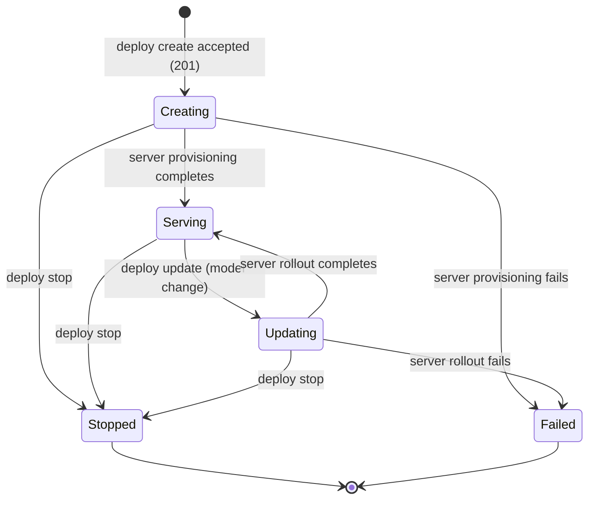

# Lifecycle: mlx deploy command

## Overview

The deploy group tracks one resource with a meaningful lifecycle: the Deployment (the online inference serving unit and its endpoint).
The state machine itself is owned and executed server-side (FEAT-p2), so this document fixes the client's observation and interaction contract: which states the CLI renders, how each subcommand behaves per observed state, the three user-triggered transitions (`deploy create`, `deploy update`, `deploy stop`), and the guards the CLI enforces locally.
It is the client view; where the two could drift, the FEAT-p2 state machine wins.

## Resources

| Resource | Description | Lifecycle Type | Spec Ref |
|---|---|---|---|
| Deployment | Server-owned serving unit for one model version behind one endpoint, observed via `deploy list`/`deploy get` and mutated via `deploy create`/`deploy update`/`deploy stop` | State machine (client view of a server-owned state machine) | specification.md, Deployment resource |

The scaling input (flags) is a per-invocation request field, not a managed resource; it has no lifecycle entry.

## State Diagrams

### Deployment (client-observed contract)

The server may add transitions the CLI does not model (for example Serving to Failed on an infrastructure error); the CLI tolerates them by rendering the reported state verbatim (open-on-read rule, specification.md).

## States

### Deployment

| State | Description | Entry Condition | Exit Condition | Spec Ref |
|---|---|---|---|---|
| Creating | Accepted by the server, endpoint provisioning under way | 201 response to `deploy create` | Provisioning completes, fails, or `deploy stop` | FR-1; specification.md, create sequence |
| Serving | Endpoint serves the current model version | Server provisioning completes, or a rollout completes | `deploy update` (model change) or `deploy stop` | FR-1, FR-8 |
| Updating | A model rollout is in flight; the endpoint keeps serving | `deploy update` with `--model` accepted | Rollout completes or fails, or `deploy stop` | FR-6, FR-8; specification.md, update sequence |
| Stopped | Terminated by a stop request; resources released server-side | `deploy stop` accepted | Terminal: no exit | FR-7 |
| Failed | Terminated unsuccessfully (provisioning or rollout failure) | Server reports failure | Terminal: no exit | specification.md, error mapping |

The state values are the illustrative v1 set; unknown server-reported values render verbatim (specification.md, open on read).
A scaling-only `deploy update` (replicas or bounds without `--model`) does not change the observed state; Serving stays Serving.

## Transitions

### Deployment

| From | To | Trigger | Actor | Side Effects | Guard Conditions | Spec Ref |
|---|---|---|---|---|---|---|
| (none) | Creating | `deploy create` | User | Local flag validation, POST with one `Idempotency-Key`, endpoint reference reported, `deploy_create_succeeded` | Flags pass local validation (forms, combination, bounds); model version confirmed server-side | FR-1, FR-2, FR-3 |
| (none) | (none) | Create attempt fails | User or system | Nothing created; error plus hint; `deploy_create_failed` | Validation failure (exit 1), unknown model version (exit 1), auth failure (exit 2), unreachable (exit 3) | FR-2, FR-3, NFR-1, NFR-2 |
| Serving | Updating | `deploy update` with `--model` | User | PATCH, rollout starts server-side, updating line, `deploy_update_succeeded` | Non-empty flag subset; forms and rules pass locally; deployment exists; terminal-state refusals are adjudicated server-side and the CLI surfaces the returned error | FR-6, FR-8 |
| Serving | Serving (unchanged) | `deploy update` (scaling only) | User | PATCH, new scaling reported on next `deploy get`, `deploy_update_succeeded` | Same guards; no state change by design | FR-6 |
| (any non-terminal) | (none) | Update attempt fails | User or system | Nothing changed; error plus hint; `deploy_update_failed` | Empty subset (exit 1), validation failure (exit 1), unknown deployment or model (exit 1), auth failure (exit 2), unreachable (exit 3) | FR-6, NFR-1, NFR-2 |
| Creating, Serving, Updating | Stopped | `deploy stop` | User | POST stop, confirmation line, server releases the endpoint and resources, `deploy_stop_succeeded` | Deployment exists; observed state non-terminal (server enforces authoritatively; CLI surfaces the 409 naming the state) | FR-7 |
| (non-terminal) | (none) | Stop attempt refused | User or system | Nothing changed; error naming the deployment and state; `deploy_stop_failed` | Unknown deployment (404), already stopped (409), auth failure, unreachable | FR-7 |
| Creating | Serving | Server provisioning | Server | None client-side; the next `deploy list`/`deploy get` shows serving | Provisioning succeeded server-side | Observed only |
| Creating | Failed | Server provisioning failure | Server | None client-side | Server-side | Observed only |
| Updating | Serving | Server rollout completion | Server | `rollout` field disappears from `deploy get` | Server-side | FR-8; Observed only |
| Updating | Failed | Server rollout failure | Server | `rollout` field disappears; the served version and endpoint disposition are as the server reports | Server-side | Observed only |
| any | (unchanged) | `deploy list`, `deploy get` | User | Read-only; no deployment state is mutated | Deployment exists | FR-4, FR-5 |

Racing transitions: a stop issued while a rollout is running resolves server-side; the CLI surfaces whichever outcome the server returns (a stop accepted mid-rollout reports Stopped, a stop racing a completed rollout returns the 409 naming the state).
A stop issued during Creating is modeled but adjudicated server-side.
The CLI never adjudicates a race itself.

## Invariants

| Resource | Invariant | Enforced By | Violation Handling |
|---|---|---|---|
| Deployment | The CLI never derives or writes deployment state; it renders the server-reported state verbatim, including unknown state values | Read-only command handlers plus output tests | A command that mutates or rejects an unknown state fails review and tests |
| Deployment | Mutations occur only through the three server endpoints (create, update, stop); the CLI applies no local state gate beyond flag validation and surfaces the server's refusals | Single handlers per command; error mapping table | A client-side bypass attempt fails review |
| Deployment | Every mutating command constructs the `scaling` object through the single validation module: exactly one mode, bounds paired, min less than or equal to max, positive integers | The shared flag-validation module; argument-surface tests | A handler constructing scaling ad hoc fails review |
| Deployment | One create invocation carries exactly one `Idempotency-Key`, reused across retries | Client core key handling; retry tests | A second key on retry fails tests (would create duplicate deployments, FR-9) |
| Deployment | The rollout is rendered from the server-reported `rollout` object only; the CLI never infers a rollout from state or model fields alone | Get handler reads the documented field; output tests | An inferred-rollout rendering fails tests |
| Deployment | The deployment name is opaque after creation: get, update, and stop resolve by the name verbatim and never reconstruct it | Name handling centralized in the client mapping point | A command deriving or transforming names fails review |

## Retention and Expiry

| Resource | Retention Policy | Expiry Trigger | Cleanup Action | Spec Ref |
|---|---|---|---|---|
| Deployment (client side) | The CLI holds no deployment state between invocations; the name and endpoint reference are reported at create and re-discoverable via `deploy list` | Process exit | Nothing to clean up; deployment retention (including how long stopped records persist) is server-side (FEAT-p2) | FR-1, FR-4 |

## Event Emissions

The CLI emits no cross-system events in v1; the observable surface is command output and exit codes.
Product analytics events (opt-out, anonymous install_id, no secret or identity fields) align with the transitions above and are specified in telemetry.md.

| Transition | Event | Payload | Consumer | Spec Ref |
|---|---|---|---|---|
| (none) to Creating | `deploy_create_succeeded` | install_id, scaling_mode, duration_ms, retried | Product analytics (opt-out) | telemetry.md |
| create attempt fails | `deploy_create_failed` | install_id, reason (usage, references, auth, unreachable), duration_ms | Product analytics (opt-out) | telemetry.md |
| Serving to Updating (or scaling-only update) | `deploy_update_succeeded` | install_id, changed (model, scaling, or both), duration_ms | Product analytics (opt-out) | telemetry.md |
| update attempt fails | `deploy_update_failed` | install_id, reason | Product analytics (opt-out) | telemetry.md |
| non-terminal to Stopped | `deploy_stop_succeeded` | install_id, prior_state | Product analytics (opt-out) | telemetry.md |
| stop attempt refused | `deploy_stop_failed` | install_id, reason (unknown, terminal, auth, unreachable) | Product analytics (opt-out) | telemetry.md |
| state observed via `deploy get` | `deploy_state_reported` | install_id, state, duration_ms | Product analytics (opt-out) | telemetry.md |

The command-level event `deploy_list_completed` is not transition-tied and is specified in telemetry.md only; `deploy get` fires `deploy_state_reported`, listed above.

## Out of Scope

- The server-side state machine, rollout mechanics, provisioning, reconciliation, and retention of stopped deployments (owned by FEAT-p2).
- The endpoint's own lifecycle beyond the deployment view (provisioning details are server-side; the CLI renders the reference).
- Model version lifecycle and registry states (owned by FEAT-p13); `name:version` is a reference submitted here.
- Restarting or resuming a stopped deployment; serving again is a new `deploy create` (the server may reuse the name per its own policy).
