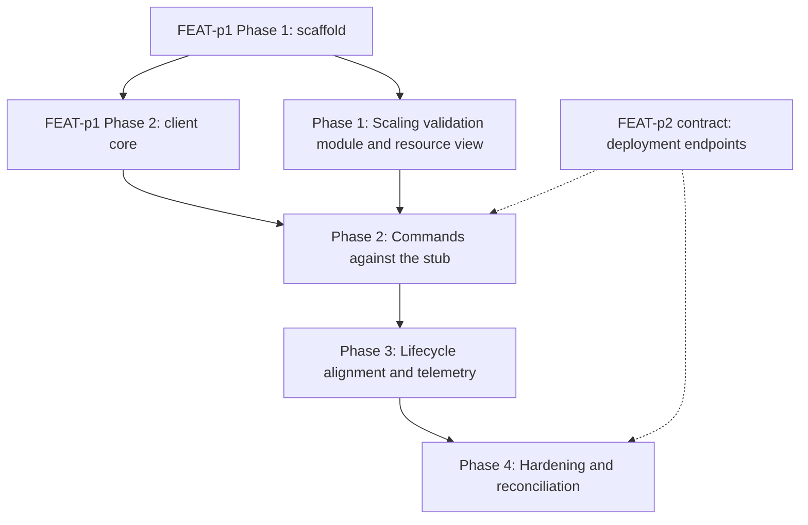

# Implementation Plan: mlx deploy command

## Goal

Deliver the `mlx deploy` command group (create, list, get, update, stop) inside the unified CLI, implementing FEAT-p1-FR-9 and FR-10 to the letter of `requirements.md`, `specification.md`, `lifecycle.md`, and `telemetry.md`.
The plan is unified (`plan.md`, not a split `plan/` set): the work spans a single concern (one CLI command group composing the shared client core plus a scaling-validation module), so a split would add files without adding clarity; the structure choice is the skill's automation default, noted here because this run is non-interactive.
It is the delegated slice of FEAT-p1's Phase 3 deployment deliverable (`deploy create/list/get/update/stop`, FR-9 and FR-10).

## Phases

### Phase 1: Scaling validation module and resource view

**Goal:** The flag-validation rules and the deployment resource view are fully specified in code with actionable errors and open-on-read tolerance, with no server involvement.
**Effort:** 2 person-days
**Depends on:** FEAT-p1 Phase 1 (scaffold with the stubbed `deploy` group)

**Deliverables:**
- [ ] Typed flag models with the deterministic validation order from the specification (model reference form, static-versus-bounds combination, bound pairing, min less than or equal to max, positive integers, endpoint-name form, non-empty subset on update)
- [ ] CLI constants: the model reference and kebab-case patterns, the static-versus-autoscale scaling modes
- [ ] The flag-to-scaling-object mapping (create default static 1; update omitted-keeps-current, `--replicas` clears autoscaling, bounds replace a static count)
- [ ] Validation errors naming the flag, the broken rule, and the fix; exit 1 on every validation failure; no server call
- [ ] Deployment resource view model: tolerant of unknown fields, unknown `state`, `rollout.status`, and `scaling.mode` values rendered verbatim
- [ ] Unit tests covering every FR-2 and FR-3 local acceptance criterion plus the empty-update rejection

### Phase 2: Commands against the stub

**Goal:** All five subcommands work end to end against the contract-conformant stub, with the error mapping, output modes, and rollout rendering complete.
**Effort:** 3 person-days
**Depends on:** Phase 1; FEAT-p1 Phase 2 (client core: auth token, workspace scoping, retry with backoff, JSON mode, idempotency-key support)

**Deliverables:**
- [ ] `deploy create`: one `Idempotency-Key` per invocation reused across retries, 201 handled (deployed line with endpoint reference; JSON deployment object), 400 MODEL_NOT_FOUND and 409 ENDPOINT_NAME_TAKEN surfaced naming the reference or name (FR-1, FR-3, FR-9)
- [ ] `deploy list`: cursor following to exhaustion, NAME/STATE/MODEL/ENDPOINT table, empty result exits 0 (FR-4)
- [ ] `deploy get`: key-value block with the rollout line when the server reports a rollout, 404 naming the deployment (FR-5, FR-8)
- [ ] `deploy update`: non-empty subset enforcement, omitted-keeps-current semantics, static-versus-bounds replacement, updating line after a model change (FR-6)
- [ ] `deploy stop`: confirmation line, 409 already-stopped surfaced naming the state, 404 naming the deployment (FR-7)
- [ ] Error mapping table implemented (400 and 404 and 409 to exit 1, 401 to exit 2, 5xx and unreachable retried then exit 3)
- [ ] `--json` output mode for all five subcommands per the specification's shapes
- [ ] Stub deployment endpoints: create (model existence, endpoint-name conflict, idempotent replay), list (cursor), get (with rollout progression), update, stop (terminal refusal)
- [ ] Acceptance criteria from `requirements.md` mapped to pytest scenarios passing against the stub

### Phase 3: Lifecycle alignment and telemetry instrumentation

**Goal:** The lifecycle invariants hold under test and the telemetry events fire per the plan, with opt-out honored before first emission.
**Effort:** 2 person-days
**Depends on:** Phase 2

**Deliverables:**
- [ ] Read-only rendering guaranteed: unknown state values render verbatim, the rollout renders from the server-reported object only, and no command mutates deployment state locally (lifecycle invariants, with output tests)
- [ ] Scaling construction routed through the single validation module on both create and update (invariant, with argument-surface tests)
- [ ] Single idempotency key per create invocation verified across retry paths (FR-9)
- [ ] Telemetry events implemented: `deploy_create_succeeded`, `deploy_create_failed`, `deploy_update_succeeded`, `deploy_update_failed`, `deploy_stop_succeeded`, `deploy_stop_failed`, `deploy_state_reported` (get only), `deploy_list_completed`, with `source`, `install_id`, and `cli_version` on every event
- [ ] Opt-out (`MLX_TELEMETRY=off`, config flag) checked before any event leaves the process; local buffer written when enabled
- [ ] Redaction by construction: no model references, deployment names, endpoint names, token, or identity fields enter the event pipeline (verified by tests)

### Phase 4: Hardening and reconciliation

**Goal:** NFR acceptance criteria pass, the toolchain gates are green, and the client view is reconciled with the published FEAT-p2 deployment contract.
**Effort:** 1 person-day
**Depends on:** Phase 3

**Deliverables:**
- [ ] Error-message audit: cause plus fix on every failure path (NFR-1)
- [ ] Render budget verified: `deploy list` and `deploy get` render in under 500 ms warm (NFR-3)
- [ ] Argument-surface coverage complete for all five subcommands and every scaling flag combination (NFR-4)
- [ ] `uv run ruff check .`, `uv run ruff format --check .`, `uv run ty check .`, and `uv run pytest` all green (NFR-4)
- [ ] Reconcile the state vocabulary, the rollout representation, the three consumer-side error codes, and the one-name design with the published FEAT-p2 contract, or record the remaining gaps
- [ ] FR-9 retry safety verified end to end against the stub's replay semantics

## Phase Dependencies

Solid edges are hard sequencing; dashed edges are external dependencies (the stub stands in for FEAT-p2 until the contract and server land).
Phase 1 needs only the scaffold, so it can start as soon as FEAT-p1 Phase 1 completes and run while the client core is still being built.

## Milestones

| Milestone | Phase | Success Criteria |
|---|---|---|
| M1: Validation correct locally | Phase 1 | Every FR-2 and FR-3 local acceptance criterion passes with no server participant |
| M2: Full group on the stub | Phase 2 | All FR-1, FR-3 through FR-9 acceptance criteria pass against the stub |
| M3: Invariant-safe and instrumented | Phase 3 | Lifecycle invariants hold under test; telemetry events fire per plan with opt-out honored |
| M4: Shippable slice | Phase 4 | All NFR acceptance criteria pass; four toolchain gates green; contract reconciliation done or gap recorded |

## Dependencies

| Dependency | Type | Owner | Risk if Delayed |
|---|---|---|---|
| FEAT-p1 Phase 1 scaffold (command tree with stubbed `deploy` group) | External | FEAT-p1 implementors | Blocks Phase 1 |
| FEAT-p1 Phase 2 client core (auth, workspace, retry, JSON mode, idempotency-key support) | External | FEAT-p1 implementors | Blocks Phase 2; Phase 1 proceeds meanwhile |
| FEAT-p2 deployment contract (endpoints, state vocabulary, rollout representation, error codes, name model) | External | FEAT-p2 implementors | Phase 2 codes against the stub; Phase 4 reconciliation slips or records a gap |
| Stub server deployment endpoints including rollout progression and idempotent replay | Internal | This feature | Blocks automated acceptance testing in Phase 2 |

## Risk Register

| Risk | Likelihood | Impact | Mitigation |
|---|---|---|---|
| Client core (FEAT-p1 Phase 2) lands late | Medium | High | Phase 1 is pure local validation with no client dependency; it absorbs the slip |
| FEAT-p2 publishes deployment schemas that differ from this feature's consumer view | Medium | Medium | Consumer view cites the normative owner; Phase 4 reconciliation catches drift; constants and error mapping are single-place |
| The one-name design is rejected by the contract (distinct deployment name) | Medium | Medium | Name handling is isolated in one mapping point plus create's output handler; the change is local |
| The contract exposes no rollout object (state only) | Medium | Medium | The rollout line degrades gracefully (state renders verbatim regardless); Phase 4 reconciles |
| Idempotency replay semantics differ from the FEAT-p2 sketch | Low | Medium | FR-9 degrades to at-most-once creation with a clear retry warning; the handler is single-place |
| An open-question default flips (stop prompt, readiness wait, default scaling of 1) | Low | Low | Each default is isolated behind a single handler or decision row; the change is local |
| Stub drifts from the real contract | Medium | Medium | Stub assertions derive from the specification's consumer view; Phase 4 reconciles against the published contract |

## Assumptions

- The FEAT-p1 client core (auth, workspace scoping, retry, JSON mode, idempotency-key support) is available before Phase 2 starts.
- The consumer-side contract view in `specification.md` matches what FEAT-p2 publishes for the deployment endpoints (the stub encodes this view).
- The illustrative state vocabulary (`creating`, `serving`, `updating`, `stopped`, `failed`) and the `rollout` object approximate the published contract closely enough that reconciliation is adjustment, not rework.
- The recorded defaults hold: no stop confirmation, create returns on acceptance, static 1 default scaling, one-name design.
- The telemetry infrastructure posture (anonymous install_id, opt-out, local buffer, deferred destination) matches what the p3 plan settles for the CLI.

Note: per this run's write scope (feature directory only), these assumptions were not promoted to `.sdlc/knowledge/assumptions/`; the consumer-view match and the one-name design are the first candidates when that path is writable (the stub-target dependency is already covered by parent assumption 1).

## Timeline

No calendar committed (team capacity unknown); duration-only.

| Phase | Duration |
|---|---|
| Phase 1: Scaling validation module and resource view | 2 days |
| Phase 2: Commands against the stub | 3 days |
| Phase 3: Lifecycle alignment and telemetry | 2 days |
| Phase 4: Hardening and reconciliation | 1 day |
| Total | ~8 working days |
