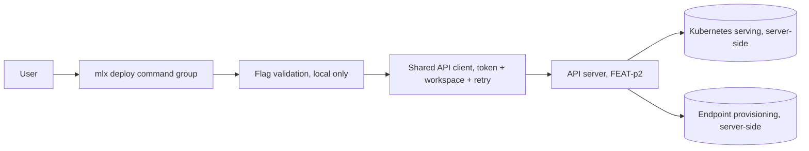
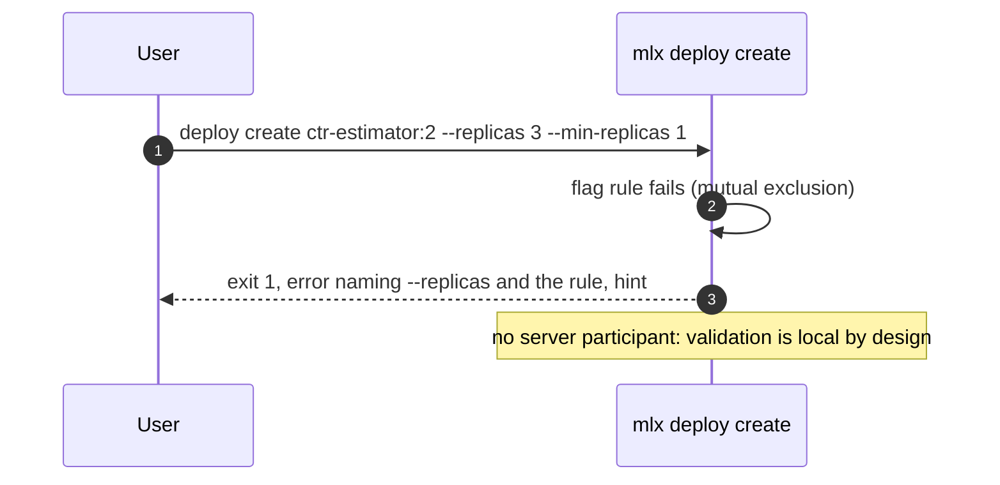
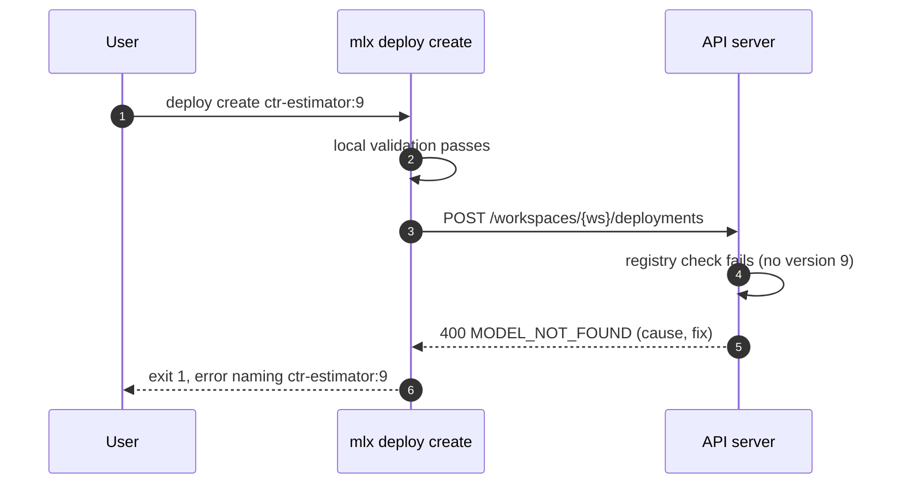
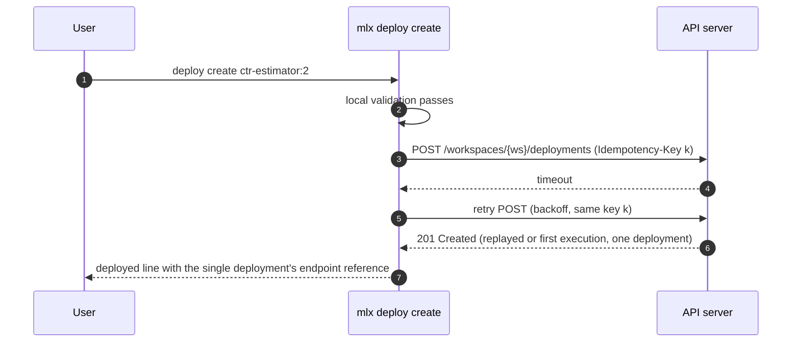
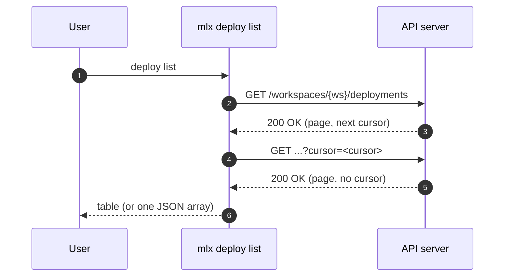
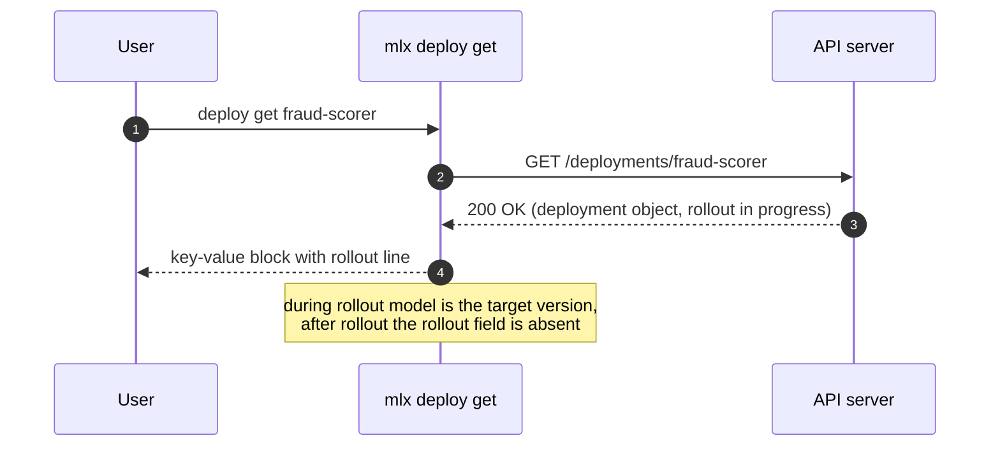
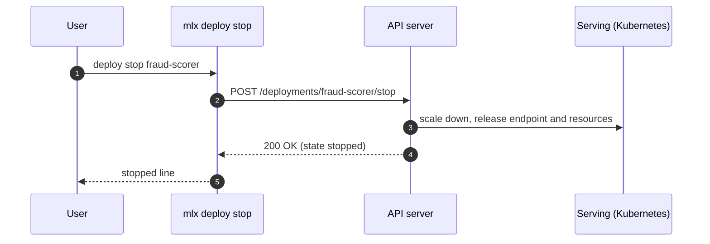

# Specification: mlx deploy command

## Overview

The `deploy` group is a cyclopts command group inside the `mlx` CLI package: five subcommands (`create`, `list`, `get`, `update`, `stop`) with no spec-file input, backed by a local flag-validation module and the shared API client (auth token, workspace scoping, retry) from the FEAT-p1 client core.
The CLI is a pure consumer of the deployment endpoints owned by the FEAT-p2 contract; this specification fixes the client-side contract view, the scaling input model, the deployment resource view, and the error and output behavior of each subcommand.

## Architecture



The command group adds no new layers; it composes the FEAT-p1 client core with a flag-validation module and command handlers.
Rollout execution, endpoint provisioning, and resource release stay server-side; the CLI observes them through the deployment resource.

## Data Models

### Scaling input (flags to request fields, owned by this feature)

| Input | Request field | Constraints |
|---|---|---|
| `--replicas <n>` | `scaling: {"mode": "static", "replicas": n}` | Positive integer; mutually exclusive with the bound flags |
| `--min-replicas <n>` and `--max-replicas <n>` | `scaling: {"mode": "autoscale", "min_replicas": n, "max_replicas": n}` | Positive integers; passed together; min less than or equal to max |
| All scaling flags omitted (create) | `scaling: {"mode": "static", "replicas": 1}` | Recorded default (cli-design Open Question 8) |
| All scaling flags omitted (update) | Field absent from the request | Omitted flags keep their current values |

Setting `--replicas` on update clears any autoscaling bounds; setting the bound flags replaces a static count.
Validation order is fixed so the first failure is deterministic: model reference form, static-versus-bounds combination, bound pairing, min less than or equal to max, positive integers, `--endpoint-name` form (create only), non-empty flag subset (update only).
Every validation failure exits 1 with an error naming the flag and the broken rule, and no server call is made.

### Local input forms

| Input | Rule |
|---|---|
| Model reference | `^[a-z0-9]+(-[a-z0-9]+)*:[0-9]+$` (kebab-case name, numeric version following the p9 schema; Open Question 6) |
| `--endpoint-name` | `^[a-z0-9]+(-[a-z0-9]+)*$` (kebab-case) |
| Counts | Integers accepted by cyclopts typing, then checked greater than 0 |

### Deployment resource (client view; resource owned by FEAT-p2)

| Field | Type | Constraints | Description |
|---|---|---|---|
| name | string | Kebab-case; the endpoint name chosen or generated (one-name design, Open Questions 4 and 7) | Deployment identifier used by get, update, stop |
| endpoint | string | Server-reported reference, rendered verbatim | The reference create prints and inference clients call |
| model | string | `name:version` form | Currently served model version, or the rollout target while updating |
| state | string | Open on read: illustrative v1 values `creating`, `serving`, `updating`, `stopped`, `failed`; unknown values render verbatim rather than failing | Current lifecycle state (transitions owned server-side) |
| scaling | object | Exactly one of `{"mode": "static", "replicas"}` or `{"mode": "autoscale", "min_replicas", "max_replicas"}` | Scaling configuration as last set |
| rollout | object | Present only while a model update is in flight: `{"from_model", "to_model", "status"}` with status open on read | Server-reported rollout progress (consumer-side shape, risk 1) |
| created_at | string | ISO timestamp when the contract provides it | Creation time |

The client tolerates unknown response fields (a future `updated_at`, for example) and ignores them rather than failing; unknown `state`, `rollout.status`, and `scaling.mode` values render verbatim rather than failing.
The list endpoint returns deployment summaries (`name`, `state`, `model`, `endpoint`).

## API Contracts

This feature defines no API surface of its own; no `api.yaml` is written.
The normative deployment contract is owned by FEAT-p2 (`.sdlc/features/p2-api-server/plan/contract.md`, FEAT-p1 CLI mapping table).
The table below is the consumer-side view this feature codes against; if the two drift, the FEAT-p2 document wins.

| Method | Path | Purpose |
|---|---|---|
| POST | `/workspaces/{workspace}/deployments` | Create a deployment (model reference, scaling, optional endpoint name); `Idempotency-Key` header |
| GET | `/workspaces/{workspace}/deployments?cursor=<cursor>` | List deployments in the workspace (cursor-paginated per FEAT-p2-FR-14) |
| GET | `/deployments/{deployment}` | Fetch one deployment |
| PATCH | `/deployments/{deployment}` | Update the served model and/or scaling; omitted fields keep their current values |
| POST | `/deployments/{deployment}/stop` | Stop the deployment and release its resources |

Bearer-token auth, the cursor pagination convention, the error model (code, message, likely cause, suggested fix), and the `Idempotency-Key` header on POST are inherited from the FEAT-p2 contract conventions and are implemented once in the shared client, not per command.

List pagination behavior: `deploy list` follows the cursor until exhausted in both human and JSON modes, and the JSON document is then the complete array of deployment summaries.
The render budget (NFR-3) covers local startup and rendering; wall-clock adds one round trip per page.

Error mapping (server status to CLI behavior; exit codes inherited from the FEAT-p1 plan):

| Status | Server code | CLI behavior |
|---|---|---|
| 400 | INVALID_INPUT | Exit 1, print the server's cause and fix |
| 400 | MODEL_NOT_FOUND (consumer-side request, see Risks) | Exit 1, error naming the unknown model reference |
| 401 | UNAUTHENTICATED | Exit 2, prompt re-authentication hint |
| 404 | DEPLOYMENT_NOT_FOUND | Exit 1, error naming the missing deployment |
| 409 | ENDPOINT_NAME_TAKEN (create; consumer-side request, see Risks) | Exit 1, error naming the endpoint name in use |
| 409 | INVALID_STATE (stop of an already-stopped deployment; consumer-side request, see Risks) | Exit 1, error naming the deployment and its current state |
| 5xx or unreachable | any | Retry with backoff (NFR-2), then exit 3 with a clear server-unreachable or server-error message |

## Sequences

### deploy create (happy path)

```mermaid
sequenceDiagram
    autonumber
    participant U as User
    participant CLI as mlx deploy create
    participant S as API server
    participant K as Serving (Kubernetes)
    U->>CLI: deploy create ctr-estimator:2 --min-replicas 2 --max-replicas 8
    CLI->>CLI: validate flags locally (form, combination, bounds)
    CLI->>S: POST /workspaces/{ws}/deployments (Idempotency-Key)
    S->>K: create serving deployment, provision endpoint
    K-->>S: accepted
    S-->>CLI: 201 Created (deployment object, state creating)
    CLI-->>U: deployed line with endpoint reference (or JSON document)
    Note over S,K: endpoint readiness proceeds server-side; deploy get shows it
```

### deploy create (local validation failure, no server call)



### deploy create (unknown model version confirmed server-side)



### deploy create (transient failure retried, no duplicate)



### deploy list (cursor followed)



### deploy update (model change triggers a rollout)

```mermaid
sequenceDiagram
    autonumber
    participant U as User
    participant CLI as mlx deploy update
    participant S as API server
    participant K as Serving (Kubernetes)
    U->>CLI: deploy update fraud-scorer --model ctr-estimator:3
    CLI->>CLI: validate flags locally (non-empty subset, forms, rules)
    CLI->>S: PATCH /deployments/fraud-scorer (model only)
    S->>K: start rollout to ctr-estimator:3 (endpoint keeps serving)
    S-->>CLI: 200 OK (deployment object, state updating, rollout)
    CLI-->>U: updating line (or JSON document)
    Note over S,K: rollout proceeds server-side; deploy get reports progress
```

### deploy get (including during a rollout)



### deploy stop



## Technical Decisions

| Decision | Choice | Rationale |
|---|---|---|
| Contract ownership | No local `api.yaml`; code against the FEAT-p2 contract mapping | One normative source for the deployment endpoints avoids drift; FEAT-p2 publishes the contract the CLI consumes |
| Scaling input model | Typed flag-to-object mapping in one validation module (static versus autoscale modes) | The mutual exclusion and bound rules are enforced once, on create and update alike; the request body always carries a well-formed `scaling` object |
| One-name design | The endpoint name (chosen or generated) addresses the deployment for get, update, and stop | Fewest user-visible identifiers; a distinct server-assigned deployment name would change one mapping point and create's output (Open Questions 4 and 7) |
| Model reference form | Closed local check `^[a-z0-9]+(-[a-z0-9]+)*:[0-9]+$`; existence confirmed server-side | Follows the p9 job spec schema convention; the CLI has no authoritative registry view (FEAT-p13 owns discovery) |
| `state` and rollout `status` enums | Open on read: illustrative values rendered, unknown values rendered verbatim | A new server state must not crash older clients; listings degrade gracefully |
| Idempotency | One `Idempotency-Key` (UUID v4) per create invocation, reused across retries (FR-9) | Makes NFR-2 retries safe; matches the FEAT-p2 Phase 1 convention |
| Create returns on acceptance | The command returns at the 201; readiness is observed via `deploy get` | Provisioning is server-side and asynchronous; holding the command open would couple the CLI to rollout timing (Open Question 3) |
| Rollout visibility | `deploy get` renders the `rollout` object when present; no streaming in v1 | FR-8 satisfied by observation; streaming remains a parent-surface change (Open Question 1) |
| Empty update | Usage error naming at least one flag | A no-op mutation is a footgun; the server never sees an empty PATCH |
| Stop of an already-stopped deployment | 409 surfaced naming the deployment and state | Mirrors the p9 terminal-cancel refusal; the server enforces authoritatively |
| Output | Human tables and key-value blocks by default; single JSON document under the parent's `--json` (create, update, get emit the deployment object; list an array of summaries; stop `{name, state}`) | Inherited FEAT-p1-FR-12 convention, matching the cli-design shapes |
| Interactive budget | `list` and `get` render in under 500 ms warm (NFR-3) | Keeps the inherited performance target measurable; no streaming command exists in this group |
| Testing posture | All commands run against the contract-conformant stub; the deploy argument surface gets pytest coverage (NFR-4) | Matches the parent constraint until the FEAT-p2 server exists |

## Risks and Unknowns

1. The deployment and rollout state vocabulary plus the `rollout` object shape are consumer-side assumptions; reconcile when the FEAT-p2 deployment schemas land.
2. The `MODEL_NOT_FOUND`, `ENDPOINT_NAME_TAKEN`, and stop-refusal `INVALID_STATE` codes are consumer-side requests; reconcile against the published contract.
3. The one-name design may not match the server's identity model; if FEAT-p2 assigns distinct deployment and endpoint names, create's output and the name resolution of get, update, and stop change (isolated to one mapping point and one output handler).
4. The numeric version assumption follows the p9 schema but the registry surface (FEAT-p13) is still pending; a non-numeric version would relax the local regex only.
5. No server exists yet; every sequence is exercised against a contract-conformant stub (parent assumption 1, `.sdlc/knowledge/assumptions/1-cli-target-server.md`).
6. Idempotent replay depends on the FEAT-p2 Phase 1 convention landing with replay semantics as sketched; without it, FR-9 degrades to at-most-once creation with a clear retry warning.

## Out of Scope

- Serving execution, rollout mechanics, endpoint provisioning, resource release, and their persistence (owned by FEAT-p2).
- Model registration, listing, and version inspection (owned by FEAT-p13); this feature only references `name:version`.
- Rollout log streaming and a watch mode for `deploy get` (Open Question 1; add via a parent-surface change).
- List filters, traffic splitting between versions, and deployment deletion; add only on demand via a parent-surface change.
