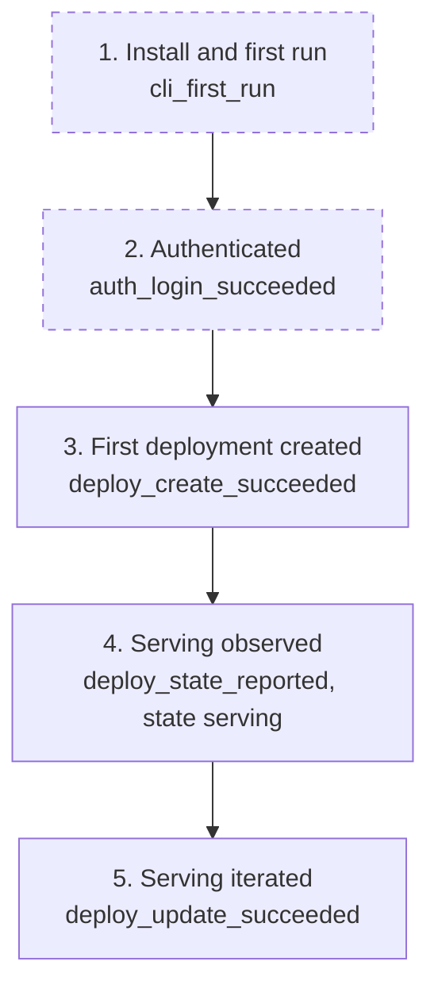

# Telemetry: mlx deploy command

## Overview

Online inference is one of the five operation families the platform exists for, and the deploy group closes the loop after training: a registered model only creates value once it serves.
This plan instruments the deploy flows to answer four questions: are users deploying at all (adoption), do creates succeed (input ergonomics and reference accuracy), do deployments reach an observed serving state (feedback loop), and do users keep their serving footprint healthy (updates and stops rather than lingering deployments).
Events are anonymous and opt-out per the conventions FEAT-p3 established: no token, no identity, no server URL, and additionally no model references, deployment names, or endpoint names (user content stays out wholesale).

## Success Metrics

| Metric | Target | Measurement Method | Timeframe |
|---|---|---|---|
| Time to first deployment | Median under 60 minutes from `auth_login_succeeded` to first `deploy_create_succeeded` per install_id, among installs that ever deploy | Funnel over `auth_login_succeeded` and `deploy_create_succeeded` | First 7 days after each release |
| Create success rate | 90% or higher | `deploy_create_succeeded` / (`deploy_create_succeeded` + `deploy_create_failed`) | Weekly |
| Create failure mix | No single `reason` above 60% of `deploy_create_failed` | Group `deploy_create_failed` by `reason` | Weekly |
| Serving conversion | 70% or higher of `deploy_create_succeeded` installs also emit `deploy_state_reported` with state serving within 24 hours | Join create and observation events per install_id | Weekly |
| Rollout tracking closure | 60% or higher of `deploy_update_succeeded` events with changed model are followed by a `deploy_state_reported` within 1 hour | Join update and observation events per install_id | Weekly |

Serving conversion and rollout closure measure observed outcomes: the CLI can only mark success when the user looks, so both are upper bounds on the true times; the bias is stated rather than hidden.

## User Funnel

Steps 1 and 2 are dashed because their marking events are owned by FEAT-p3 (onboarding and auth).
Step 5 completes for users who change the served model or scaling; stopping is a healthy exit, not funnel churn, and is measured through the stop events instead.

| Step | Event | Entry Criteria | Exit Criteria |
|---|---|---|---|
| 1. Install and first run | `cli_first_run` | Fresh install_id created | The user authenticates |
| 2. Authenticated | `auth_login_succeeded` | First successful login for the install_id | The user deploys a model |
| 3. First deployment created | `deploy_create_succeeded` | First accepted create for the install_id | The user observes the deployment |
| 4. Serving observed | `deploy_state_reported` with state serving | First serving observation for the install_id | The user updates or stops the deployment |
| 5. Serving iterated | `deploy_update_succeeded` | First accepted update for the install_id | End of funnel |

## Analytics Events

All events carry `source: "cli"`, the anonymous `install_id`, and `cli_version`; those shared properties are listed once here and not repeated per event.
No event carries the token, user identity, server URL, profile name, model reference, deployment name, or endpoint name.

### deploy_create_succeeded

**Trigger:** The server accepts the create and the endpoint reference is reported.
**Location:** `deploy create` command handler, after the deployed line prints.

| Property | Type | Required | Description |
|---|---|---|---|
| scaling_mode | string | Yes | `static` or `autoscale` |
| retried | boolean | Yes | Whether at least one retry was needed (NFR-2, FR-9) |
| duration_ms | number | Yes | Wall time from command start to the deployed line |

### deploy_create_failed

**Trigger:** A create attempt ends without a deployment.
**Location:** `deploy create` error paths, local and server.

| Property | Type | Required | Description |
|---|---|---|---|
| reason | string | Yes | `usage` (local validation), `references` (unknown model version), `auth`, or `unreachable` (maps to exit codes 1, 1, 2, 3) |
| duration_ms | number | Yes | Wall time from command start to failure |

### deploy_update_succeeded

**Trigger:** The server accepts an update (model, scaling, or both).
**Location:** `deploy update` command handler, after the updating line prints.

| Property | Type | Required | Description |
|---|---|---|---|
| changed | string | Yes | `model`, `scaling`, or `both` |
| duration_ms | number | Yes | Wall time from command start to the updating line |

### deploy_update_failed

**Trigger:** An update attempt ends without an accepted change.
**Location:** `deploy update` error paths, local and server.

| Property | Type | Required | Description |
|---|---|---|---|
| reason | string | Yes | `usage` (empty subset, validation), `unknown` (deployment or model), `auth`, or `unreachable` |

### deploy_stop_succeeded

**Trigger:** The server accepts a stop request.
**Location:** `deploy stop` command handler.

| Property | Type | Required | Description |
|---|---|---|---|
| prior_state | string | Yes | The observed state at stop (`creating`, `serving`, `updating`, or a server-added value recorded verbatim) |

### deploy_stop_failed

**Trigger:** A stop attempt is rejected or fails.
**Location:** `deploy stop` error paths.

| Property | Type | Required | Description |
|---|---|---|---|
| reason | string | Yes | `unknown` (404), `terminal` (409 already stopped), `auth`, or `unreachable` |

### deploy_state_reported

**Trigger:** `deploy get` finishes rendering one deployment's state.
**Location:** `deploy get` command handler only; `deploy list` does not fire it (cardinality).

| Property | Type | Required | Description |
|---|---|---|---|
| state | string | Yes | The rendered state, verbatim (`creating`, `serving`, `updating`, `stopped`, `failed`, or a server-added value) |
| duration_ms | number | Yes | Wall time of the command (feeds the NFR-3 budget watch) |

### deploy_list_completed

**Trigger:** `deploy list` finishes rendering the listing.
**Location:** `deploy list` command handler, after the table or JSON document prints.

| Property | Type | Required | Description |
|---|---|---|---|
| result_count | number | Yes | Deployments rendered after cursor-following to exhaustion |
| duration_ms | number | Yes | Wall time of the command (feeds the NFR-3 budget watch) |

## Counter Metrics

| Metric | Concern | Threshold |
|---|---|---|
| Local validation share of create failures | Scaling rules or error messages not self-explanatory (NFR-1) | `usage` reason above 40% of `deploy_create_failed` in a week |
| Reference failure share of create failures | Users guessing model versions (registry discoverability) | `references` reason above 20% of `deploy_create_failed` in a week |
| Unreachable share of create attempts | Server reachability incidents | Above 5% of attempts in a week |
| Terminal stop share | Users stopping already-stopped deployments (tracking gap or state confusion) | `terminal` reason above 20% of `deploy_stop_failed` plus `deploy_stop_succeeded` in a week |
| Unknown-name stop share | One-name design confusion (users cannot find the deployment they mean) | `unknown` reason above 40% of `deploy_stop_failed` in a week |

## Telemetry Requirements

| Requirement | Type | Notes |
|---|---|---|
| Reuse FEAT-p3 telemetry infrastructure | Infrastructure | Same opt-out gate (`MLX_TELEMETRY=off` or config), same local-file buffer, same deferred destination decision; no new pipeline for this group |
| Anonymous by construction | Event | The deploy events list no model references, deployment names, or endpoint names; the structlog redaction family masks them before events form (NFR-3 posture inherited) |
| Bounded properties | Event | All properties are primitives (string, number, boolean); no arrays or nested objects, so events stay queryable |
| State values pass through open-enum | Event | `state` and `prior_state` record the server's string verbatim so a future state does not break event parsing |

## Dashboards and Alerts

- **Dashboard:** "Deploy operations" (to be created when a destination exists): funnel `cli_first_run` to `deploy_create_succeeded` to serving observed, create success rate and failure mix by reason, rollout tracking closure, stop outcomes by reason, `deploy get` and `deploy list` duration p95.
- **Alerts:** unreachable share above 5% for a week (possible server incident); usage share above 40% (error message regression); references share above 20% (registry discoverability problem); terminal stop share above 20% and unknown-name stop share above 40% (state and name discoverability, the one-name design's risk signal).

## Out of Scope

- Server-side serving metrics: endpoint latency, throughput, replica health, rollout mechanics (FEAT-p2's observability scope).
- Per-model or per-endpoint usage analytics: model references, deployment names, and endpoint names are deliberately absent, so per-model serving usage cannot be computed from these events.
- Session-level user tracking: no user identity, no cross-machine correlation; install_id is per machine.
- Any telemetry without the FEAT-p3 opt-out gate, or carrying token, identity, server URL, or resource names.
