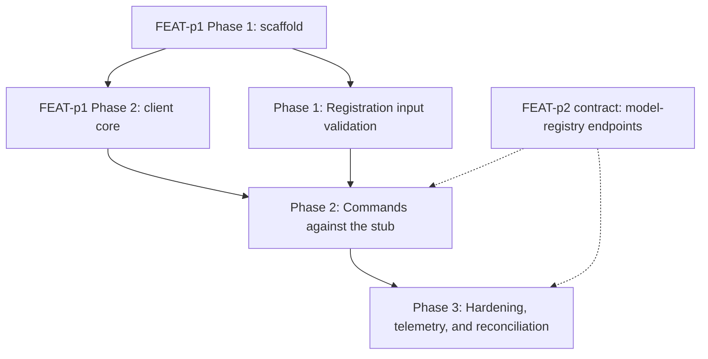

# Implementation Plan: mlx model command

## Goal

Deliver the `mlx model` command group (register, list, get) inside the unified CLI, implementing FEAT-p1-FR-7 to the letter of `requirements.md` and `specification.md`, with the product instrumentation defined in `telemetry.md`.
The plan is unified (`plan.md`, not a split `plan/` set): the work spans a single concern (one CLI command group composing the shared client core), so a split would add files without adding clarity; the non-interactive run context defaults to unified per the create-plan skill.
It is the delegated slice of FEAT-p1's Phase 3 model deliverable and inherits that plan's constraints (stub server until FEAT-p2 lands).

## Phases

### Phase 1: Registration input validation

**Goal:** Every registration input rule from the specification is enforced in code with actionable errors, with no server involvement.
**Effort:** 1.5 person-days
**Depends on:** FEAT-p1 Phase 1 (scaffold with the stubbed `model` group)

**Deliverables:**
- [ ] Typed input validation for `model register` with the deterministic order from the specification (artifact path, then name pattern, then version format)
- [ ] CLI constants for recognized schemes (s3, gs, file) and the version format (positive integer)
- [ ] Bare-path rule implemented: a bare path must exist locally; an unrecognized scheme is rejected naming the scheme
- [ ] `file://` normalization for bare local paths plus the one-line stderr cross-machine note
- [ ] Validation errors naming the input, likely cause, and fix; exit 1 on every validation failure
- [ ] Unit tests covering every FR-5 acceptance criterion plus the normalization and note behavior

### Phase 2: Commands against the stub

**Goal:** All three subcommands work end to end against the contract-conformant stub, with the error mapping and both output modes complete.
**Effort:** 3 person-days
**Depends on:** Phase 1; FEAT-p1 Phase 2 (client core: auth token, workspace scoping, retry with backoff, JSON mode)

**Deliverables:**
- [ ] `model register`: POST with `Idempotency-Key`, reports name and assigned version, 409 surfaced as the duplicate-version error naming model and version (FR-1, FR-2)
- [ ] `model list`: cursor-following pagination to exhaustion, human table (name, version count) (FR-3)
- [ ] `model get`: one block per version with artifact location and creation time, lineage line rendered when present, 404 error naming the missing model (FR-4, FR-6)
- [ ] Error mapping table implemented (400 to exit 1, 401 to exit 2, 404 and 409 to exit 1, 5xx and unreachable retried then exit 3)
- [ ] `--json` output shapes: complete array of summarized model objects for `list`, single object with versions array for `get` (FEAT-p1-FR-12)
- [ ] Stub model-registry endpoints (register with default-version assignment and 409, list with cursor, get with versions newest first and optional lineage) added to the contract-conformant stub
- [ ] Acceptance criteria from `requirements.md` mapped to pytest scenarios passing against the stub

### Phase 3: Hardening, telemetry, and reconciliation

**Goal:** NFR acceptance criteria pass, the telemetry events from `telemetry.md` are emitted, the toolchain gates are green, and the client view is reconciled with the published FEAT-p2 model-registry contract.
**Effort:** 1.5 person-days
**Depends on:** Phase 2

**Deliverables:**
- [ ] Error-message audit: cause plus fix on every failure path (NFR-1)
- [ ] Render budget verified: `list` and `get` render in under 500 ms warm (NFR-3)
- [ ] Telemetry events implemented per `telemetry.md`: the six events with their bounded properties, reusing the FEAT-p3 opt-out gate, anonymous install_id, and local-file buffer; no model names or artifact paths in any payload
- [ ] Argument-surface coverage complete for all three subcommands plus `--name` and `--version` (NFR-4)
- [ ] `uv run ruff check .`, `uv run ruff format --check .`, `uv run ty check .`, and `uv run pytest` all green (NFR-4)
- [ ] Reconcile the CLI's scheme and version-format constants and the error mapping with the published FEAT-p2 model schemas, or record the remaining gap
- [ ] Confirm the lineage rendering against the published lineage shape, or record the gap

## Phase Dependencies

Solid edges are hard sequencing; dashed edges are external dependencies (the stub stands in for FEAT-p2 until the contract and server land).
Phase 1 needs only the scaffold, so it can start as soon as FEAT-p1 Phase 1 completes and run while the client core is still being built.

## Milestones

| Milestone | Phase | Success Criteria |
|---|---|---|
| M1: Validation correct locally | Phase 1 | Every FR-5 acceptance criterion passes with no server participant |
| M2: Full group on the stub | Phase 2 | All FR-1 through FR-6 acceptance criteria pass against the stub |
| M3: Instrumented, shippable slice | Phase 3 | All NFR acceptance criteria pass; telemetry events emitted per `telemetry.md`; four toolchain gates green |

## Dependencies

| Dependency | Type | Owner | Risk if Delayed |
|---|---|---|---|
| FEAT-p1 Phase 1 scaffold (command tree with stubbed `model` group) | External | FEAT-p1 implementors | Blocks Phase 1 |
| FEAT-p1 Phase 2 client core (auth, workspace, retry, JSON mode) | External | FEAT-p1 implementors | Blocks Phase 2; Phase 1 proceeds meanwhile |
| FEAT-p2 model-registry contract (endpoints, schemas, error model, pagination, lineage shape) | External | FEAT-p2 implementors | Phase 2 codes against the stub; Phase 3 reconciliation slips or records a gap |
| Stub server model-registry endpoints | Internal | This feature | Blocks automated acceptance testing in Phase 2 |
| FEAT-p3 telemetry infrastructure (opt-out gate, install_id, local buffer) | External | FEAT-p3 implementors | Blocks the telemetry deliverable in Phase 3; commands ship uninstrumented meanwhile |

## Risk Register

| Risk | Likelihood | Impact | Mitigation |
|---|---|---|---|
| Client core (FEAT-p1 Phase 2) lands late | Medium | High | Phase 1 is pure local validation with no client dependency; it absorbs the slip |
| FEAT-p2 publishes model schemas that differ from this feature's consumer view | Medium | Medium | Consumer view cites the normative owner; Phase 3 reconciliation deliverable catches drift; constants and error mapping are single-place |
| OQ1 resolves to semver instead of integer sequence | Low | Low | Version validation and default-version reporting are isolated in the validation module and register handler; the change is local |
| OQ2 flips to upload semantics (server adds an upload endpoint) | Medium | Medium | Record-only posture is isolated in path handling; the register handler gains one upload step; the telemetry local-path share metric supplies the demand signal |
| Published lineage shape differs from the assumed opaque reference | Low | Low | Lineage renders as one opaque line; a concrete shape change is cosmetic |
| Stub drifts from the real contract | Medium | Medium | Stub assertions derive from the specification's consumer view; Phase 3 reconciles against the published contract |
| FEAT-p3 telemetry infrastructure unavailable for Phase 3 | Medium | Low | Commands are fully functional without events; the telemetry deliverable lands when the gate and buffer exist |

## Assumptions

- The FEAT-p1 client core (auth, workspace scoping, retry, JSON mode) is available before Phase 2 starts.
- The consumer-side contract view in `specification.md` matches what FEAT-p2 publishes for the model-registry endpoints (the stub encodes this view).
- The three recorded defaults hold: integer sequence with max-plus-one defaulting, record-only local paths with `file://` normalization, lineage rendered when present.
- Workspace registries are small enough that cursor-following to exhaustion stays within one or two round trips in practice.
- The FEAT-p3 telemetry infrastructure (opt-out gate, anonymous install_id, local buffer) is available for Phase 3 instrumentation.

Note: per this run's write scope (feature directory only), these assumptions were not promoted to `.sdlc/knowledge/assumptions/`; the first two are candidates when that path is writable (the stub-target dependency is already covered by parent assumption 1).

## Timeline

No calendar committed (team capacity unknown); duration-only.

| Phase | Duration |
|---|---|
| Phase 1: Registration input validation | 1.5 days |
| Phase 2: Commands against the stub | 3 days |
| Phase 3: Hardening, telemetry, and reconciliation | 1.5 days |
| Total | ~6 working days |
