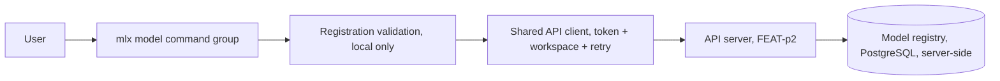
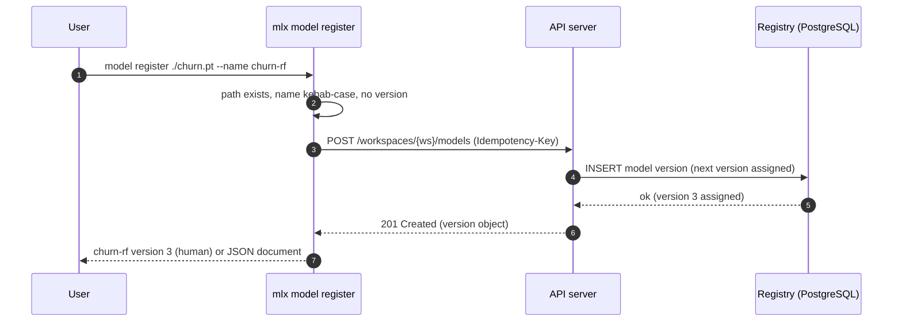
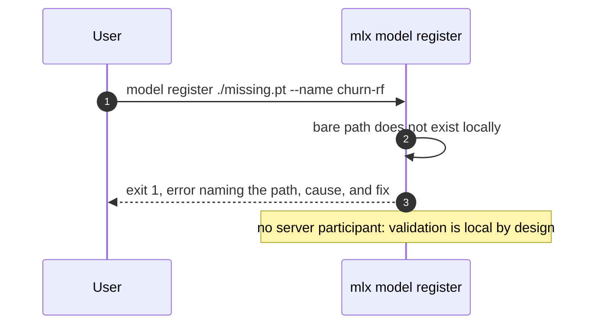
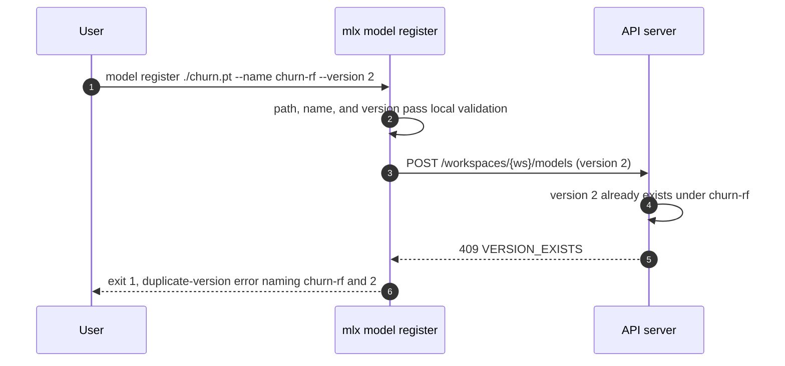
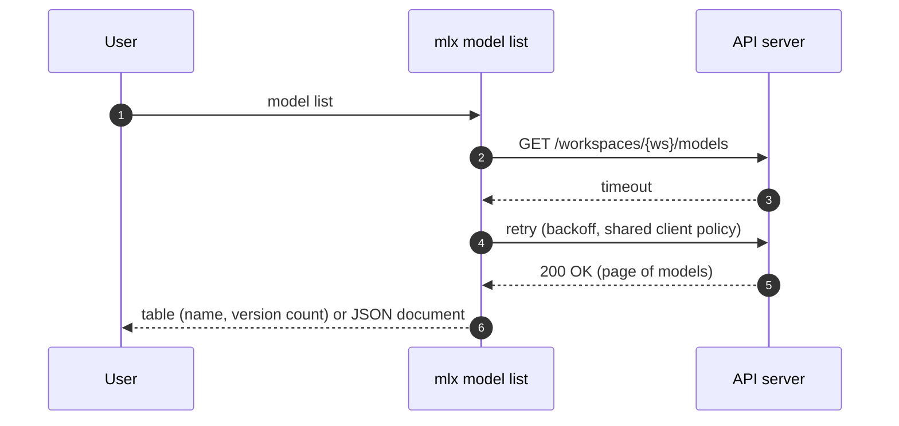
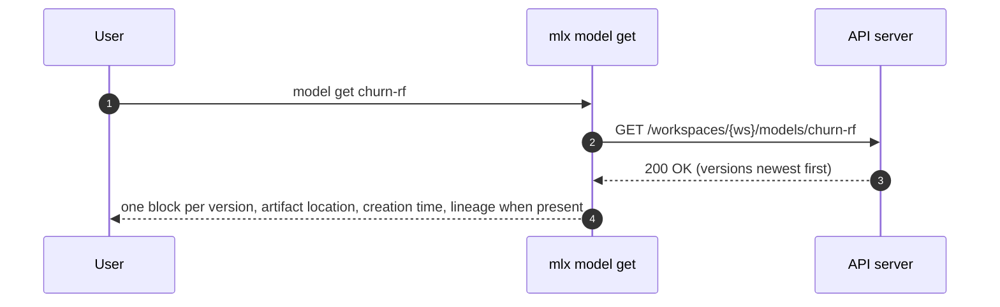

# Specification: mlx model command

## Overview

The `model` group is a cyclopts command group inside the `mlx` CLI package: three subcommands (`register`, `list`, `get`) backed by a local registration-validation module and the shared API client (auth token, workspace scoping, retry) from the FEAT-p1 client core.
The CLI is a pure consumer of the model-registry endpoints owned by the FEAT-p2 contract; this specification fixes the client-side contract view, the registration input rules, and the error and output behavior of each subcommand.

## Architecture

The command group adds no new layers; it composes the FEAT-p1 client core with a model-specific validation module and command handlers.
The registry's artifact bytes live in artifact storage (S3-compatible), and only their locations transit this group's commands.

## Data Models

### Registration input (CLI arguments, owned by this feature)

`model register` takes its input as command arguments, not a spec file.

| Field | Type | Required | Constraints | Description |
|---|---|---|---|---|
| artifact-path | string | Yes | A bare path that exists on the local filesystem, or a URI with a recognized scheme (`s3://`, `gs://`, `file://` in v1; set is a CLI constant, extensible); a bare path that does not exist locally is rejected, and an unrecognized scheme is rejected | Location of the externally trained artifact |
| `--name` | string | Yes | Kebab-case (`^[a-z0-9]+(-[a-z0-9]+)*$`), names a family of versions (uniqueness is per name-and-version pair, confirmed server-side) | Registry model name, reused across versions |
| `--version` | integer | No | Positive integer (`^[1-9][0-9]*$`, a CLI constant in v1); defaults server-side to the next version under the name | Explicit version for the registered artifact |

Validation order is fixed so the first failure is deterministic: artifact path (local existence or scheme), then name pattern, then version format.
Every validation failure exits 1 with an error naming the input and the fix, and no server call is made.
A bare local path is normalized to a `file://` URI before submission, and the CLI prints one stderr note advising that jobs on other machines cannot read a local path.

### Model registry entry (client view; resource owned by FEAT-p2)

| Field | Type | Constraints | Description |
|---|---|---|---|
| name | string | Kebab-case, unique per workspace | Model identity; a family of versions |
| versions | version list | At least one once registered | Versions ordered newest first in responses |

Version object:

| Field | Type | Constraints | Description |
|---|---|---|---|
| version | integer | Server-assigned or client-requested, unique per model | Sequence number under the name |
| artifact_location | string | URI | Where the artifact bytes live |
| created_at | timestamp | Server-assigned | Registration time, rendered per version |
| lineage | object, optional | Present on versions produced by training jobs (FEAT-p2-FR-7); shape owned by FEAT-p2 | Reference to the producing job |

The client tolerates unknown response fields (a future `labels`, for example) and ignores them rather than failing.
The `lineage` field is optional by design: externally registered versions carry none.

## API Contracts

This feature defines no API surface of its own; no `api.yaml` is written.
The normative model-registry contract is owned by FEAT-p2 (`.sdlc/features/p2-api-server/plan/contract.md`, FEAT-p1 CLI mapping table).
The table below is the consumer-side view this feature codes against; if the two drift, the FEAT-p2 document wins.

| Method | Path | Purpose |
|---|---|---|
| POST | `/workspaces/{workspace}/models` | Register an artifact as a new version (creates the model when the name is new; body: name, artifact_location, optional version) |
| GET | `/workspaces/{workspace}/models?cursor=<cursor>` | List models in the workspace (cursor-paginated per FEAT-p2-FR-14) |
| GET | `/workspaces/{workspace}/models/{model}` | Fetch one model with its versions array |

Bearer-token auth, the cursor pagination convention, the error model (code, message, likely cause, suggested fix), and the `Idempotency-Key` header on POST are all inherited from the FEAT-p2 contract conventions and are implemented once in the shared client, not per command.

List pagination behavior: `model list` follows the cursor until exhausted in both human and JSON modes, and the JSON document is then the complete array of model objects.
A typical workspace's registry fits in one page, so the common case is one round trip.

Output behavior (fixed by `spec.md` and the parent output conventions):

In list responses the model object is summarized (name and version count); in get responses the model object carries the full versions array.

- `model list` human mode renders a table of model names and version counts.
- `model get` human mode renders one block per version with its artifact location and creation time, plus a lineage line when the field is present.
- `--json` mode prints a single JSON document: an array of model objects for `list`, and one object with a versions array for `get` (FEAT-p1-FR-12).

Error mapping (server status to CLI behavior; exit codes inherited from the FEAT-p1 plan):

| Status | Server code | CLI behavior |
|---|---|---|
| 400 | INVALID_INPUT | Exit 1, print the server's cause and fix |
| 401 | UNAUTHENTICATED | Exit 2, prompt re-authentication hint |
| 404 | MODEL_NOT_FOUND | Exit 1, error naming the missing model |
| 409 | VERSION_EXISTS | Exit 1, duplicate-version error naming the model and version (FR-2) |
| 5xx or unreachable | any | Retry with backoff (NFR-2), then exit 3 with a clear server-unreachable or server-error message |

## Sequences

### model register (happy path, default version)

### model register (local validation failure, no server call)

### model register (duplicate explicit version)

### model list (transient failure retried)

### model get (versions with lineage)

## Technical Decisions

| Decision | Choice | Rationale |
|---|---|---|
| Contract ownership | No local `api.yaml`; code against the FEAT-p2 contract mapping | One normative source for the model-registry endpoints avoids drift; FEAT-p2 publishes the contract the CLI consumes |
| Input shape | Command arguments, no spec file | The registration input is two or three primitives (`spec.md`); a YAML wrapper would add friction without adding information |
| Bare-path rule | A bare path must exist locally at registration time; URIs are scheme-checked only | Local existence is cheap and catches typos before a server round trip; remote reachability is the server's or nobody's job (matches the dataset posture) |
| Path normalization | Bare local paths submitted as `file://` URIs, with one stderr note about cross-machine readability | Keeps `artifact_location` uniformly a URI; the note prevents the silent footgun of jobs on other machines (OQ2 default) |
| OQ1 default (version scheme) | Integer sequence starting at 1; omitted version means max existing plus 1 | Semver implies compatibility promises the registry cannot verify; monotonic integers match version-count rendering and the spec's "next version" default |
| OQ2 default (local path) | Record the location only; no upload in v1 | The CLI never talks to artifact storage (parent constraint: compute and storage access is server-side); upload would need an FEAT-p2 endpoint that does not exist |
| OQ3 default (lineage display) | Render one lineage line per version when the field is present; omit silently when absent | The inspect response carries lineage for server-registered versions (FEAT-p2-FR-7); presence-optional rendering tolerates both producers |
| Version format constant | Positive-integer regex held as a CLI constant | v1 fixed shape; the error can name the accepted format offline; drift risk tracked below |
| Duplicate version | Surface the server's 409 as the duplicate-version error | (name, version) uniqueness is server-side truth (`spec.md`); the CLI never guesses |
| Output | Human table for `list` and per-version blocks for `get`; single JSON document under the parent's `--json` | Inherited FEAT-p1-FR-12 convention and the `spec.md` output contract |
| Interactive budget | `list` and `get` render in under 500 ms warm (NFR-3); total wall-clock adds one round trip per page | Keeps the inherited performance target measurable while allowing multi-page listings |
| Testing posture | All commands run against the contract-conformant stub; the model argument surface gets pytest coverage (NFR-4) | Matches the parent constraint until the FEAT-p2 server exists |

## Risks and Unknowns

1. The record-only default (OQ2) means artifacts registered from local disks are unreadable by jobs on other machines; the stderr note mitigates, and a server-side upload endpoint would supersede it.
2. The CLI's version-format and scheme constants can drift from the server registry's accepted values; reconcile when the FEAT-p2 model schemas land.
3. The `lineage` shape is owned by FEAT-p2 and not yet published; this feature renders it as an opaque reference line, so a concrete shape change is cosmetic.
4. Registering under a name that training jobs also register to (FEAT-p2-FR-6) can collide on explicit versions; the 409 path covers it, but bump-rule interplay is unverified until the server exists.
5. No server exists yet; every sequence is exercised against a contract-conformant stub (parent assumption 1, `.sdlc/knowledge/assumptions/1-cli-target-server.md`).

## Out of Scope

- Server-side registry storage, version assignment, uniqueness enforcement, pagination, and lineage capture (FEAT-p2).
- Uploading artifact bytes to artifact storage (deferred with the OQ2 default; an FEAT-p2 contract addition would enable it).
- Deleting models or versions (not in the parent command surface).
- Deploying models for online inference (FEAT-p12) and batch inference over a registered model (FEAT-p10); both consume `name:version` references this group produces.
- Training-job auto-registration of final checkpoints (server-side effect of training jobs, FEAT-p2-FR-6).
