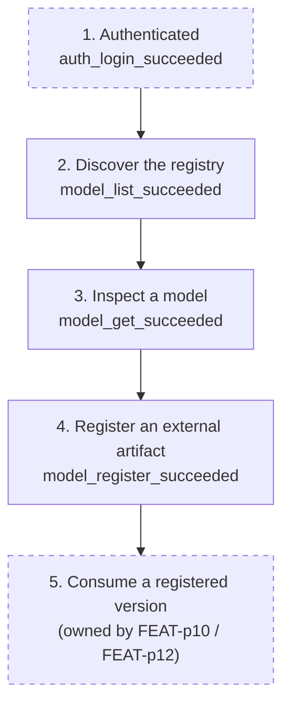

# Telemetry: mlx model command

## Overview

The model registry is the bridge between artifact production (external training captured by `model register`, or server-side training jobs) and consumption (batch inference and deployment referencing `name:version`).
This plan instruments the model group to answer three questions: do users register external artifacts (adoption), do registrations succeed (input ergonomics and version-bump clarity), and do consumers discover registered models before referencing them (registry discoverability feeding the goals.md operation-coverage audit).
Events are anonymous and opt-out per the conventions FEAT-p3 established: no token, no identity, no server URL, and additionally no model names and no artifact paths or locations (they fingerprint an organization's data and filesystems).

## Success Metrics

| Metric | Target | Measurement Method | Timeframe |
|---|---|---|---|
| Time to first register | Median under 1 hour from `cli_first_run` to first `model_register_succeeded` per install_id, among installs that ever register | Funnel over `cli_first_run` and `model_register_succeeded` | First 7 days after each release |
| Register success rate | 95% or higher | `model_register_succeeded` / (`model_register_succeeded` + `model_register_failed`) | Weekly |
| Register failure mix | No single `reason` above 60% of `model_register_failed` | Group `model_register_failed` by `reason` | Weekly |
| Discovery before first consumption | 50% or more of install_ids with a first model-referencing batch or deploy command ran `model list` or `model get` before it | Sequence check per install_id against FEAT-p10 and FEAT-p12 submission events (pending until those events exist) | First 30 days after each release |
| Verification loop closure | 60% or higher of succeeded registers also emit `model_get_succeeded` within 24 hours | Join register and get events per install_id | Weekly |

## User Funnel

Steps 2 through 4 are owned by this feature; steps 1 and 5 are dashed because their marking events belong to FEAT-p3, FEAT-p10, and FEAT-p12.
The funnel models the external-artifact journey, not the only path: training users reach step 5 through steps 2 and 3 only, which the discovery metric captures without requiring funnel ordering.

| Step | Event | Entry Criteria | Exit Criteria |
|---|---|---|---|
| 1. Authenticated | `auth_login_succeeded` (FEAT-p3) | Session stored | The user runs a model command |
| 2. Discover the registry | `model_list_succeeded` | First successful `model list` for the install_id | The user inspects a model or registers |
| 3. Inspect a model | `model_get_succeeded` | First successful `model get` | The user registers or consumes |
| 4. Register an external artifact | `model_register_succeeded` | First accepted registration for the install_id | The user consumes a registered version |
| 5. Consume a registered version | (owned by FEAT-p10 / FEAT-p12) | A batch or deploy command referencing `name:version` | End of funnel (goals.md key result) |

## Analytics Events

All events carry `source: "cli"`, the anonymous `install_id`, and `cli_version`; those shared properties are listed once here and not repeated per event.
No event carries the model name, artifact path or location, lineage job id, workspace identity, or server URL.

### model_register_succeeded

**Trigger:** The server accepts the registration and returns the assigned version.
**Location:** `model register` command handler, after the name and version are rendered.

| Property | Type | Required | Description |
|---|---|---|---|
| version_explicit | boolean | Yes | Whether `--version` was supplied (default-bump adoption signal) |
| was_local_path | boolean | Yes | Whether the artifact path was a bare local path (record-only posture signal, specification OQ2 default) |
| json_mode | boolean | Yes | Whether the command ran with `--json` (FR-12 adoption signal) |
| duration_ms | number | Yes | Wall time from command start to rendered result |

### model_register_failed

**Trigger:** A registration attempt ends without an assigned version.
**Location:** `model register` error paths.

| Property | Type | Required | Description |
|---|---|---|---|
| reason | string | Yes | `usage` (local validation, exit 1), `duplicate-version` (409, exit 1), `auth` (exit 2), `unreachable` or `server` (exit 3) |
| stage | string | Yes | `local-validation` or `submit` (where the attempt stopped) |
| duration_ms | number | Yes | Wall time from command start to failure |

### model_list_succeeded

**Trigger:** A listing renders successfully (including an empty listing).
**Location:** `model list` command handler, after rendering.

| Property | Type | Required | Description |
|---|---|---|---|
| result_count | number | Yes | Models rendered after cursor-following to exhaustion (0 for an empty registry) |
| pages_fetched | number | Yes | Cursor pages fetched to exhaustion (transparency check on the listing model) |
| json_mode | boolean | Yes | Whether the command ran with `--json` |
| duration_ms | number | Yes | Wall time of the command |

### model_list_failed

**Trigger:** A listing attempt ends without rendering.
**Location:** `model list` error paths.

| Property | Type | Required | Description |
|---|---|---|---|
| reason | string | Yes | `auth`, `unreachable`, or `server` (maps to exit codes 2, 3, 3) |
| duration_ms | number | Yes | Wall time from command start to failure |

### model_get_succeeded

**Trigger:** One model's versions render successfully.
**Location:** `model get` command handler, after rendering.

| Property | Type | Required | Description |
|---|---|---|
| version_count | number | Yes | Versions rendered for the model |
| had_lineage | boolean | Yes | Whether any rendered version carried the lineage field (mixed-producer registry signal) |
| json_mode | boolean | Yes | Whether the command ran with `--json` |
| duration_ms | number | Yes | Wall time of the command |

### model_get_failed

**Trigger:** An inspection attempt ends without rendering.
**Location:** `model get` error paths.

| Property | Type | Required | Description |
|---|---|---|---|
| reason | string | Yes | `unknown-model` (404, exit 1), `auth` (exit 2), `unreachable` or `server` (exit 3) |
| duration_ms | number | Yes | Wall time from command start to failure |

## Counter Metrics

| Metric | Concern | Threshold |
|---|---|---|
| Local-validation share of register failures | Input ergonomics: users repeatedly failing path, name, or version checks (NFR-1 message quality) | Above 30% of `model_register_failed` in a week |
| Duplicate-version share of register attempts | Bump-rule confusion: explicit versions colliding with existing ones (OQ1 interplay) | Above 20% of register attempts in a week |
| Local-path share of successful registers | Record-only posture strain: artifacts unreadable cross-machine (OQ2 default) | Above 50% sustained over two weeks |
| Unknown-model share of `model get` runs | Discoverability: users guessing names that do not exist | Above 20% in a week |

## Telemetry Requirements

| Requirement | Type | Notes |
|---|---|---|
| Reuse FEAT-p3 telemetry infrastructure | Infrastructure | Same opt-out gate (`MLX_TELEMETRY=off` or config), same local-file buffer, same deferred destination decision; no new pipeline for this group |
| Anonymous by construction | Event | The model events list no model names and no artifact paths or locations; redaction happens before events form, so the structlog family is not even needed here |
| Bounded properties | Event | All properties are primitives (string, number, boolean); no arrays or nested objects, so events stay queryable |
| Reason values map to exit codes | Event | `usage`, `duplicate-version`, `unknown-model` (exit 1), `auth` (exit 2), `unreachable`, `server` (exit 3), matching the specification's error mapping |

## Dashboards and Alerts

- **Dashboard:** "Model registry" (to be created when a destination exists): funnel (`model_list_succeeded` to `model_register_succeeded`), register success rate and failure mix by reason, discovery-before-consumption share, verification loop closure, local-path share.
- **Alerts:** local-validation share above 30% for a week (input ergonomics regression); duplicate-version share above 20% for a week (bump-rule confusion); local-path share above 50% sustained two weeks (record-only posture straining, raise the upload-endpoint question with FEAT-p2).

## Out of Scope

- Server-side registry metrics (registration latency, storage usage, lineage capture): FEAT-p2's observability scope.
- Consumption-side attribution (which models batch and deploy jobs reference): owned by FEAT-p10 and FEAT-p12; model names stay out of this group's events.
- Per-model or per-workspace analytics (fingerprinting risk, no decision needs them yet).
- Cross-machine or cross-user correlation: install_id is per machine, inherited from FEAT-p3's design.
- Any telemetry without the FEAT-p3 opt-out gate, or carrying token, identity, server URL, model names, or artifact paths.
