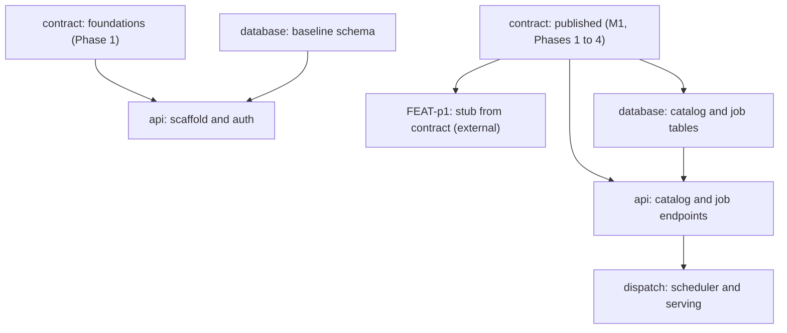

# Implementation Plan: API Server

## Goal

Deliver the API server (FEAT-p2): the central component that processes and dispatches user requests, makes placement decisions, and backs every FEAT-p1 CLI command.
The plan is split by concern: the API contract (OpenAPI 3 plus proto), the FastAPI/gRPC server, the PostgreSQL persistence layer, and the dispatch layer that places work on Kubernetes.
The contract lands first so FEAT-p1 can code against it with a contract-conformant stub, closing assumption 1.

## Concerns

| Concern | Plan | Owner |
|---|---|---|
| contract | [plan/contract.md](contract.md) | ml-platform implementors |
| api | [plan/api.md](api.md) | ml-platform implementors |
| database | [plan/database.md](database.md) | ml-platform implementors |
| dispatch | [plan/dispatch.md](dispatch.md) | ml-platform implementors |

## Milestones

| Milestone | Concern | Phase | Success Criteria |
|---|---|---|---|
| M1: Contract published | contract | Phases 1 to 4 | OpenAPI 3 document and protos cover all five operation families; the FEAT-p1 stub builds from them (FR-1) |
| M2: Server skeleton serves auth | api, database | api Phase 2, database Phase 1 | Token auth, users/me, and workspace scoping enforced against PostgreSQL (FR-2, FR-3, FR-12) |
| M3: Catalog CRUD live | api, database | api Phase 3, database Phase 2 | Datasets, secrets, compute types, experiments, and models endpoints pass contract tests (FR-7, FR-14) |
| M4: Jobs submit and observable | api, database, dispatch | api Phases 4 and 5, database Phase 3, dispatch Phases 1 and 2 | Jobs submit with idempotency, dispatch to k8s, stream logs, and survive restart (FR-4, FR-10, FR-11, NFR-2) |
| M5: Training and serving live | dispatch, database | dispatch Phases 3 to 5, database Phase 4 | Training jobs register models, batch jobs complete, deployments serve and stop (FR-5, FR-6, FR-8, FR-9) |
| M6: v1 operable | all | api Phase 6, database Phase 5 | NFR gates green: hashed tokens, request ids in logs, p95 latency, four toolchain gates (NFR-1 to NFR-5) |

## Cross-Concern Dependencies

| Dependency | Type | Owner | Risk if Delayed |
|---|---|---|---|
| FEAT-p1 consumes the published contract for its stub | External | FEAT-p1 implementors | Delays FEAT-p1 Phase 2; both plans idle |
| Artifact and checkpoint storage backend decision (open question 1) | External | ml-platform implementors | Blocks dispatch training integration |
| Token issuance decision (open question 2) | External | ml-platform implementors | Blocks api auth phase |
| Cloud provider decision (open question 3) | External | ml-platform implementors | Blocks real dispatch targets; the fake backend mitigates |
| k8s environment (kind cluster) for integration tests | Internal | ml-platform implementors | Dispatch phases test against the fake backend only |

## Risk Register

| Risk | Likelihood | Impact | Mitigation |
|---|---|---|---|
| Five requirements open questions unresolved at implementation start (storage backend, token issuance, cloud provider, REST vs gRPC scope, idempotency) | High | High | Resolve all five during specifications; the contract phases encode each decision |
| Placement and dispatch to Kubernetes is the largest implementation risk (per requirements review, FR-11) | Med | High | Compute backend abstraction with a fake; k8s-only target in v1; early spike in dispatch Phase 2 |
| Dual REST plus gRPC surface doubles contract and server maintenance | Med | Med | REST covers everything in v1; gRPC limited to log streaming (open question 4 leaning) |
| Long-lived log streams break through proxies and ingress | Med | Med | SSE with heartbeat for REST; gRPC streaming fallback; validate against a real ingress in CI |
| PostgreSQL schema churn while the FEAT-p1 contract stabilizes | Med | Low | Migrations from day one; the contract document is the source of truth for resources |
| No Kubernetes environment available for integration testing | Med | Med | kind cluster in GHA; fake backend for unit-level dispatch tests |

## Assumptions

- The OpenAPI 3 contract alone is sufficient input for the FEAT-p1 contract-conformant stub (assumption 2).
- A single PostgreSQL instance with migrations suffices for v1 scale.
- Kubernetes is the only dispatch target in v1; the cloud provider choice stays deferred behind the compute backend interface (assumption 3).

## Timeline

No calendar committed yet (team capacity unknown); duration-only.

| Concern | Phases | Duration |
|---|---|---|
| contract | 4 phases | 10 days |
| api | 6 phases | 18 days |
| database | 5 phases | 11 days |
| dispatch | 5 phases | 17 days |
| Total (contract first, api and database in parallel, dispatch overlapping api Phase 5) | | ~40 working days |
