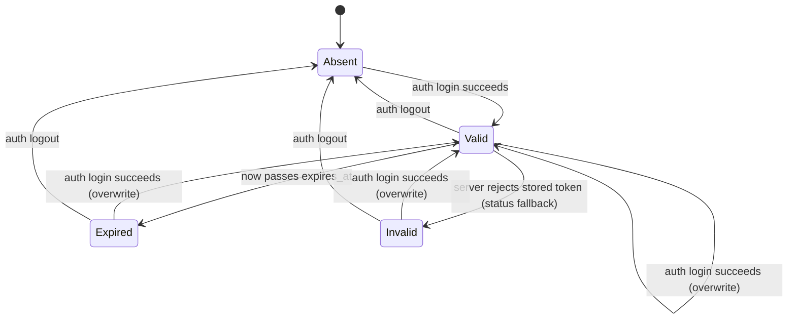

# Lifecycle: mlx auth command

## Overview

The auth group manages one resource with a meaningful lifecycle: the stored session (the `[auth]` section of the active profile's config file).
Its lifecycle matters because every other command group consumes it through session resolution, and its validity rules (expiry honored locally, rejection detected via the server) decide whether operations proceed or the user is sent back to `auth login`.

## Resources

| Resource | Description | Lifecycle Type | Spec Ref |
|---|---|---|---|
| Stored session | Token, cached identity, and optional expiry persisted in the active profile's config file | State Machine | specification.md, Data Models |

## State Diagrams

### Stored session

## States

### Stored session

Valid, Expired, and Invalid are derived at read time from the stored `expires_at` and the latest validation outcome; only login and logout mutate the stored data (see Invariants).

| State | Description | Entry Condition | Exit Condition | Spec Ref |
|---|---|---|---|---|
| Absent | No `[auth]` section; the profile has at most a server URL | Initial state, or `auth logout` from any state | `auth login` succeeds | specification.md, Sequences (Logout) |
| Valid | `[auth]` present and acceptable: `expires_at` absent, or `now` before it | `auth login` stores the session | Timer passes `expires_at`, the server rejects the token, re-login, or logout | specification.md, Sequences (Login) |
| Expired | `[auth]` present and `now` at or past `expires_at` | Time passes the stored expiry | Re-login or logout; no refresh path in v1 | FR-8; specification.md, Technical Decisions |
| Invalid | `[auth]` present but the server rejected the stored token on the status fallback round trip | Status round trip (no `expires_at`) returns not valid | Re-login or logout; storage is not mutated by status | specification.md, Sequences (Status) |

## Transitions

### Stored session

| From | To | Trigger | Actor | Side Effects | Guard Conditions | Spec Ref |
|---|---|---|---|---|---|---|
| Absent | Valid | `auth login` validation returns valid | User | Atomic write of token, expiry, cached identity; mode set user-only; success line (or JSON document) | Non-empty token; http(s) server URL; server reachable; token accepted | FR-1; specification.md, Sequences (Login) |
| Absent | Absent | Login rejected (exit 2), unreachable (exit 3), or usage error (exit 1) | User or system | Nothing stored; error plus hint | None | FR-2, FR-3, FR-7 |
| Valid | Valid | `auth login` succeeds while already logged in (token rotation) | User | Atomic overwrite of token, expiry, cached identity | Same guards as Absent to Valid | specification.md, Data Models |
| Valid | Absent | `auth logout` | User | `[auth]` removed; `[server]` kept | None (idempotent; Absent stays Absent) | FR-4 |
| Valid | Expired | Wall-clock time passes `expires_at` | System (timer) | None until next read; next read reports invalid session | `expires_at` present | FR-8 |
| Valid | Invalid | Status fallback round trip rejects the stored token | System | None; status reports invalid without mutating storage | `expires_at` absent | FR-5; specification.md, Sequences (Status) |
| Expired | Valid | Re-login succeeds | User | Overwrites token, expiry, identity in one atomic write | Same guards as Absent to Valid | specification.md, Data Models |
| Invalid | Valid | Re-login succeeds | User | Same overwrite as above | Same guards | specification.md, Data Models |
| Expired, Invalid | Absent | `auth logout` | User | Same cleanup as Valid to Absent | None | FR-4 |

## Invariants

| Resource | Invariant | Enforced By | Violation Handling |
|---|---|---|---|
| Stored session | Only `auth login` and `auth logout` write the `[auth]` section; `auth status` and every other command are read-only on it | Credential store API exposes write paths only to login and logout | Code review and store unit tests; a violating call site fails review |
| Stored session | The token never appears in logs, output, or JSON documents | structlog redaction processor plus output tests (NFR-1) | Test failure blocks merge |
| Stored session | `server.url` survives logout | Logout implementation removes only `[auth]` | Store unit test asserting `[server]` intact after logout |
| Stored session | The config file mode is user-only after every write | Store re-asserts mode on each atomic write (0600 or ACL) | Store unit test fails on relaxed mode |
| Stored session | A session is never reported valid once `now` is past `expires_at` | Read-time validity check | Status unit tests with frozen clock |

## Retention and Expiry

| Resource | Retention Policy | Expiry Trigger | Cleanup Action | Spec Ref |
|---|---|---|---|---|
| Stored session | Persists until `auth logout`; no time-based retention | Server-reported `expires_at` passing (local), or server rejection detected (fallback round trip) | `auth logout` removes only the `[auth]` keys; the profile file and `[server]` section are kept | FR-4, FR-8 |

## Event Emissions

The CLI emits no cross-system events in v1; the observable surface is the commands' own output and exit codes.
Product analytics events (opt-out, no token, no identity fields) are specified in telemetry.md and align with these transitions.

| Transition | Event | Payload | Consumer | Spec Ref |
|---|---|---|---|---|
| Absent -> Valid | `auth_login_succeeded` | install_id, profile_type, has_expiry, duration_ms | Product analytics (opt-out) | telemetry.md |
| no state change (login attempt fails) | `auth_login_failed` | install_id, reason (usage, rejected, unreachable) | Product analytics (opt-out) | telemetry.md |
| Valid/Expired/Invalid -> Absent | `auth_logout_succeeded` | install_id, profile_type | Product analytics (opt-out) | telemetry.md |
| any read | `auth_status_reported` | install_id, validity, checked_via (local, server) | Product analytics (opt-out) | telemetry.md |

## Out of Scope

- The profile config file as a resource (profile creation, naming, `[server]` management beyond auth's writes); owned by FEAT-p1 FR-16.
- Server-side token lifecycle: issuance, revocation, and expiry enforcement (owned by FEAT-p2 FR-13).
- Refresh or silent re-authentication flows (requirements Open Question 1); every Expired or Invalid recovery goes through an explicit `auth login`.
- Multiple concurrent sessions per profile; one stored session per profile file.
