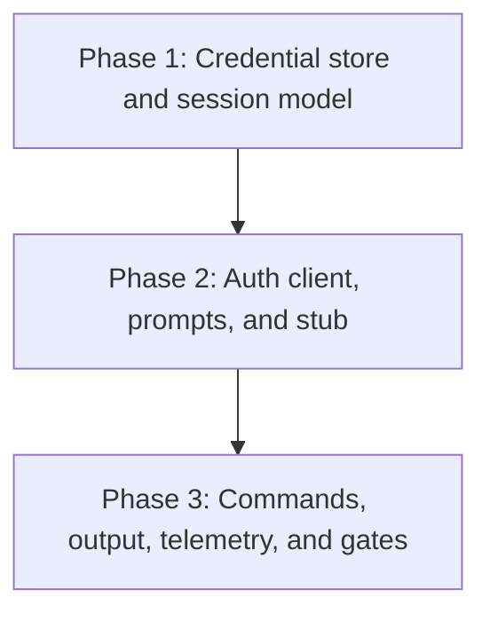

# Implementation Plan: mlx auth command

## Goal

Deliver the `mlx auth` command group (`login`, `logout`, `status`) per specification.md, including the credential store, the auth client with retry, the prompt layer, and the session-resolution seam every other command group consumes.
This plan is the auth slice of FEAT-p1 Phase 2 (client core); the command surface itself is settled in cli-design.md and is not restated here.
Plan structure: unified (`plan.md`), chosen per the create-plan skill's non-interactive default; the feature is one cohesive client-side concern, too small to split.

## Phases

### Phase 1: Credential store and session model

**Goal:** The stored-session state machine (lifecycle.md) is implemented and testable without any server.
**Effort:** 1 person-day
**Depends on:** None (lands inside FEAT-p1 Phase 2)

**Deliverables:**
- [ ] Platform config directory resolution (Linux, macOS, Windows) and `profiles/<name>.toml` read/write (specification.md, Data Models)
- [ ] `AuthSession` model with read-time validity derivation (valid, expired, invalid, absent) per lifecycle.md states
- [ ] Atomic write (temp file plus rename) with user-only mode set before content is written (0600 or ACL)
- [ ] Lifecycle invariants as unit tests: only login and logout mutate `[auth]`; `server.url` survives logout; mode re-asserted on every write; overwrite-on-relogin semantics
- [ ] `config_version` handling: ignore unknown keys, named error on newer versions

### Phase 2: Auth client, prompts, and stub

**Goal:** Tokens validate end to end against the contract stub, interactively and non-interactively.
**Effort:** 1 person-day
**Depends on:** Phase 1

**Deliverables:**
- [ ] `AuthClient` against the validation endpoint (expected `POST /auth/tokens/validate`), behind an interface so contract drift is a one-file change
- [ ] Retry with backoff (0.5s, 1s, 2s, jittered, 3 attempts total) on connection errors and 5xx only; no retry on 401 (FR-7)
- [ ] Masked token prompt (getpass-style), server prompt, TTY detection; non-interactive missing input exits 1 naming the flag (cli-design.md, Interactive Behavior)
- [ ] Contract-stub extension covering 200 (with and without expiry), 401, and unreachable behavior, reconciled with FEAT-p2's `api.yaml` when it lands

### Phase 3: Commands, output, telemetry, and gates

**Goal:** All auth acceptance criteria pass and the toolchain gates are green.
**Effort:** 1 person-day
**Depends on:** Phase 2

**Deliverables:**
- [ ] `auth login|logout|status` wired through cyclopts with per-command help (NFR-1, cli-design.md Help Text)
- [ ] Exit code mapping (1 usage, 2 rejected or no valid session, 3 unreachable) and `error:` plus `hint:` message format (FR-7, NFR-3)
- [ ] Human and `--json` output modes for all three commands; token never in any output (NFR-1)
- [ ] structlog redaction processor masking any `token` field on stderr (specification.md, Technical Decisions)
- [ ] Telemetry per telemetry.md: `cli_first_run`, `auth_login_succeeded`, `auth_login_failed`, `auth_logout_succeeded`, `auth_status_reported`, behind opt-out (`MLX_TELEMETRY=off` or config) with the local buffer only
- [ ] pytest coverage of the argument surface plus gherkin-derived scenarios for every FR and NFR acceptance criterion (NFR-6)

## Phase Dependencies

Strictly linear: each phase's tests are the next phase's fixtures.

## Milestones

| Milestone | Phase | Success Criteria |
|---|---|---|
| M1: Store solid | Phase 1 | Lifecycle invariants and store unit tests green with no server involved |
| M2: Round trip | Phase 2 | Interactive and non-interactive login succeed against the stub; 401 and unreachable paths exit 2 and 3 |
| M3: Feature done | Phase 3 | All requirements.md acceptance criteria pass; ruff, format, ty, and pytest gates green |

## Dependencies

| Dependency | Type | Owner | Risk if Delayed |
|---|---|---|---|
| FEAT-p1 Phase 1 scaffold (package, entry point, config, profiles) | Internal | FEAT-p1 implementors | Blocks Phase 1 here; auth builds on the profile machinery |
| FEAT-p1 Phase 2 budget re-baseline (this slice needs ~3 of its currently budgeted 4 person-days) | Internal | FEAT-p1 plan owner | Without reconciliation, auth competes with the workspace, user, member, JSON-mode, and stub work in the same phase; escalate before implementation starts |
| Validation endpoint contract (FEAT-p2 `api.yaml`) | External | FEAT-p2 implementors | Phase 2 codes against the expected shape; drift means rework confined to `AuthClient` and the stub |
| Telemetry destination decision (telemetry.md open question) | External | Platform maintainers | Non-blocking: events buffer locally, nothing is sent |

## Risk Register

| Risk | Likelihood | Impact | Mitigation |
|---|---|---|---|
| FEAT-p2 contract drift on the validation endpoint (specified concurrently) | High | Medium | Client behind an interface; stub mirrors the expected shape; reconcile with FEAT-p2's `api.yaml` before M2 |
| No Windows host to verify ACL restriction and prompt behavior | Medium | Low | Permission tests marked for a Windows CI matrix; document manual verification otherwise |
| Status fallback round trip (no stored expiry) exceeds user expectation of a fast status | Medium | Low | Budget scoped in NFR-4; watch `auth_status_reported.duration_ms` p95 counter metric |
| getpass edge cases across terminals (no echo, cancel via Ctrl-D) | Low | Low | Prompt layer isolated in Phase 2 with its own tests; treat Ctrl-D as empty input (exit 1) |

## Assumptions

- FEAT-p1 Phase 1 (scaffold, profiles, config) lands before Phase 1 here starts.
- The validation endpoint returns an identity and optionally an expiry (specification.md, consumed contract); FEAT-p1 assumption 1 (`.sdlc/knowledge/assumptions/1-cli-target-server.md`) already tracks the stub-versus-server question.
- Promotion of these assumptions into `.sdlc/knowledge/` records is outside this run's write scope (feature directory only); if the pipeline owner wants them formalized, run `/create-assumption` after this run.

## Timeline

No calendar committed (team capacity unknown); duration-only.

| Phase | Duration |
|---|---|
| Phase 1: Credential store and session model | 1 day |
| Phase 2: Auth client, prompts, and stub | 1 day |
| Phase 3: Commands, output, telemetry, and gates | 1 day |
| Total | ~3 working days |

Budget tension, not a fit: FEAT-p1 Phase 2 budgets 4 person-days for the whole client core, and this slice alone needs ~3 of them once the concurrently planned sibling command groups are counted.
The FEAT-p1 plan owner must re-baseline Phase 2 (or descope, with telemetry instrumentation the first candidate to defer) before implementation starts.
