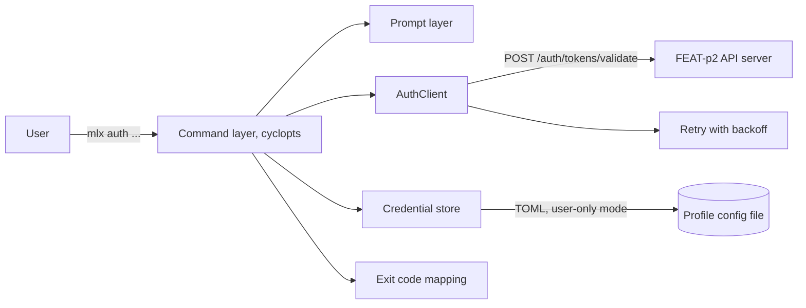
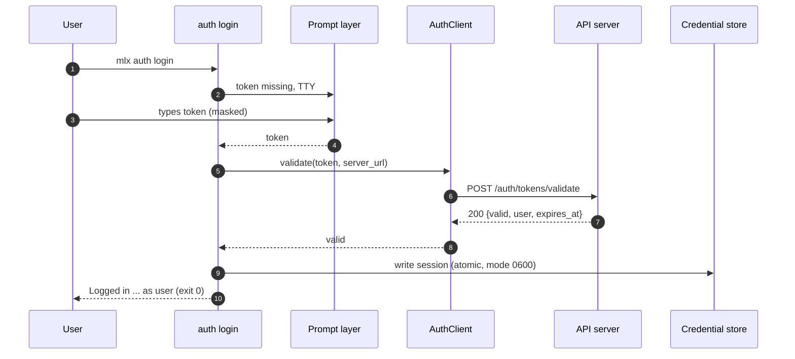
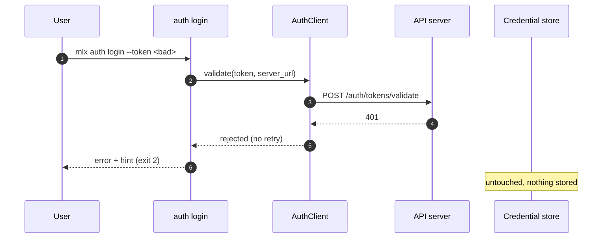
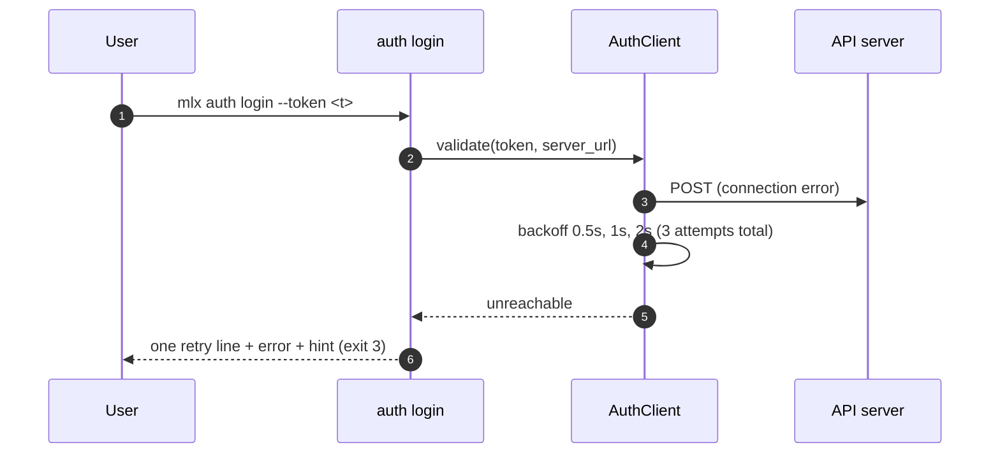
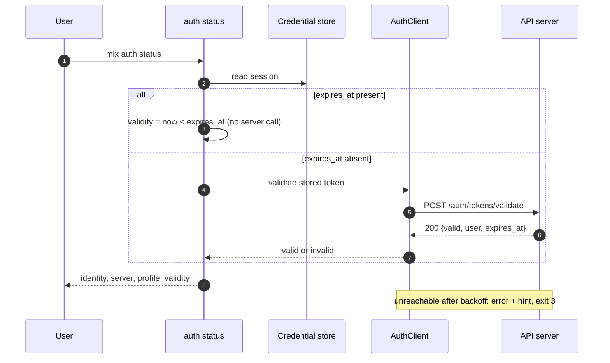
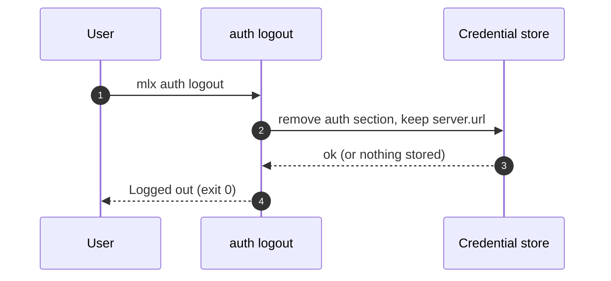

# Specification: mlx auth command

## Overview

The `mlx auth` group is a client-side feature built on cyclopts: a command layer (`login`, `logout`, `status`), a credential store backed by the active profile's config file, an auth client that validates tokens against the FEAT-p2 API server, and a prompt layer for interactive input.
The design goal is a session-resolution seam the rest of the CLI codes against: one module owns reading, validating, and clearing the stored session, so no other command group touches credentials directly.

## Architecture

| Component | Responsibility |
|---|---|
| Command layer | Argument parsing, prompt orchestration, output rendering (human and `--json`), exit codes |
| Prompt layer | Masked token prompt (getpass-style, no echo), server URL prompt, TTY detection; fails fast with a usage error when not a TTY |
| AuthClient | Validates a token against the server, with retry-with-backoff on transient failures and no retry on rejection |
| Credential store | Atomic read/write of the profile config file, user-only file mode, TOML forward compatibility |
| Session resolution | Shared helper returning the stored session for any command group (the FEAT-p1 Phase 2 seam) |

## Data Models

### Stored session (profile config file)

Path: `<platform-config-dir>/mlx/profiles/<name>.toml`, created with mode 0600 (POSIX) or ACL-restricted (Windows).

| Field | Type | Constraints | Description |
|---|---|---|---|
| config_version | integer | >= 1, default 1 | Config schema version for additive evolution |
| server.url | http(s) URL | not null once set | API server base URL; survives logout |
| auth.token | string | not null when logged in | The secret; never rendered, logged, or printed |
| auth.expires_at | RFC 3339 timestamp | nullable | Server-reported expiry; absent means unknown |
| auth.user.email | email string | not null when logged in | Cached identity from the validation response |
| auth.user.display_name | string | nullable | Optional cached display name |

A successful login overwrites any existing stored session for the profile (re-login replaces token, expiry, and cached identity in one write).

### Validation response (consumed; owned by FEAT-p2)

| Field | Type | Constraints | Description |
|---|---|---|---|
| valid | boolean | not null | Whether the token is accepted |
| user.email | email string | present when valid | Authenticated identity |
| user.display_name | string | nullable | Optional display name |
| expires_at | RFC 3339 timestamp | nullable | Token expiry the CLI honors (FR-8) |

Forward compatibility: the CLI ignores fields it does not recognize in the validation response and in the config file, and treats unrecognized `config_version` values greater than its own as a usage error naming the newer profile.
Additive keys are the only allowed evolution inside `config_version` 1.

### In-memory model

`AuthSession` dataclass: `server_url`, `token`, `expires_at`, `user`; passed between layers and never logged (a structlog redaction processor masks any field named `token`).

## API Contracts

This feature defines no API surface; `api.yaml` is therefore not written here.
The group consumes the token-validation endpoint of the FEAT-p2 contract, whose normative definition lives with FEAT-p2 (`api.yaml` there).

| Method | Path (expected) | Purpose |
|---|---|---|
| POST | /auth/tokens/validate | Validate the bearer token, return identity and expiry |

Error codes consumed:

| Status | Meaning in auth terms | CLI behavior |
|---|---|---|
| 200 | Token valid | Store session, exit 0 |
| 401 | Credentials rejected | No retry, exit 2 |
| 5xx / connection error | Transient or unreachable | Retry with backoff, then exit 3 |

The exact path and schema are a tracked dependency (Risks and Unknowns 1); the stub used by tests mirrors whatever FEAT-p2 settles on.

## Sequences

### Login (interactive happy path)

### Login (rejected credentials)

### Login (unreachable server)

### Status (local-first validity with round-trip fallback)

### Logout

## Technical Decisions

| Decision | Choice | Rationale |
|---|---|---|
| Status is local-first with round-trip fallback | Validity from stored expiry when present; otherwise one validation round trip (exit 3 when unreachable) | Satisfies FR-5 in every case while keeping the common path inside NFR-4's budget; the round-trip fallback is the path cli-design's unreachable error table already describes |
| Identity cached at login | `auth.user` written by `login`, read by `status` | `status` renders without a round trip; identity refreshes on next login |
| Storage medium | TOML file per profile, atomic write (temp file plus rename), mode set before content is written | No new dependency; matches FEAT-p1's profile config; atomicity avoids torn files; keyring rejected as v1 scope |
| Retry policy | 3 attempts total, exponential backoff 0.5s/1s/2s with jitter, only on connection errors and 5xx | Satisfies FEAT-p1-NFR-2 while never retrying a 401 rejection (FR-7) |
| Logging | structlog to stderr with a redaction processor masking any `token` field | Satisfies NFR-1 by construction rather than by convention |
| Non-interactive input | Missing token or server without a TTY is a usage error (exit 1) naming the flag | Scripts and CI fail fast instead of hanging on a prompt |

## Risks and Unknowns

1. The FEAT-p2 validation endpoint (path, schema, error codes) is being specified concurrently; the stub and this client must be reconciled against its final `api.yaml` before FEAT-p1 Phase 2 lands.
2. When the server reports no expiry, every `auth status` pays a round trip (outside NFR-4's budget); behavior on the first operation after a server-side revocation is untested territory until refresh lands (requirements OQ 1).
3. Windows ACL restriction needs a real Windows host to verify; POSIX modes are covered by tests.

## Out of Scope

- Defining the server-side API contract (owned by FEAT-p2; no `api.yaml` here).
- Token issuance, revocation, and refresh flows (FEAT-p2 FR-13 and requirements OQ 1).
- SSO, mTLS, browser device flows, and the `MLX_TOKEN` environment variable (requirements OQ 3).
- Profile management beyond writing auth fields (FEAT-p1 FR-16).
