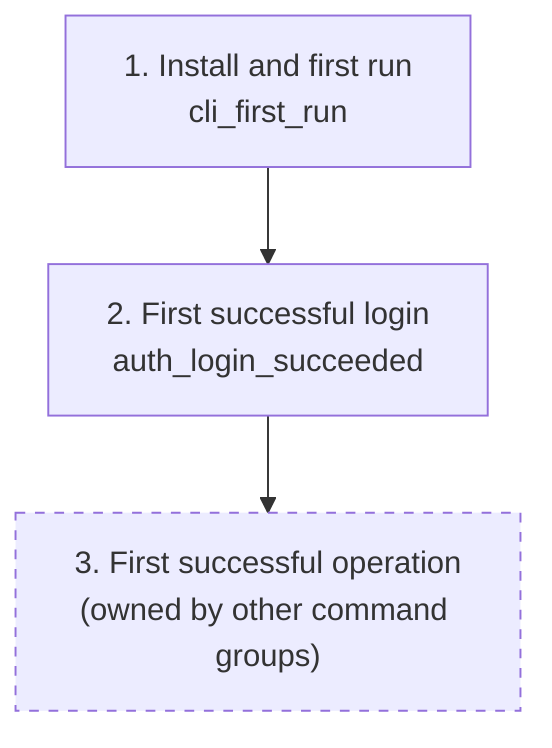

# Telemetry: mlx auth command

## Overview

Auth is the gate to every operation, so it is where platform onboarding is won or lost: goals.md's key result "under 1 hour from install to first successful task" is measured from first run through first successful login.
This plan instruments the auth flows with anonymous, opt-out events (no token, no identity, no server URL) and defines the login health metrics that detect reachability problems and error-message failures early.

## Success Metrics

| Metric | Target | Measurement Method | Timeframe |
|---|---|---|---|
| Time to first login | Median under 10 minutes from `cli_first_run` to first `auth_login_succeeded` per install_id | Funnel over `cli_first_run` and `auth_login_succeeded` | First 7 days after each release |
| Login success rate | 95% or higher | `auth_login_succeeded` / (`auth_login_succeeded` + `auth_login_failed`) | Weekly |
| Login failure mix | No single `reason` above 60% of `auth_login_failed` | Group `auth_login_failed` by `reason` | Weekly |
| Session health | Under 20% of `auth_status_reported` with `validity` in (expired, invalid) | Group `auth_status_reported` by `validity` | Weekly |

## User Funnel

Steps 1 and 2 are owned by this feature; step 3 is dashed because its marking event belongs to the operation command groups.

| Step | Event | Entry Criteria | Exit Criteria |
|---|---|---|---|
| 1. Install and first run | `cli_first_run` | The CLI creates a fresh install_id at first run | The user attempts or completes a login |
| 2. First successful login | `auth_login_succeeded` | First `auth_login_succeeded` for the install_id | The user runs any operation command |
| 3. First successful operation | (owned by other command groups) | A successful operation command | End of funnel (goals.md key result) |

## Analytics Events

All events carry `source: "cli"`, the anonymous `install_id`, and the CLI version (`cli_version`); those shared properties are listed once here and not repeated per event.
No event carries the token, user identity (email or name), the server URL, or the profile name.

### cli_first_run

**Trigger:** First run of the CLI on a machine (install_id created).
**Location:** Session resolution bootstrap, before any command executes.

| Property | Type | Required | Description |
|---|---|---|---|
| source | string | Yes | Always `cli` |
| install_id | string | Yes | Random UUID v4 generated once, stored in the user-only config directory |
| cli_version | string | Yes | Semver of the installed CLI |

### auth_login_succeeded

**Trigger:** The server accepts the token and the session is stored.
**Location:** `auth login` command handler, after the atomic write.

| Property | Type | Required | Description |
|---|---|---|---|
| profile_type | string | Yes | `default` or `named` (profile name never included) |
| has_expiry | boolean | Yes | Whether the server reported an expiry |
| duration_ms | number | Yes | Wall time from command start to stored session |
| prompt_used | boolean | Yes | Whether the token came from the masked prompt (vs `--token`) |

### auth_login_failed

**Trigger:** A login attempt ends without storing a session.
**Location:** `auth login` error paths.

| Property | Type | Required | Description |
|---|---|---|---|
| reason | string | Yes | `usage`, `rejected`, or `unreachable` (maps to exit codes 1, 2, 3) |
| duration_ms | number | Yes | Wall time from command start to failure |

### auth_logout_succeeded

**Trigger:** Logout completes (including the nothing-stored case).
**Location:** `auth logout` command handler.

| Property | Type | Required | Description |
|---|---|---|---|
| profile_type | string | Yes | `default` or `named` |

### auth_status_reported

**Trigger:** `auth status` finishes rendering its report.
**Location:** `auth status` command handler.

| Property | Type | Required | Description |
|---|---|---|---|
| validity | string | Yes | `valid`, `expired`, `invalid`, or `absent` |
| checked_via | string | Yes | `local` (stored expiry) or `server` (fallback round trip) |
| duration_ms | number | Yes | Wall time of the command (feeds the NFR-4 budget watch) |

## Counter Metrics

| Metric | Concern | Threshold |
|---|---|---|
| Unreachable share of login attempts | Server reachability or wrong server URL stored in profiles | Above 5% of attempts in a week |
| Usage-error share of login failures | Error messages or prompts not self-explanatory (NFR-1, NFR-3) | Above 20% of `auth_login_failed` in a week |
| Status duration p95 | NFR-4 budget erosion on the local path | Above 400 ms trending over a week |

## Telemetry Requirements

| Requirement | Type | Notes |
|---|---|---|
| Anonymous install_id (UUID v4, user-only file) | Event | Generated once at first run; the join key for onboarding funnels |
| Opt-out before first emission | Infrastructure | `MLX_TELEMETRY=off` env var or `telemetry.enabled = false` in the config file; checked before any event leaves the process |
| Local buffer, deferred destination | Infrastructure | Events append to a local file when telemetry is enabled; no network destination is decided yet, so nothing is sent until one is chosen (the destination decision is tracked in this run's review findings) |
| Redaction by construction | Event | The token and identity fields never enter the event pipeline (NFR-1); enforced by the same structlog redaction processor family as the logs |

## Dashboards and Alerts

- **Dashboard:** "Auth and onboarding" (to be created when a destination exists): funnel `cli_first_run` to `auth_login_succeeded`, login success rate, failure mix by reason, session health, status duration p95.
- **Alerts:** unreachable share above 5% for a week (possible server-side incident); usage-error share above 20% (error message regression).

## Out of Scope

- Server-side authentication metrics (FEAT-p2's observability scope: request rates, 401 rates, latency).
- Operation-level onboarding events beyond the dashed funnel step (owned by the operation command groups).
- Session-level user tracking: no user identity, no cross-machine correlation; install_id is per machine.
- Any telemetry that is on by default with no opt-out, or that includes token, identity, or server URL fields.
