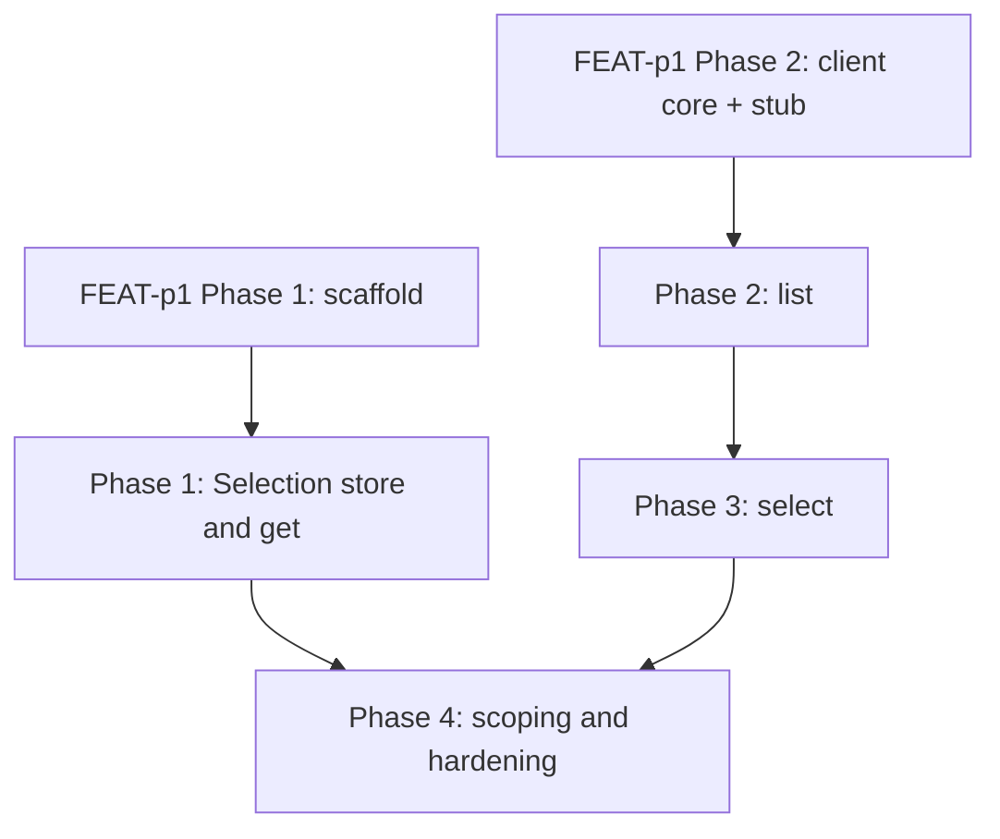

# Implementation Plan: mlx workspace command

## Goal

Deliver the `mlx workspace` command group (`list`, `select`, `get`) that implements FEAT-p1 FR-3 and FR-12 per this feature's specification: server-validated selection persisted in the active profile, roster listing with JSON output, and the no-selection error contract every operation command consumes.
The plan is unified (single `plan.md`): the work spans one concern (one command group over the FEAT-p1 client core), so a split structure would add files without adding clarity.

## Phases

### Phase 1: Selection store and `workspace get`

**Goal:** The selection round-trips locally: `get` reports the stored workspace or a clear no-selection statement, with no network involvement.
**Effort:** 1 person-day
**Depends on:** FEAT-p1 Phase 1 (scaffold: command tree, profiles, toolchain gates)

**Deliverables:**
- [ ] Selection store over the FEAT-p1 profile module: read/write the `workspace` key (string or null), preserve unknown keys on write (specification, Selection state)
- [ ] `mlx workspace get`: human output (name, or clear no-selection statement) and JSON output (object, or `null`), exit 0 in both no-selection cases (FR-3, FR-6)
- [ ] Per-profile isolation: selection writes touch only the active profile (FR-2 acceptance criterion "selection is per profile")
- [ ] Help text for the group and `get` (NFR-1)
- [ ] pytest coverage: get with selection, without selection, JSON mode, profile isolation (NFR-4)

### Phase 2: `workspace list` against the contract stub

**Goal:** The roster is visible: `list` renders the server roster with both output modes and the full error mapping.
**Effort:** 1 person-day
**Depends on:** FEAT-p1 Phase 2 (client core: auth, API client with retry, contract-conformant stub)

**Deliverables:**
- [ ] `mlx workspace list` via `GET /workspaces`, following cursor pagination until exhaustion (specification, API Contracts)
- [ ] Human table (name, description) with TTY-aware rendering honoring `NO_COLOR`; clear statement when the roster is empty (FR-1)
- [ ] JSON mode: single document, array of workspace objects, unknown fields tolerated (FR-6)
- [ ] Status mapping: 401/403 to exit 2; retry with backoff then exit 3 on 5xx or unreachable (NFR-2)
- [ ] pytest coverage against the stub: non-empty roster, empty roster, auth failure, unreachable server

### Phase 3: `workspace select` with server validation

**Goal:** Selection is validated by the server and unknown names get an actionable, suggested fix.
**Effort:** 1 person-day
**Depends on:** Phase 2 (roster fetching and error mapping to reuse)

**Deliverables:**
- [ ] Local kebab-case validation (`^[a-z0-9]+(-[a-z0-9]+)*$`) before any network call, exit 1 with the expected form in the message (FR-2)
- [ ] Server validation via `GET /workspaces/{workspace}`; on 200 persist to the active profile and confirm (human line, or JSON echo of the workspace object) (FR-2, FR-6)
- [ ] On 404: fetch the roster, suggest the closest match via `difflib`, exit 3 (FR-5)
- [ ] pytest coverage: happy path across invocations, malformed name, unknown name with suggestion, JSON mode

### Phase 4: Scoping enforcement and hardening

**Goal:** Every operation command consumes the selection through one guard, and the feature's NFR gates are green.
**Effort:** 1 person-day
**Depends on:** Phases 1 and 3

**Deliverables:**
- [ ] No-selection guard wired at the client-core seam used by all operation commands: exit 1 with the error naming `mlx workspace select` (FR-4, message contract from `cli-design.md`)
- [ ] Integration test: a stub operation command succeeds in the selected workspace and fails with exit 1 without one (FR-4 acceptance criteria)
- [ ] Error message audit across all failure paths: cause plus one concrete fix (NFR-1)
- [ ] Warm startup and render check: `get` and `list` under 500 ms (NFR-3)
- [ ] Toolchain gates green: `ruff check`, `ruff format --check`, `ty check`, `pytest` (NFR-4)

## Phase Dependencies

Phases 1 and 2 are parallel once their FEAT-p1 prerequisites land.

## Milestones

| Milestone | Phase | Success Criteria |
|---|---|---|
| M1: Selection usable locally | Phase 1 | FR-2 (persistence, per-profile) and FR-3 acceptance criteria pass without a server |
| M2: Roster visible | Phase 2 | FR-1 and FR-6 (list) acceptance criteria pass against the stub |
| M3: Selection validated | Phase 3 | FR-2 (malformed name) and FR-5 acceptance criteria pass against the stub |
| M4: Scoping enforced | Phase 4 | FR-4 acceptance criteria pass; NFR-1, NFR-3, NFR-4 gates green |

## Dependencies

| Dependency | Type | Owner | Risk if Delayed |
|---|---|---|---|
| FEAT-p1 Phase 1 scaffold (command tree, profiles, toolchain) | External | FEAT-p1 implementors | Blocks Phase 1 and all later phases |
| FEAT-p1 Phase 2 client core (auth, retry, contract stub) | External | FEAT-p1 implementors | Blocks Phases 2 and 3; Phase 1 proceeds |
| FEAT-p2 workspace contract operations (`GET /workspaces`, `GET /workspaces/{workspace}`) | External | FEAT-p2 implementors | Phases 2 and 3 code against the stub; real server needed for end-to-end verification only |

## Risk Register

| Risk | Likelihood | Impact | Mitigation |
|---|---|---|---|
| The `workspace` profile key convention is not adopted by the FEAT-p1 scaffold | Med | Med | Align during FEAT-p1 Phase 1; the key is a single string, trivially movable later |
| FEAT-p2 contract paths for workspaces drift before publication | Med | Med | Pin both paths in one client module; regenerate the stub from the published contract |
| Concurrent pN command-group features rework the shared client core seam | Med | Low | Keep changes confined to the workspace module and the selection store; the Phase 4 guard is the only shared-path change |
| Closest-match suggestions unhelpful for short or heavily misspelled names | Low | Low | Degrade to the `workspace list` hint when no candidate passes the difflib cutoff |

## Assumptions

- The contract-conformant stub serves both workspace operations per the FEAT-p2 mapping; this is FEAT-p1 assumption 1 territory and is not re-recorded.
- The FEAT-p1 profile module exposes reading and writing arbitrary per-profile keys; validated when FEAT-p1 Phase 1 lands (small interface, low risk, mitigation named above).
- No new assumption records were created for this plan: this run is confined to the feature directory, and both beliefs above are either already tracked by the parent feature or carry low risk with a named validation point.

## Timeline

No calendar committed yet (team capacity unknown); duration-only.

| Phase | Duration |
|---|---|
| Phase 1: Selection store and get | 1 day |
| Phase 2: list | 1 day |
| Phase 3: select | 1 day |
| Phase 4: scoping and hardening | 1 day |
| Total (Phases 1 and 2 parallel) | ~3 working days |
