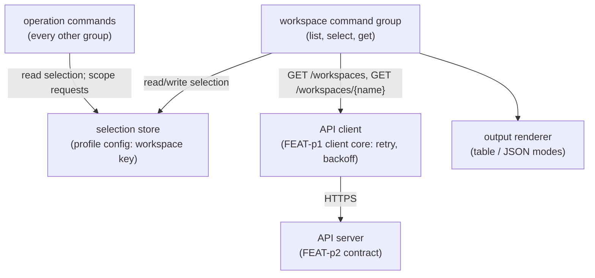
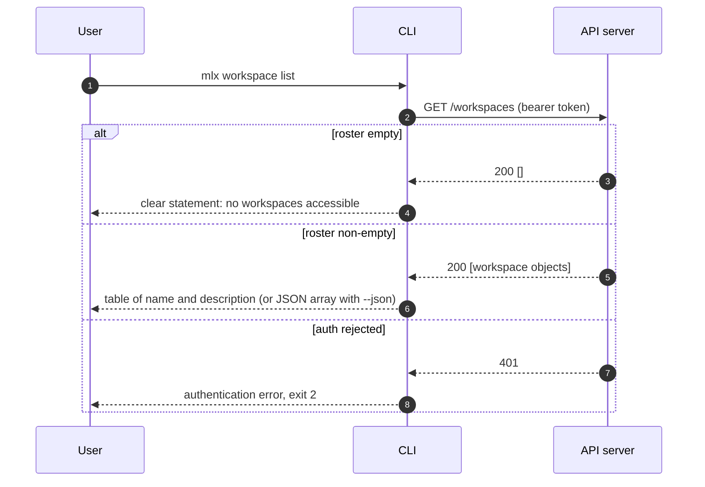
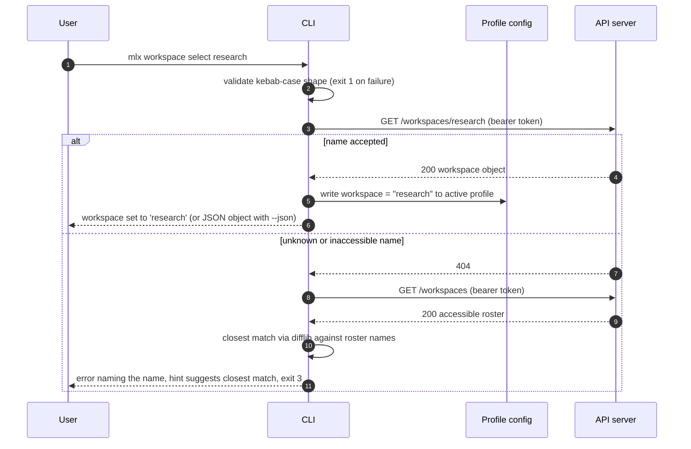
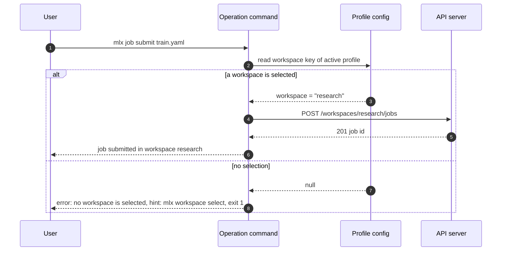
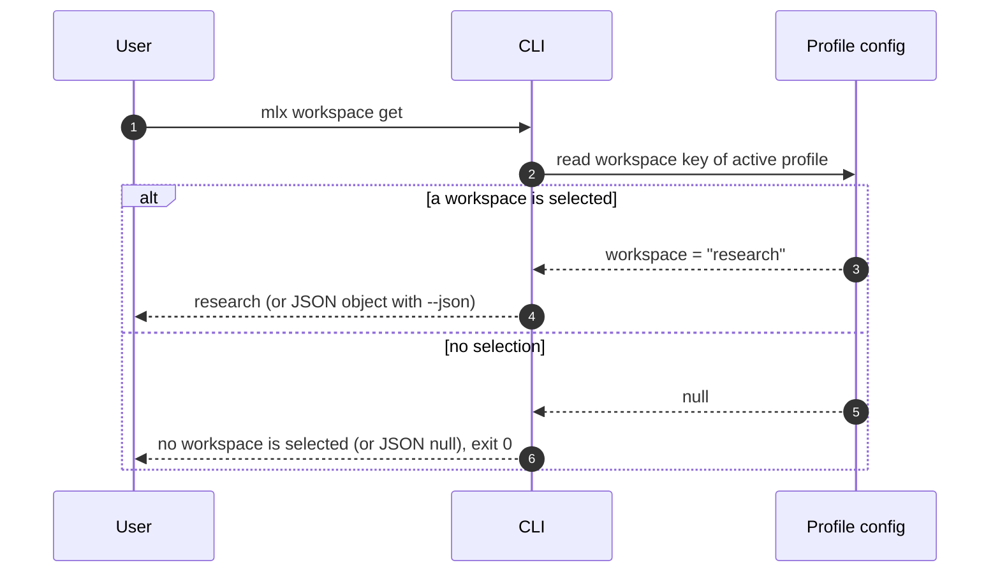

# Specification: mlx workspace command

## Overview

The `mlx workspace` command group is a thin client feature: three cyclopts subcommands over the FEAT-p1 client core (profiles, API client, output modes), reading the workspace roster from the FEAT-p2 contract and persisting the selection as a single key in the active profile.
No new services, endpoints, or databases are introduced; all novelty is in the interaction contract (validation order, error mapping, output shapes) defined here.

## Architecture

Components and responsibilities:

| Component | Responsibility | Owner |
|---|---|---|
| `workspace` command group | Argument parsing, local validation, orchestration, exit codes | This feature (FEAT-p4) |
| Selection store | Persist and read the `workspace` key of the active profile | This feature, over the FEAT-p1 profile module |
| API client | Authenticated HTTP with retry and backoff | FEAT-p1 client core |
| Output renderer | Table and JSON rendering, TTY awareness | FEAT-p1 output conventions |
| API server | Authoritative workspace roster and access checks | FEAT-p2 |

## Data Models

### Workspace (client view)

| Field | Type | Constraints | Description |
|---|---|---|---|
| name | string | kebab-case, `^[a-z0-9]+(-[a-z0-9]+)*$`, unique | Workspace identifier used in commands and path segments |
| description | string | may be empty | Human-readable summary shown by `list` |

Forward compatibility: the model is an open object; the CLI ignores fields it does not recognize (for example a future `created_at` or `role`) rather than rejecting the payload.
No field other than `name` is treated as required by any workspace command output path.

### Selection state (profile)

| Field | Type | Constraints | Description |
|---|---|---|---|
| workspace | string or null | kebab-case when present | Name of the active workspace for the profile; null or absent means no selection |

The key lives in the active profile's section of the CLI configuration file (format and location owned by FEAT-p1).
Evolution is additive: future keys (for example `selected_at`) may be added beside it; unknown keys are preserved on write.

## API Contracts

This feature defines no API surface; it consumes the FEAT-p2 contract (see `.sdlc/features/p2-api-server/plan/contract.md`, "API Surface: FEAT-p1 CLI Mapping").
No `api.yaml` is written for this feature because it adds no operations.

Operations consumed:

| Method | Path | Purpose |
|---|---|---|
| GET | /workspaces | List workspaces the user can access (FR-1) |
| GET | /workspaces/{workspace} | Fetch one workspace; used by `select` to validate the name server-side (FR-2, FR-5) |

The roster follows the FEAT-p2 cursor pagination convention (FEAT-p2 FR-14): `list` and the closest-match roster fetch follow cursors until the roster is exhausted, so pagination is transparent to the user.
The accessible roster is expected to stay small (tens of workspaces), so no partial-page or lazy rendering is designed.

Status mapping:

| Server result | CLI behavior | Exit code |
|---|---|---|
| 200 | Render table (list) or persist selection (select) | 0 |
| 401 or 403 | Authentication error; credential handling per FEAT-p1 FR-2 | 2 |
| 404 on `/workspaces/{workspace}` | Unknown or inaccessible name; fetch roster, suggest closest match | 3 |
| 5xx or network failure | Retry with backoff per FEAT-p1 NFR-2, then clear unreachable-server error | 3 |

## Sequences

### `workspace list`

### `workspace select <name>` (happy path and unknown name)

### Operation command scoped by the selection

### `workspace get`

## Technical Decisions

| Decision | Choice | Rationale |
|---|---|---|
| Where `select` validates the name | Server-side via `GET /workspaces/{workspace}` | The roster is server-authoritative (access can change any time); one round trip on the happy path instead of list-then-check |
| Closest-match source | Client-side `difflib.get_close_matches` over the roster fetched after a 404 | Keeps the server contract minimal; the roster is small; no server-side fuzzy endpoint needed |
| `workspace get` data source | Local profile read, no network call | Matches the spec's output contract (name or statement, nothing server-derived); fast and works offline; staleness is safe because every operation revalidates server-side |
| Selection storage | Single `workspace` string key in the active profile's config section | Smallest sufficient state; per-profile isolation falls out of the profile mechanism (FR-16); additive evolution stays possible |
| Unknown-name exit code | 3 (server error) after the 404 | Follows the FEAT-p1 exit code scheme: the failure originates server-side |
| No-selection behavior for `get` | Exit 0 with a clear statement, JSON `null` | Introspection, not an operation; scripts detect absence via null; recorded as a requirements resolution |
| Kebab-case rule | `^[a-z0-9]+(-[a-z0-9]+)*$`, checked before any network call | Cheap local rejection of malformed input with an actionable usage error (exit 1) |

## Risks and Unknowns

1. The FEAT-p2 workspace endpoints exist only as the planned contract until its M1 milestone lands; until then this feature codes against the contract-conformant stub (FEAT-p1 assumption 1).
2. The profile configuration format is designed in FEAT-p1 Phase 1; this feature depends on its `workspace` key convention being adopted there.
3. Closest-match suggestions degrade gracefully, not perfectly: with large edit distance no candidate is suggested, and the error still points to `workspace list`.
4. Auto-selection of a single accessible workspace remains an open question (requirements, question 1); v1 ships explicit selection only.

## Out of Scope

- Workspace membership management (`member list|add|remove`, FEAT-p1 FR-24).
- Creating, renaming, or deleting workspaces from the CLI.
- A `--workspace` global override flag or per-command workspace argument.
- Server-side workspace administration and tenancy rules (FEAT-p2 FR-3).
