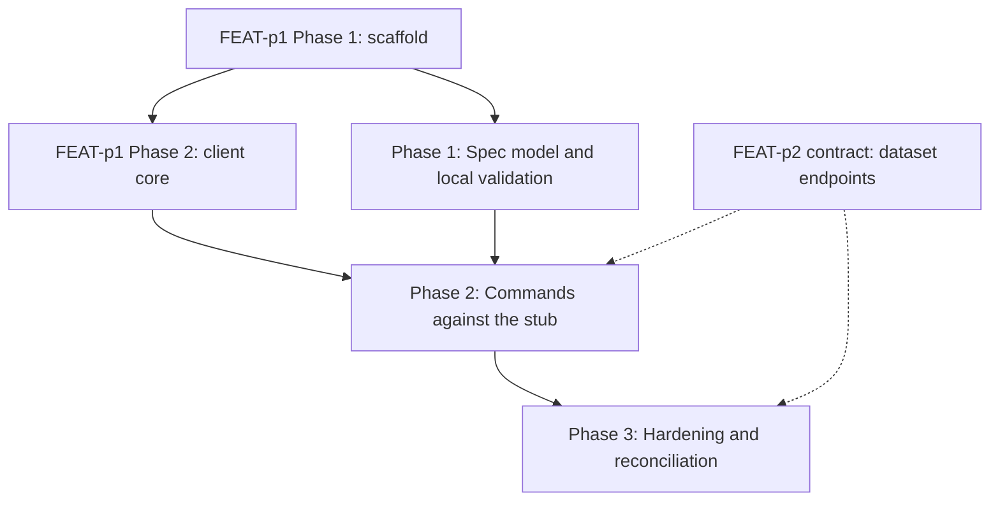

# Implementation Plan: mlx dataset command

## Goal

Deliver the `mlx dataset` command group (create, list, get, delete) inside the unified CLI, implementing FEAT-p1-FR-20 to the letter of `requirements.md` and `specification.md`.
The plan is unified (`plan.md`, not a split `plan/` set): the work spans a single concern (one CLI command group composing the shared client core), so a split would add files without adding clarity.
It is the delegated slice of FEAT-p1's Phase 3 dataset deliverable and inherits that plan's constraints (stub server until FEAT-p2 lands).

## Phases

### Phase 1: Spec model and local validation

**Goal:** The spec-file format is fully specified in code and every validation rule from the specification is enforced with actionable errors, with no server involvement.
**Effort:** 2 person-days
**Depends on:** FEAT-p1 Phase 1 (scaffold with the stubbed `dataset` group)

**Deliverables:**
- [ ] Typed spec model (name, location, format, description, labels) with the deterministic validation order from the specification (parse, required fields in order, format membership, scheme, name pattern)
- [ ] CLI constants for known formats (parquet, csv, jsonl) and recognized schemes (s3, gs, file)
- [ ] Validation errors naming the field, likely cause, and fix; the `format` error lists accepted values; exit 1 on every validation failure
- [ ] Edge rules implemented: single-line description enforcement, label deduplication preserving first occurrence, unknown fields ignored with a warning
- [ ] Unit tests covering every validation acceptance criterion (FR-5) plus the edge rules

### Phase 2: Commands against the stub

**Goal:** All four subcommands work end to end against the contract-conformant stub, with the error mapping and both output modes complete.
**Effort:** 3 person-days
**Depends on:** Phase 1; FEAT-p1 Phase 2 (client core: auth token, workspace scoping, retry with backoff, JSON mode)

**Deliverables:**
- [ ] `dataset create`: POST with `Idempotency-Key`, reports name and version, 409 surfaced as the duplicate-name conflict error (FR-1, FR-6)
- [ ] `dataset list`: cursor-following pagination to exhaustion, `--label` filter flag, human table (name, format, one-line description) (FR-2, FR-7)
- [ ] `dataset get`: full detail output (name, location, format, version, description, labels), 404 error naming the missing dataset (FR-3, FR-6)
- [ ] `dataset delete`: 204 handling with confirmation line, 404 error naming the missing dataset (FR-4, FR-6)
- [ ] Error mapping table implemented (400 to exit 1, 401 to exit 2, 404 and 409 to exit 1, 5xx and unreachable retried then exit 3)
- [ ] `--json` output mode for all four subcommands (single JSON document, nothing else)
- [ ] Stub dataset endpoints (create, list with cursor and label, get, delete) added to the contract-conformant stub
- [ ] Acceptance criteria from `requirements.md` mapped to pytest scenarios passing against the stub

### Phase 3: Hardening and reconciliation

**Goal:** NFR acceptance criteria pass, the toolchain gates are green, and the client view is reconciled with the published FEAT-p2 dataset contract.
**Effort:** 1 person-day
**Depends on:** Phase 2

**Deliverables:**
- [ ] Error-message audit: cause plus fix on every failure path (NFR-1)
- [ ] Render budget verified: `list` and `get` render in under 500 ms warm (NFR-3)
- [ ] Argument-surface coverage complete for all four subcommands plus `--label` (NFR-4)
- [ ] `uv run ruff check .`, `uv run ruff format --check .`, `uv run ty check .`, and `uv run pytest` all green (NFR-4)
- [ ] Reconcile the CLI's format and scheme constants and the error mapping with the published FEAT-p2 dataset schemas, or record the remaining gap
- [ ] FR-7 verified end to end against the stub's `label` parameter, or explicitly deferred if the contract addition is still pending

## Phase Dependencies

Solid edges are hard sequencing; dashed edges are external dependencies (the stub stands in for FEAT-p2 until the contract and server land).
Phase 1 needs only the scaffold, so it can start as soon as FEAT-p1 Phase 1 completes and run while the client core is still being built.

## Milestones

| Milestone | Phase | Success Criteria |
|---|---|---|
| M1: Validation correct locally | Phase 1 | Every FR-5 acceptance criterion passes with no server participant |
| M2: Full group on the stub | Phase 2 | All FR-1 through FR-7 acceptance criteria pass against the stub |
| M3: Shippable slice | Phase 3 | All NFR acceptance criteria pass; four toolchain gates green |

## Dependencies

| Dependency | Type | Owner | Risk if Delayed |
|---|---|---|---|
| FEAT-p1 Phase 1 scaffold (command tree with stubbed `dataset` group) | External | FEAT-p1 implementors | Blocks Phase 1 |
| FEAT-p1 Phase 2 client core (auth, workspace, retry, JSON mode) | External | FEAT-p1 implementors | Blocks Phase 2; Phase 1 proceeds meanwhile |
| FEAT-p2 dataset contract (endpoints, schemas, error model, pagination) | External | FEAT-p2 implementors | Phase 2 codes against the stub; Phase 3 reconciliation slips or records a gap |
| Stub server dataset endpoints | Internal | This feature | Blocks automated acceptance testing in Phase 2 |

## Risk Register

| Risk | Likelihood | Impact | Mitigation |
|---|---|---|---|
| Client core (FEAT-p1 Phase 2) lands late | Medium | High | Phase 1 is pure local validation with no client dependency; it absorbs the slip |
| FEAT-p2 publishes dataset schemas that differ from this feature's consumer view | Medium | Medium | Consumer view cites the normative owner; Phase 3 reconciliation deliverable catches drift; constants and error mapping are single-place |
| `label` filter (FR-7) not accepted into the contract | Medium | Low | FR-7 is a Should; the flag is one argument on one command and drops cleanly |
| OQ2 resolves to bump-on-recreate instead of error-on-duplicate | Low | Low | Create response handling is isolated in one handler; the change is local |
| OQ1 default (no delete confirmation) overruled by the parent surface owner | Low | Low | Delete handler is single-place; adding `--yes` is a small surface change |
| Stub drifts from the real contract | Medium | Medium | Stub assertions derive from the specification's consumer view; Phase 3 reconciles against the published contract |

## Assumptions

- The FEAT-p1 client core (auth, workspace scoping, retry, JSON mode) is available before Phase 2 starts.
- The consumer-side contract view in `specification.md` matches what FEAT-p2 publishes for the dataset endpoints (stub encodes this view).
- The three recorded defaults hold: no delete confirmation, error-on-duplicate, scheme-only location validation.
- Workspace dataset catalogs are small enough that cursor-following to exhaustion stays within one or two round trips in practice.

Note: per this run's write scope (feature directory only), these assumptions were not promoted to `.sdlc/knowledge/assumptions/`; the first two are candidates when that path is writable (the stub-target dependency is already covered by parent assumption 1).

## Timeline

No calendar committed (team capacity unknown); duration-only.

| Phase | Duration |
|---|---|
| Phase 1: Spec model and local validation | 2 days |
| Phase 2: Commands against the stub | 3 days |
| Phase 3: Hardening and reconciliation | 1 day |
| Total | ~6 working days |
