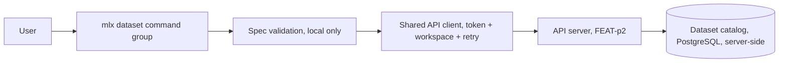
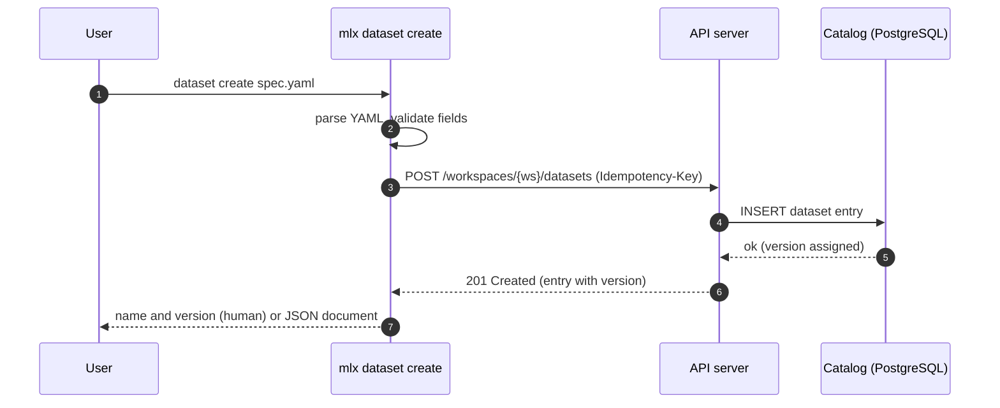
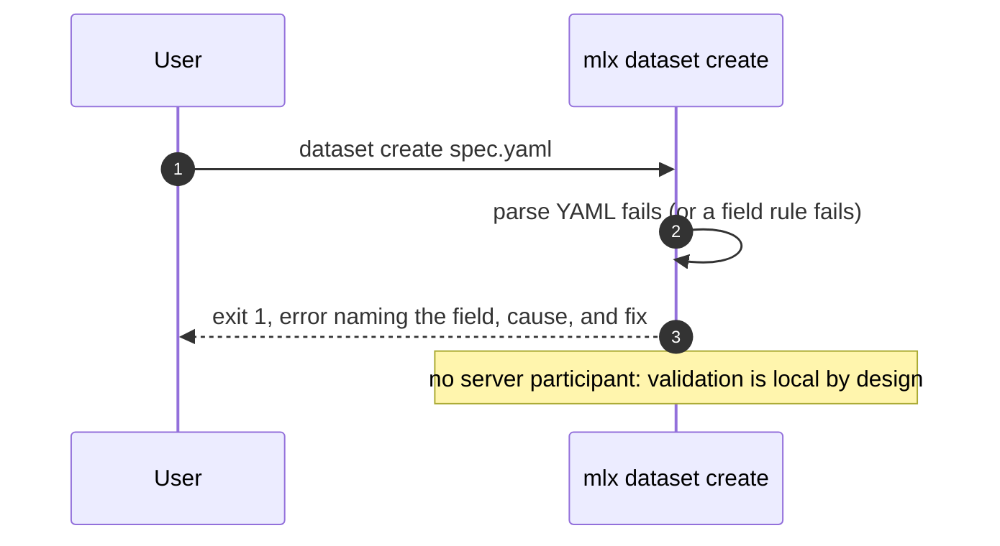
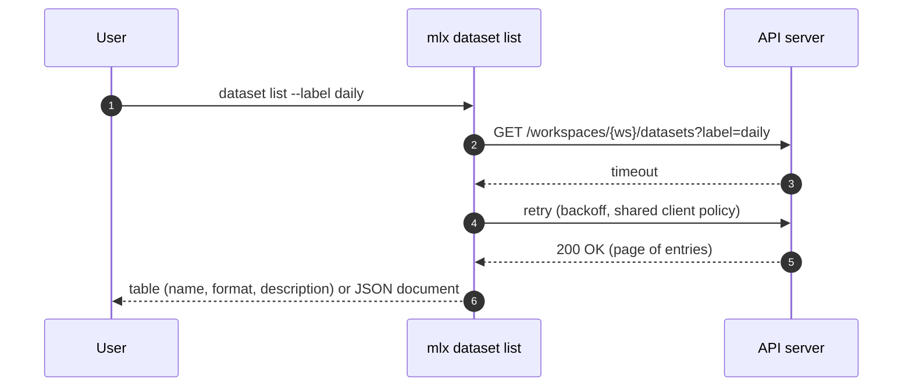
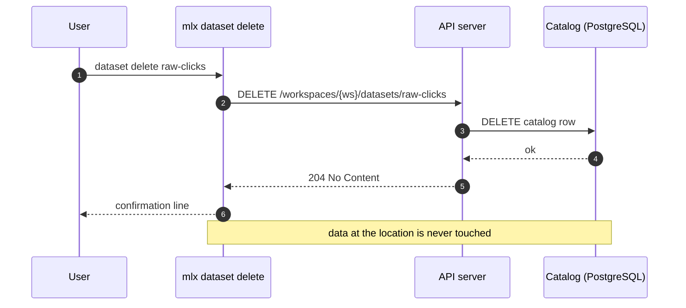

# Specification: mlx dataset command

## Overview

The `dataset` group is a cyclopts command group inside the `mlx` CLI package: four subcommands (`create`, `list`, `get`, `delete`) backed by a local spec-validation module and the shared API client (auth token, workspace scoping, retry) from the FEAT-p1 client core.
The CLI is a pure consumer of the dataset endpoints owned by the FEAT-p2 contract; this specification fixes the client-side contract view, the spec-file format, and the error and output behavior of each subcommand.

## Architecture

The command group adds no new layers; it composes the FEAT-p1 client core with a dataset-specific validation module and command handlers.

## Data Models

### Dataset spec file (input, owned by this feature)

One YAML file per `dataset create` invocation.

| Field | Type | Required | Constraints | Description |
|---|---|---|---|---|
| name | string | Yes | Kebab-case (`^[a-z0-9]+(-[a-z0-9]+)*$`), unique in the workspace (uniqueness confirmed server-side) | User-visible dataset identifier |
| location | string | Yes | URI with a recognized scheme (`s3://`, `gs://`, `file://` in v1; set is a CLI constant, extensible) | Where the data lives |
| format | string | Yes | One of the known catalog formats: `parquet`, `csv`, `jsonl` (closed set held as a CLI constant in v1) | Data format at the location |
| description | string | No | Single line; a value containing newlines is rejected with an actionable error | Shown in listings |
| labels | string list | No | Free-form tags; duplicates removed preserving first occurrence; empty allowed | Filter handle for listings |

Unknown fields in the spec file are ignored with a warning, never rejected (forward compatibility).
Validation order is fixed so the first failure is deterministic: YAML parse, then required fields in table order (name, location, format), then format membership, then location scheme, then name pattern.
Every validation failure exits 1 with an error naming the field and the fix (for `format`, the error lists the accepted values), and no server call is made.

### Dataset catalog entry (client view; resource owned by FEAT-p2)

| Field | Type | Constraints | Description |
|---|---|---|---|
| name | string | Kebab-case, unique per workspace | Catalog identifier |
| location | string | URI | Where the data lives |
| format | string | `parquet`, `csv`, or `jsonl` | Data format |
| description | string, optional | Single line | Shown in listings |
| labels | string list | May be empty | Tags |
| version | integer | Server-assigned | Entry version reported by create and get |

The client tolerates unknown response fields (a future `created_at`, for example) and ignores them rather than failing.

## API Contracts

This feature defines no API surface of its own; no `api.yaml` is written.
The normative dataset contract is owned by FEAT-p2 (`.sdlc/features/p2-api-server/plan/contract.md`, FEAT-p1 CLI mapping table).
The table below is the consumer-side view this feature codes against; if the two drift, the FEAT-p2 document wins.

| Method | Path | Purpose |
|---|---|---|
| POST | `/workspaces/{workspace}/datasets` | Create a dataset entry from the validated spec fields |
| GET | `/workspaces/{workspace}/datasets?label=<label>&cursor=<cursor>` | List datasets in the workspace (cursor-paginated per FEAT-p2-FR-14; `label` filter is a requested addition, see Risks) |
| GET | `/workspaces/{workspace}/datasets/{dataset}` | Fetch one dataset entry |
| DELETE | `/workspaces/{workspace}/datasets/{dataset}` | Delete the catalog entry only |

Bearer-token auth, the cursor pagination convention, the error model (code, message, likely cause, suggested fix), and the `Idempotency-Key` header on POST are all inherited from the FEAT-p2 contract conventions and are implemented once in the shared client, not per command.

List pagination behavior: `dataset list` follows the cursor until exhausted in both human and JSON modes, and the JSON document is then the complete array of entries.
A typical workspace's catalog fits in one page, so the common case is one round trip; the wall-clock cost of page-walking is noted under NFR-3 below.

Error mapping (server status to CLI behavior; exit codes inherited from the FEAT-p1 plan):

| Status | Server code | CLI behavior |
|---|---|---|
| 400 | INVALID_INPUT | Exit 1, print the server's cause and fix |
| 401 | UNAUTHENTICATED | Exit 2, prompt re-authentication hint |
| 404 | DATASET_NOT_FOUND | Exit 1, error naming the missing dataset |
| 409 | CONFLICT | Exit 1, duplicate-name conflict error (FR-1/FR-6) |
| 5xx or unreachable | any | Retry with backoff (NFR-2), then exit 3 with a clear server-unreachable or server-error message |

## Sequences

### dataset create (happy path)

### dataset create (local validation failure, no server call)

### dataset list (transient failure retried)

### dataset delete (catalog entry only)

## Technical Decisions

| Decision | Choice | Rationale |
|---|---|---|
| Contract ownership | No local `api.yaml`; code against the FEAT-p2 contract mapping | One normative source for the dataset endpoints avoids drift; FEAT-p2 publishes the contract the CLI consumes |
| Spec parsing | PyYAML with a typed field-by-field validation module | Mature parser; field-by-field errors satisfy the actionable-error rule (FEAT-p1-NFR-1) better than schema-exception dumps |
| Unknown spec fields | Ignore with a warning | Additive spec evolution does not break older CLI versions |
| Known formats | CLI constant (`parquet`, `csv`, `jsonl`) | v1 fixed set; the error can list accepted values offline; drift risk tracked below |
| Recognized schemes | CLI constant (`s3`, `gs`, `file`) | Extensible when the catalog adds storage backends |
| Duplicate name | Surface the server's 409 as the conflict error | Uniqueness is server-side truth (spec.md); the CLI never guesses |
| OQ1 default (delete confirmation) | No confirmation and no `--yes` flag in v1 | Deleting a catalog entry never destroys data and is recoverable by re-registering; revisit if the parent surface owner disagrees |
| OQ2 default (versioning) | Error on duplicate name; `version` is opaque and server-assigned | Matches the current FEAT-p2 contract posture; a bump-on-recreate change alters only the create response handling |
| OQ3 default (location reachability) | No reachability check; scheme validation only | The CLI has no storage credentials; reachability is the server's or nobody's job in v1 |
| Label filter | Server-side `label` query parameter on the list endpoint | Client-side filtering would fetch every page; the parameter is a contract addition requested from FEAT-p2 |
| Output | Human tables and key-value blocks by default; single JSON document under the parent's `--json` | Inherited FEAT-p1-FR-12 convention |
| Interactive budget | `list` and `get` render in under 500 ms warm (NFR-3); total wall-clock adds one round trip per page | Keeps the inherited performance target measurable while allowing multi-page listings |
| Testing posture | All commands run against the contract-conformant stub; the dataset argument surface gets pytest coverage (NFR-4) | Matches the parent constraint until the FEAT-p2 server exists |

## Risks and Unknowns

1. The `label` filter (FR-7) needs a contract addition to the dataset list endpoint owned by FEAT-p2; if declined or delayed, FR-7 slips out of v1 (client-side page-walking filtering is explicitly rejected).
2. The CLI's known-format and scheme constants can drift from the server catalog's accepted values; reconcile when the FEAT-p2 dataset schemas land.
3. Versioning semantics (OQ2) are undecided; create assumes error-on-duplicate, so a bump-on-recreate decision would change the create flow's success handling.
4. The delete-confirmation default (OQ1) was chosen here; the parent command-surface owner may mandate a `--yes` flag, a small surface change.
5. Location reachability (OQ3) is unverified, so a typo'd location surfaces only when a job reads the dataset; the error at that point must name the dataset.
6. No server exists yet; every sequence is exercised against a contract-conformant stub (parent assumption 1, `.sdlc/knowledge/assumptions/1-cli-target-server.md`).

## Out of Scope

- Server-side dataset storage, uniqueness enforcement, pagination, and versioning behavior (FEAT-p2).
- Copying or verifying data at a dataset's location (FEAT-p1-FR-5, data copy).
- Job-time dataset resolution and its error messages (job submission commands).
- Reading dataset contents or schema inference from the data itself.
