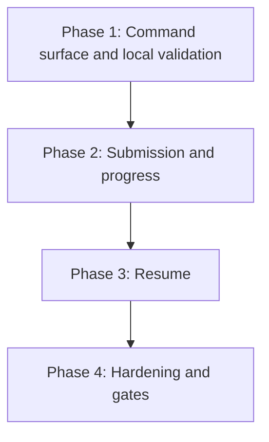

# Implementation Plan: mlx data command

## Goal

Deliver the `mlx data copy` command group (FEAT-p6): local input validation, submission of a server-executed transfer, progress rendering to a terminal state, and resumption after interruption, all through the FEAT-p1 client core against the FEAT-p2 transfer contract.
Plan structure: unified (`plan.md`), because the work is one cohesive command group with tightly coupled phases rather than independent concerns.

## Phases

### Phase 1: Command surface and local validation

**Goal:** `mlx data copy` is registered with help text and rejects every invalid input locally, deterministically, with actionable errors and no server call.
**Effort:** 1 person-day
**Depends on:** None (uses the FEAT-p1 Phase 1 command-tree scaffold)

**Deliverables:**
- [ ] `data` group and `copy` subcommand registered in cyclopts with help text for every argument and option (NFR-1)
- [ ] URI validation module implementing the fixed order: source URI parse, destination URI parse, source scheme, destination scheme, pair rule (FR-2)
- [ ] Recognized-scheme constant (`s3`, `gs`, `file`) shared with the dataset group, plus the any-to-any pair-rule constant
- [ ] Per-check actionable errors with exit 1 (NFR-1)
- [ ] pytest coverage of the validation matrix, including first-failure determinism and the no-server-call property (NFR-4)

### Phase 2: Submission and progress

**Goal:** A validated copy submits to the server and the CLI renders progress to a terminal state with the correct stdout and stderr split.
**Effort:** 2 person-days
**Depends on:** Phase 1

**Deliverables:**
- [ ] Transfer submission through the shared client with the `Idempotency-Key` header (NFR-2)
- [ ] Progress poller (one GET per second) rendering one updating stderr line in human mode; stdout untouched (FR-4)
- [ ] Terminal-state handling: human one-screen summary and the single JSON summary document (FR-1, FR-5)
- [ ] Error mapping for 400, 401, 403, 404, 409, and 5xx per the specification table, including the permissions pre-flight error before any transfer (FR-3)
- [ ] Fail-soft handling of unknown states and unknown response fields
- [ ] Contract-conformant stub extension emulating transfer progress to a terminal state

### Phase 3: Resume

**Goal:** Interrupted copies resume from checkpoints via `--resume`, and interrupting the CLI leaves the transfer resumable.
**Effort:** 1 person-day
**Depends on:** Phase 2

**Deliverables:**
- [ ] `--resume` flag with the filtered lookup by source, destination, and interrupted state (FR-6)
- [ ] Resume action call and progress continuation from the checkpoint, not from zero (FR-7)
- [ ] No-state branch: fresh copy with exactly one informational line (FR-8)
- [ ] 409 TRANSFER_EXISTS surfaced with the `--resume` hint
- [ ] SIGINT handling: detach without cancelling the server-side transfer, exit with the parent's cancelled-by-user code
- [ ] Stub fixtures: an interrupted transfer for a pair and checkpoint continuation

### Phase 4: Hardening and gates

**Goal:** NFR gates are green and the group does not generate support load.
**Effort:** 1 person-day
**Depends on:** Phase 3

**Deliverables:**
- [ ] Error message audit: cause plus fix on every failure path (NFR-1)
- [ ] Startup budget verified: local validation under 500 ms warm (NFR-3)
- [ ] Verbose-output check that no credentials or tokens appear in any output (parent NFR-3 posture)
- [ ] Full pytest coverage of the argument surface and stub-driven flows for every FR scenario (NFR-4)
- [ ] Four gates green: `ruff check`, `ruff format --check`, `ty check`, `pytest` (NFR-4)

## Phase Dependencies

The chain is intentionally sequential: submission builds on the validation module, resume builds on the submission and progress machinery, and hardening audits all paths.

## Milestones

| Milestone | Phase | Success Criteria |
|---|---|---|
| M1: Fails fast and explains itself | Phase 1 | Every invalid input in the validation matrix exits 1 with an actionable error and no server call |
| M2: Copies and shows progress | Phase 2 | FR-1, FR-3, FR-4, and FR-5 acceptance criteria pass against the stub |
| M3: Resumes | Phase 3 | FR-6, FR-7, and FR-8 acceptance criteria pass against the stub |
| M4: Shippable | Phase 4 | All NFR acceptance criteria pass and the four gates are green |

## Dependencies

| Dependency | Type | Owner | Risk if Delayed |
|---|---|---|---|
| FEAT-p1 client core (shared API client, auth, workspace scoping, output modes) | Internal | FEAT-p1 implementors | Blocks Phase 2 and Phase 3; Phase 1 proceeds against the command-tree scaffold |
| FEAT-p2 transfer contract (endpoints, list filters, resume action, error codes) | External | ml-platform implementors | Blocks Phase 2 and Phase 3 against a real server; the stub keeps tests running |
| Contract-conformant stub with progress and interrupt fixtures | Internal | This feature | Blocks automated acceptance testing from Phase 2 on |

## Risk Register

| Risk | Likelihood | Impact | Mitigation |
|---|---|---|---|
| Transfer contract additions (list filters, resume action) declined or delayed by FEAT-p2 | Medium | High | Resolve specification open question 5 before Phase 3; FR-6, FR-7, and FR-8 slip without the contract change, and a client-side ledger is explicitly rejected |
| Resume backend support missing (FEAT-p1 risk register, open question 1) | Medium | Medium | Confirm during FEAT-p2 transfer design; the fallback is restart with clear errors, leaving the CLI surface unchanged |
| Scheme and pair constants drift from the server's accepted values | Medium | Low | Reconcile when the FEAT-p2 transfer schemas land; server 400 rejections surface authoritatively meanwhile |
| Polling interval too coarse for users or too hot for the server | Low | Low | The interval is a constant; the streamed-channel upgrade path is recorded in the specification |
| A transfer continuing to completion after the CLI detaches surprises users | Low | Medium | The informational resume line and the 409 hint set expectations; revisit with FEAT-p2 when a cancel operation exists |

## Assumptions

- A runnable API server target or contract-conformant stub exists for v1 (assumption 1, `.sdlc/knowledge/assumptions/1-cli-target-server.md`).
- The FEAT-p2 contract will accept the transfer list filters and the resume action (specification risk 1, open question 5).
- The FEAT-p1 client core is available before Phase 2 starts.

Note: per this run's write scope (feature directory only), risky assumptions were not promoted to `.sdlc/knowledge/assumptions/`; open questions 1 and 5 are the first candidates when that path is writable.

## Timeline

No calendar committed yet (team capacity unknown); duration-only.

| Phase | Duration |
|---|---|
| Phase 1: Command surface and local validation | 1 day |
| Phase 2: Submission and progress | 2 days |
| Phase 3: Resume | 1 day |
| Phase 4: Hardening and gates | 1 day |
| Total | ~5 working days |
