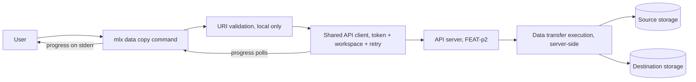
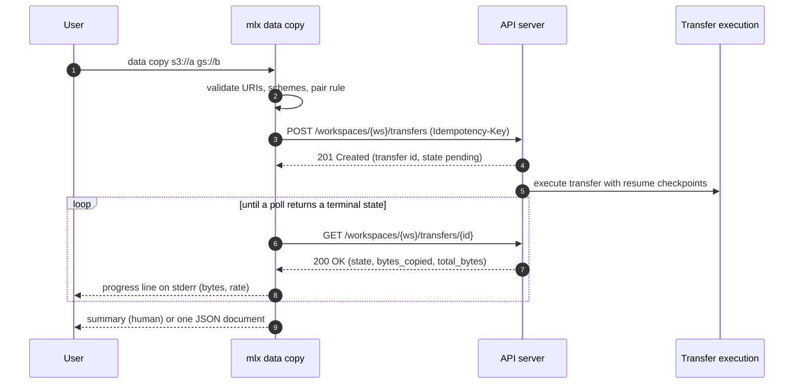
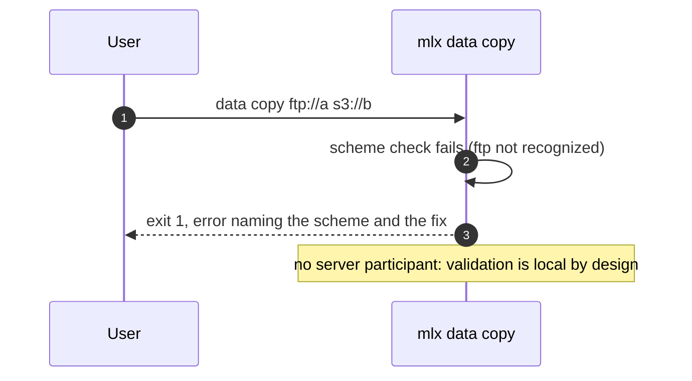
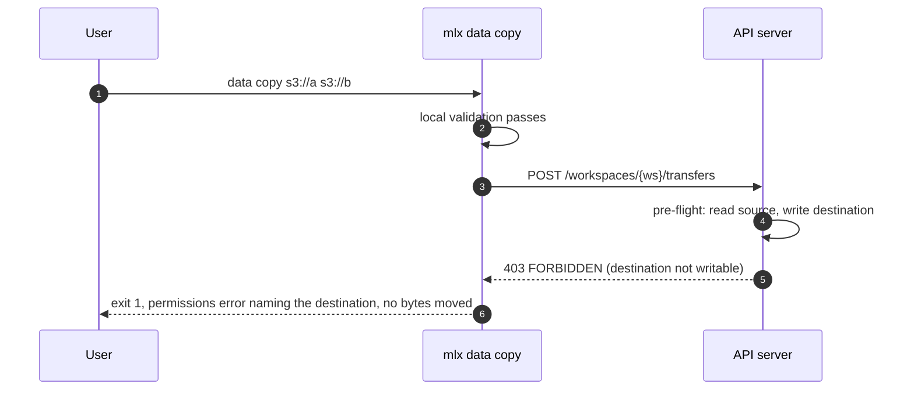
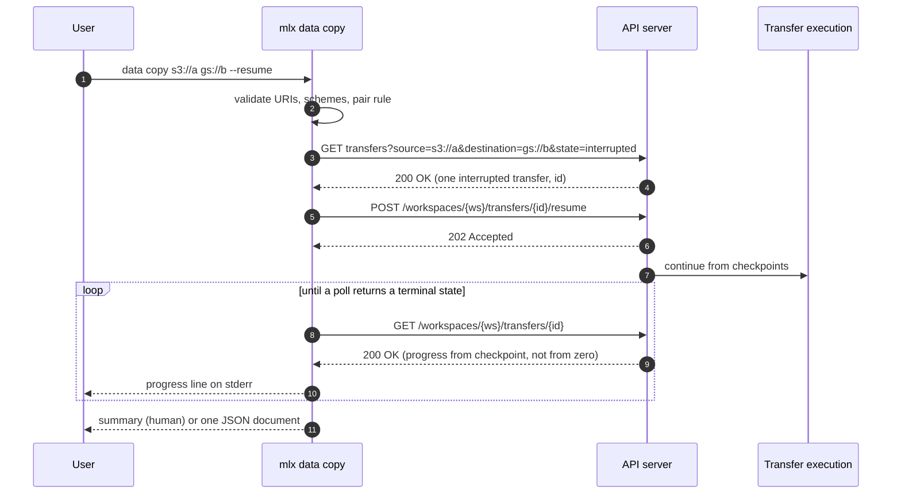
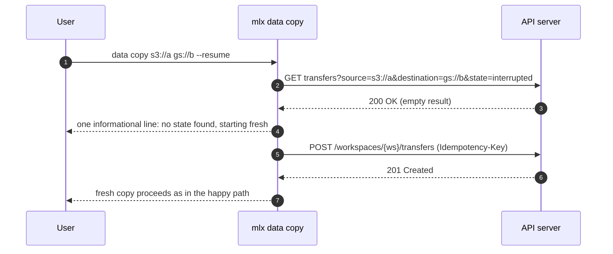

# Specification: mlx data command

## Overview

The `data` group is a cyclopts command group inside the `mlx` CLI package with a single subcommand (`copy`) backed by a local URI-validation module and the shared API client (auth token, workspace scoping, retry) from the FEAT-p1 client core.
The transfer itself executes server-side (FEAT-p2 data transfer execution); the CLI submits it, renders progress until a terminal state, and drives resumption after interruption.
This specification fixes the client-side contract view, the validation order, the progress and resume behavior, and the output documents of `data copy`.

## Architecture

The command group adds no new layers; it composes the FEAT-p1 client core with a data-specific validation module, a progress renderer, and command handlers.
The CLI never reads or writes the transferred bytes.

## Data Models

### Copy invocation (input, owned by this feature)

| Argument / option | Type | Required | Constraints | Description |
|---|---|---|---|---|
| source | string | Yes | Parses as a URI with a recognized scheme (`s3://`, `gs://`, `file://` in v1; the same CLI constant the dataset group uses) | Location to copy from |
| destination | string | Yes | Same rule as source | Location to copy to |
| `--resume` | flag | No | Absent means a fresh copy request | Continue an interrupted copy for the same source-destination pair |

Validation order is fixed so the first failure is deterministic: source parses as a URI, destination parses as a URI, source scheme recognized, destination scheme recognized, then the pair rule.
The v1 pair rule is any-to-any: every recognized scheme may be copied to every recognized scheme, held as a CLI constant so the rule can tighten without a code redesign.
Every validation failure exits 1 with an error naming the failed check and the fix, and no server call is made.
The server remains authoritative on supported pairs; a server-side unsupported-pair rejection (400) is surfaced as-is.

### Transfer resource (client view; resource owned by FEAT-p2)

| Field | Type | Constraints | Description |
|---|---|---|---|
| id | string | Server-assigned, opaque | Transfer identifier used in errors |
| source | string | URI | Echoed request source |
| destination | string | URI | Echoed request destination |
| state | string | Open value set: `pending`, `running`, `interrupted`, `succeeded`, `failed`; unknown values tolerated (see below) | Transfer lifecycle state |
| bytes_copied | integer | Monotonic within an attempt | Bytes transferred so far |
| total_bytes | integer | Server-estimated; may be revised | Total bytes to transfer |
| error | object, optional | Code, message, likely cause, suggested fix | Present when state is `failed` |

The client tolerates unknown fields and unknown state values: an unknown state is displayed verbatim and polling continues until a known terminal state (`succeeded`, `failed`), so a richer future contract does not break older CLI versions.
Terminal states are exactly `succeeded` and `failed`; every other value, known or unknown, is non-terminal.

### JSON summary document (output, owned by this feature)

One JSON document printed to stdout on success in `--json` mode.

| Field | Type | Description |
|---|---|---|
| source | string | The request source URI |
| destination | string | The request destination URI |
| state | string | Always `succeeded` in this document |
| bytes_copied | integer | Bytes transferred, equal to total on success |
| total_bytes | integer | Total bytes transferred |
| duration_seconds | number | Wall clock the CLI observed from submission to terminal state |
| average_bytes_per_second | number | bytes_copied divided by duration_seconds |

The document is additive-only within v1: new optional fields may appear; scripts consuming it must ignore unknown fields.

## API Contracts

This feature defines no API surface of its own; no `api.yaml` is written.
The normative transfer contract is owned by FEAT-p2 (`.sdlc/features/p2-api-server/plan/contract.md`, FEAT-p1 CLI mapping table).
The table below is the consumer-side view this feature codes against; if the two drift, the FEAT-p2 document wins.

| Method | Path | Purpose |
|---|---|---|
| POST | `/workspaces/{workspace}/transfers` | Request a copy from source to destination |
| GET | `/workspaces/{workspace}/transfers/{transfer}` | Fetch one transfer's state and progress |
| GET | `/workspaces/{workspace}/transfers?source=<uri>&destination=<uri>&state=interrupted` | Find the recorded interrupted transfer for a pair (resume lookup; filters are a requested addition, see Risks) |
| POST | `/workspaces/{workspace}/transfers/{transfer}/resume` | Continue an interrupted transfer from its checkpoints (requested addition, see Risks) |

Bearer-token auth, the error model (code, message, likely cause, suggested fix), and the `Idempotency-Key` header on POST are inherited from the FEAT-p2 contract conventions and are implemented once in the shared client, not per command.

Error mapping (server status to CLI behavior; exit codes inherited from the FEAT-p1 plan):

| Status | Server code | CLI behavior |
|---|---|---|
| 400 | INVALID_INPUT | Exit 1, print the server's cause and fix (covers a server-rejected scheme pair) |
| 401 | UNAUTHENTICATED | Exit 2, prompt re-authentication hint |
| 403 | FORBIDDEN | Exit 1, permissions error naming the unreadable source or unwritable destination, before any transfer |
| 404 | TRANSFER_NOT_FOUND | Exit 1, error naming the missing transfer (resume lookup raced a completed transfer) |
| 409 | TRANSFER_EXISTS | Exit 1, error explaining an interrupted transfer exists for the pair, with a hint to rerun with `--resume` |
| 5xx or unreachable | any | Retry with backoff (NFR-2), then exit 3 with a clear server-unreachable or server-error message |

## Sequences

### data copy (happy path, progress by polling)

### data copy (local validation failure, no server call)

### data copy (permissions pre-flight failure)

### data copy --resume (interrupted copy resumed)

### data copy --resume (no recorded state)

## Technical Decisions

| Decision | Choice | Rationale |
|---|---|---|
| Contract ownership | No local `api.yaml`; code against the FEAT-p2 contract mapping | One normative source for the transfer endpoints avoids drift; FEAT-p2 publishes the contract the CLI consumes |
| Validation order | Fixed sequence: source URI, destination URI, source scheme, destination scheme, pair rule | Deterministic first failure gives stable, actionable errors (FEAT-p1-NFR-1) and stable tests |
| Pair rule | Any-to-any among recognized schemes, held as a CLI constant | Matches spec.md's any-to-any goal; the constant can tighten without redesign; server rejections still surface |
| Progress transport | Poll the transfer resource once per second; render one updating stderr line in human mode | Needs no streamed channel in the contract (OQ3 default); interval trades freshness for load and is a constant |
| JSON mode output | No progress output at all; exactly one summary document on stdout | Keeps the FR-5 and FEAT-p1-FR-12 guarantee simple: stdout is parseable with one read |
| Resume protocol | Server-supported resume over the recorded transfer | The CLI holds no storage credentials and never touches the bytes, so a local chunk ledger is impossible, not just unwise (OQ1 default) |
| Resume lookup | Filtered GET by source, destination, and interrupted state; exactly one match resumes, none starts fresh | Makes FR-6's pair keying explicit and gives FR-8's informational line a natural branch point |
| Duplicate live transfer | Surface the server's 409 with a `--resume` hint | Gives `--resume` discoverability at the moment it is needed |
| Interrupt semantics | SIGINT exits with the parent's cancelled-by-user code and sends no cancel; the transfer's fate is server-owned | Keeps the CLI stateless about server policy (OQ4 default); `--resume` re-attaches and drives to completion |
| Within-copy concurrency | Server-owned; no client flag in v1 | The server executes the transfer, so concurrency is its decision (OQ2 default) |
| Idempotent submission | `Idempotency-Key` header on POST, inherited from FEAT-p2 conventions | A lost submission response retried safely never starts a duplicate transfer (NFR-2) |
| Summary duration | Wall clock measured by the CLI from submission to terminal state | The CLI cannot see server timestamps reliably; its own observation window is well-defined |
| Testing posture | All flows run against the contract-conformant stub with progress emulation; the argument surface gets pytest coverage (NFR-4) | Matches the parent constraint until the FEAT-p2 server exists |

## Risks and Unknowns

1. The transfer endpoints, the source/destination/state list filters, and the resume action are contract additions owned by FEAT-p2; if declined or delayed, FR-6, FR-7, and FR-8 slip out of v1 (a client-side ledger is explicitly rejected).
2. Resume depends on backend support the server may not offer (FEAT-p1 risk register, OQ1); the fallback is a restart-with-clear-errors transfer whose CLI surface is unchanged.
3. The CLI's scheme and pair constants can drift from the server's accepted values (conflict recorded in `review-requirements.md`); reconcile when the FEAT-p2 transfer schemas land.
4. Polling once per second trades progress freshness for request load; the upgrade path to a streamed channel is open when the contract defines one.
5. Interrupt semantics (OQ4) leave the transfer's fate to the server; a transfer that continues to completion after the CLI detaches may surprise users, mitigated by the resume flow and the informational line.
6. No server exists yet; every sequence is exercised against a contract-conformant stub (parent assumption 1, `.sdlc/knowledge/assumptions/1-cli-target-server.md`).

## Out of Scope

- Server-side transfer execution, checkpointing, scheduling, and within-copy concurrency (FEAT-p2).
- The transfer state machine and its persistence (FEAT-p2 database phase).
- Verifying copied content beyond reporting the server's transfer outcome.
- Moving data through the local workstation; the CLI never reads or writes the transferred bytes.
- Dataset catalog operations (FEAT-p5).
