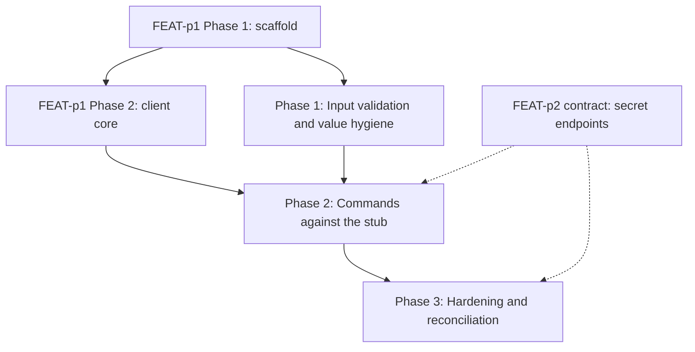

# Implementation Plan: mlx secret command

## Goal

Deliver the `mlx secret` command group (set, list, delete) inside the unified CLI, implementing FEAT-p1-FR-17 to the letter of `requirements.md` and `specification.md`, with value non-display (FEAT-p1-NFR-3) enforced as a structural property rather than a convention.
The plan is unified (`plan.md`, not a split `plan/` set): the work spans a single concern (one CLI command group composing the shared client core), so a split would add files without adding clarity.
It is the delegated slice of FEAT-p1's Phase 3 secret deliverable ("`secret set/list/delete`, values never printed") and inherits that plan's constraints (stub server until FEAT-p2 lands).

## Phases

### Phase 1: Input validation and value hygiene

**Goal:** Every input rule from the specification is enforced locally with actionable errors, and the no-leak invariant holds before any server interaction exists.
**Effort:** 1.5 person-days
**Depends on:** FEAT-p1 Phase 1 (scaffold with the stubbed `secret` group)

**Deliverables:**
- [ ] Typed input model for `secret set` (name, source) with the deterministic validation order from the specification (source exclusivity, name pattern, file existence, file readability)
- [ ] Edge rules implemented: empty literal and zero-byte file rejected as usage errors, file bytes read verbatim with no trailing-newline trimming
- [ ] Validation errors naming the input, likely cause, and fix; exit 1 on every validation failure; no server call on any of them
- [ ] Diagnostics hygiene: errors and verbose logs name the secret and inputs, never argument values; no raw argv dumps
- [ ] `secret set --help` documents the `--from-literal` shell-history risk and recommends `--from-file` (FR-7)
- [ ] Unit tests covering every FR-4 acceptance criterion plus the edge rules, with a canary value asserted absent from every output

### Phase 2: Commands against the stub

**Goal:** All three subcommands work end to end against the contract-conformant stub, with the error mapping and both output modes complete.
**Effort:** 2 person-days
**Depends on:** Phase 1; FEAT-p1 Phase 2 (client core: auth token, workspace scoping, retry with backoff, JSON mode)

**Deliverables:**
- [ ] `secret set`: POST with `Idempotency-Key`, reports the name only, 409 surfaced as the duplicate-name conflict error (FR-1, FR-5)
- [ ] `secret list`: cursor-following pagination to exhaustion, names only in human mode (FR-2)
- [ ] `secret delete`: 204 handling with confirmation naming the secret, 404 error naming the missing secret (FR-3, FR-5)
- [ ] Error mapping table implemented (400 to exit 1, 401 to exit 2, 404 and 409 to exit 1, 413 to exit 1 naming the server limit, 5xx and unreachable retried then exit 3)
- [ ] `--json` output mode for all three subcommands: exactly one JSON document, built from recognized fields only (FR-6)
- [ ] Stub secret endpoints (set with value-on-write, list names-only with cursor, delete) added to the contract-conformant stub
- [ ] Acceptance criteria from `requirements.md` mapped to pytest scenarios passing against the stub, including the canary absence assertions in human, JSON, and verbose modes

### Phase 3: Hardening and reconciliation

**Goal:** NFR acceptance criteria pass, the toolchain gates are green, and the client view is reconciled with the published FEAT-p2 secret contract.
**Effort:** 1 person-day
**Depends on:** Phase 2

**Deliverables:**
- [ ] Error-message audit: cause plus fix on every failure path (NFR-1)
- [ ] Render budget verified: `list` renders in under 500 ms warm (NFR-4)
- [ ] Argument-surface coverage complete for all three subcommands and both source flags (NFR-5)
- [ ] `uv run ruff check .`, `uv run ruff format --check .`, `uv run ty check .`, and `uv run pytest` all green (NFR-5)
- [ ] Reconcile the client view with the published FEAT-p2 secret schemas: duplicate-name semantics (OQ1), the 413 code and size limit, empty-value handling, and byte-verbatim storage, or record the remaining gap

## Phase Dependencies

Solid edges are hard sequencing; dashed edges are external dependencies (the stub stands in for FEAT-p2 until the contract and server land).
Phase 1 needs only the scaffold, so it can start as soon as FEAT-p1 Phase 1 completes and run while the client core is still being built.

## Milestones

| Milestone | Phase | Success Criteria |
|---|---|---|
| M1: Validation and no-leak correct locally | Phase 1 | Every FR-4 acceptance criterion passes with no server participant; canary value absent from all outputs |
| M2: Full group on the stub | Phase 2 | All FR-1 through FR-7 acceptance criteria pass against the stub |
| M3: Shippable slice | Phase 3 | All NFR acceptance criteria pass; four toolchain gates green |

## Dependencies

| Dependency | Type | Owner | Risk if Delayed |
|---|---|---|---|
| FEAT-p1 Phase 1 scaffold (command tree with stubbed `secret` group) | External | FEAT-p1 implementors | Blocks Phase 1 |
| FEAT-p1 Phase 2 client core (auth, workspace, retry, JSON mode) | External | FEAT-p1 implementors | Blocks Phase 2; Phase 1 proceeds meanwhile |
| FEAT-p2 secret contract (endpoints, schemas, error model, size limit) | External | FEAT-p2 implementors | Phase 2 codes against the stub; Phase 3 reconciliation slips or records a gap |
| Stub server secret endpoints | Internal | This feature | Blocks automated acceptance testing in Phase 2 |

## Risk Register

| Risk | Likelihood | Impact | Mitigation |
|---|---|---|---|
| Client core (FEAT-p1 Phase 2) lands late | Medium | High | Phase 1 is pure local validation with no client dependency; it absorbs the slip |
| FEAT-p2 publishes secret schemas that differ from this feature's consumer view (upsert instead of 409, no 413 code, value trimming) | Medium | Medium | Consumer view cites the normative owner; Phase 3 reconciliation deliverable catches drift; error mapping and byte handling are single-place |
| OQ1 resolves to upsert instead of error-on-duplicate | Low | Low | Set response handling is isolated in one handler; the 409 mapping drops cleanly |
| Parent surface owner mandates the masked prompt (OQ2) | Low | Low | Source exclusivity check generalizes to N sources; the surface change is additive |
| Verbatim-bytes or empty-value rules mismatch the server's expectations | Medium | Medium | Reconciliation deliverable in Phase 3; a mismatch surfaces as job-auth failures far from the cause, so it is checked explicitly |
| Stub drifts from the real contract | Medium | Medium | Stub assertions derive from the specification's consumer view; Phase 3 reconciles against the published contract |
| Value leaks through an untested path (framework echo, exception trace) | Low | High | Canary assertions run across human, JSON, and verbose modes in Phase 2; diagnostics-content rule bans raw argv dumps by construction |

## Assumptions

- The FEAT-p1 client core (auth, workspace scoping, retry, JSON mode) is available before Phase 2 starts.
- The consumer-side contract view in `specification.md` matches what FEAT-p2 publishes for the secret endpoints (stub encodes this view).
- The three recorded defaults hold: error-on-duplicate, no masked prompt in v1, no local size limit.
- Workspaces hold few enough secrets that cursor-following to exhaustion stays within one or two round trips in practice.
- The shared client's retry and JSON-mode machinery needs no secret-specific changes beyond the recognized-fields output rule.

Note: per this run's write scope (feature directory only), these assumptions were not promoted to `.sdlc/knowledge/assumptions/`; the first two are candidates when that path is writable (the stub-target dependency is already covered by parent assumption 1).

## Timeline

No calendar committed (team capacity unknown); duration-only.

| Phase | Duration |
|---|---|
| Phase 1: Input validation and value hygiene | 1.5 days |
| Phase 2: Commands against the stub | 2 days |
| Phase 3: Hardening and reconciliation | 1 day |
| Total | ~4.5 working days |
