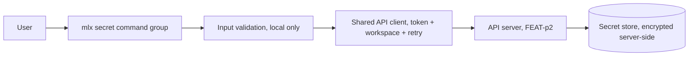
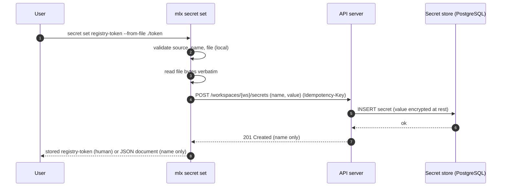
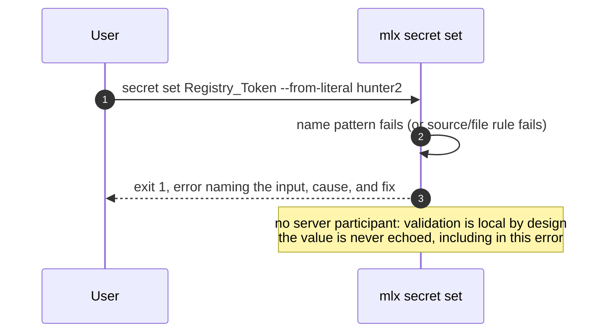
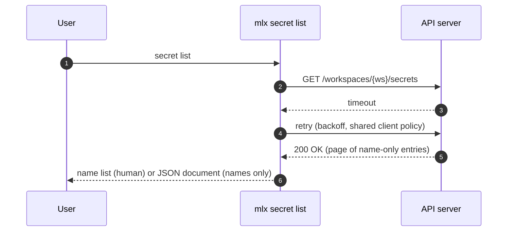
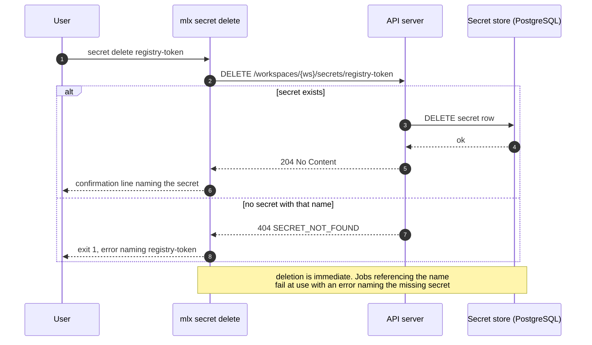

# Specification: mlx secret command

## Overview

The `secret` group is a cyclopts command group inside the `mlx` CLI package: three subcommands (`set`, `list`, `delete`) backed by a local input-validation module and the shared API client (auth token, workspace scoping, retry) from the FEAT-p1 client core.
The CLI is a pure consumer of the secret endpoints owned by the FEAT-p2 contract; this specification fixes the client-side contract view, the input rules of `set`, and the error and output behavior of each subcommand, with value non-display as the invariant that shapes every decision.

## Architecture

The command group adds no new layers; it composes the FEAT-p1 client core with a secret-specific validation module and command handlers.
The value travels exactly one hop in the clear: from the user's source (argument or file) into the POST body; it is never rendered, logged, or persisted client-side.

## Data Models

### `secret set` input (owned by this feature)

No spec file; the input is the name plus exactly one value source.

| Field | Type | Required | Constraints | Description |
|---|---|---|---|---|
| name | string | Yes | Kebab-case (`^[a-z0-9]+(-[a-z0-9]+)*$`), unique in the workspace (uniqueness confirmed server-side) | User-visible secret identifier referenced by job specs |
| `--from-literal <value>` | string | Exactly one of the two sources | Non-empty; documented as a shell-history risk in help (FR-7) | Value supplied on the command line |
| `--from-file <path>` | path | | File exists and is readable; non-empty after read; bytes stored verbatim (no trailing-newline trimming) | Value is the file's bytes |

Validation order is fixed so the first failure is deterministic: source exclusivity (both or neither is a usage error), then name pattern, then file existence, then file readability (only when `--from-file` is the source).
An empty value (empty literal or zero-byte file) is rejected locally as a usage error; a credential is never empty.
Every validation failure exits 1 with an error naming the input and the fix, and no server call is made.

### Secret listing entry (client view; resource owned by FEAT-p2)

| Field | Type | Constraints | Description |
|---|---|---|---|
| name | string | Kebab-case, unique per workspace | Secret identifier; the only field the CLI ever prints |

The contract never returns values (FEAT-p2 plan, api Phase: "secret schemas accept values on write and never return them on read").
Unknown response fields are ignored, not echoed: `secret` output is constructed from recognized fields only, so even a server bug adding a value-bearing field cannot leak through the CLI (defense in depth beyond the tolerate-unknown-fields convention).

## API Contracts

This feature defines no API surface of its own; no `api.yaml` is written.
The normative secret contract is owned by FEAT-p2 (`.sdlc/features/p2-api-server/plan/contract.md`, FEAT-p1 CLI mapping table).
The table below is the consumer-side view this feature codes against; if the two drift, the FEAT-p2 document wins.

| Method | Path | Purpose |
|---|---|---|
| POST | `/workspaces/{workspace}/secrets` | Store a credential under the validated name (value on write, never on read) |
| GET | `/workspaces/{workspace}/secrets?cursor=<cursor>` | List secret entries in the workspace (names only by contract; cursor-paginated per FEAT-p2-FR-14) |
| DELETE | `/workspaces/{workspace}/secrets/{secret}` | Remove the secret immediately |

Bearer-token auth, the cursor pagination convention, the error model (code, message, likely cause, suggested fix), and the `Idempotency-Key` header on POST are all inherited from the FEAT-p2 contract conventions and are implemented once in the shared client, not per command.
List pagination behavior: `secret list` follows the cursor until exhausted in both human and JSON modes; the JSON document is then the complete array of entries (name field only, unknown fields dropped per the defense-in-depth rule).
A typical workspace holds a handful of secrets, so the common case is one round trip.

Error mapping (server status to CLI behavior; exit codes inherited from the FEAT-p1 plan):

| Status | Server code | CLI behavior |
|---|---|---|
| 400 | INVALID_INPUT | Exit 1, print the server's cause and fix |
| 401 | UNAUTHENTICATED | Exit 2, prompt re-authentication hint |
| 404 | SECRET_NOT_FOUND | Exit 1, error naming the missing secret (delete) |
| 409 | CONFLICT | Exit 1, duplicate-name conflict error (FR-5) |
| 413 | PAYLOAD_TOO_LARGE | Exit 1, error naming the server's size limit and pointing to `--from-file` |
| 5xx or unreachable | any | Retry with backoff (NFR-2), then exit 3 with a clear server-unreachable or server-error message |

## Sequences

### secret set (happy path, from-file)

### secret set (local validation failure, no server call)

### secret list (transient failure retried)

### secret delete (happy path and missing secret)

## Technical Decisions

| Decision | Choice | Rationale |
|---|---|---|
| Contract ownership | No local `api.yaml`; code against the FEAT-p2 contract mapping | One normative source for the secret endpoints avoids drift; FEAT-p2 publishes the contract the CLI consumes |
| Value transport | Value in the POST body only; never rendered, logged, or persisted client-side | The one-hop rule makes the no-leak invariant (FR-6, NFR-3) structurally enforceable and testable |
| Diagnostics content | Errors and verbose logs name the secret and inputs, never argument values; no raw argv dumps in verbose mode | Closes the indirect leak path where a framework or debug log echoes the full command line |
| Output construction | Both output modes print recognized fields only (name); unknown response fields are ignored, not echoed | Defense in depth: even a server bug adding a value-bearing response field cannot leak through the CLI |
| File value semantics | Bytes stored verbatim, no trailing-newline trimming | Predictable round trip; trimming silently changes credentials and is a classic footgun |
| Empty value | Empty literal and zero-byte file are local usage errors | A credential is never empty; failing locally avoids a pointless server round trip |
| Validation order | Source exclusivity, name pattern, file existence, file readability | Deterministic first failure; string checks run before filesystem checks, and filesystem checks run before any read |
| Duplicate name | Surface the server's 409 as the conflict error (OQ1 default: error on duplicate, no upsert in v1) | Matches `spec.md`'s "unique in the workspace" and FR-5; upsert semantics would be a contract decision, not a CLI one |
| Masked prompt (OQ2) | Deferred out of v1; `--from-file` is the shell-history-safe path and help says so (FR-7) | The command surface is fixed by the FEAT-p1 plan; a third source is a parent-feature change |
| Local size limit (OQ3) | None enforced locally; the server's limit surfaces as the 413 mapping | One source of truth for the limit; the CLI has no business guessing it |
| Interactive budget | `list` renders in under 500 ms warm (NFR-4); total wall-clock adds one round trip per page | Keeps the inherited performance target measurable while allowing multi-page listings |
| Testing posture | All commands run against the contract-conformant stub with a canary value asserted absent from every output; the argument surface gets pytest coverage (NFR-5) | A canary grep across human, JSON, and verbose modes turns the no-leak invariant into an automated gate |

## Risks and Unknowns

1. Upsert semantics (OQ1) are undecided; set assumes error-on-duplicate, so a bump-or-overwrite decision in the FEAT-p2 contract would change only the set handler's 409 handling.
2. The 413 `PAYLOAD_TOO_LARGE` code and the server's size limit are not yet fixed in the FEAT-p2 contract; reconcile the mapping when the secret schemas land.
3. The empty-value and verbatim-bytes rules are CLI-side choices; if the server trims or rejects differently, job authentication failures would surface far from the cause, so reconcile both when the contract lands.
4. The masked prompt (OQ2) is deferred; `--from-literal` values in shell history remain a documented risk, not a mitigated one, until the parent surface owner adds the third source.
5. No server exists yet; every sequence is exercised against a contract-conformant stub (parent assumption 1, `.sdlc/knowledge/assumptions/1-cli-target-server.md`).

## Out of Scope

- Server-side secret storage, encryption at rest, and name uniqueness enforcement (FEAT-p2).
- Job-time secret resolution and its error messages (job submission and execution commands).
- Secret rotation, versioning, or expiry; one stored value per name in v1.
- Reading a secret value back under any circumstance; there is no `get` and none will be added.
- The interactive masked prompt (OQ2); a parent-feature change if adopted.
