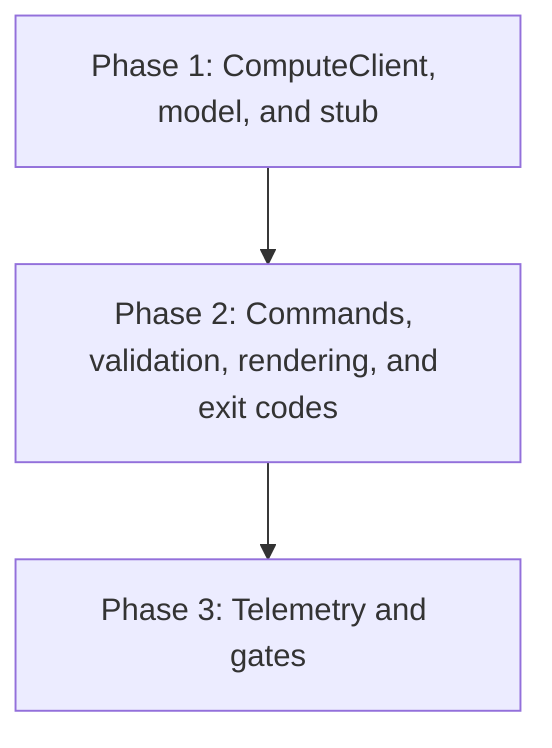

# Implementation Plan: mlx compute command

## Goal

Deliver the `mlx compute` command group (`list`, `get`) per specification.md: the `ComputeType` model, the `ComputeClient` over the FEAT-p2 compute-type endpoints, the renderers (table, key-value, JSON), the exit code mapping, and the telemetry events.
This plan is the compute slice of FEAT-p1 Phase 3 (operation commands); the command surface itself is settled in cli-design.md and is not restated here.
Plan structure: unified (`plan.md`), chosen per the create-plan skill's non-interactive default; the feature is one cohesive read-only client-side concern, too small to split.

## Phases

### Phase 1: ComputeClient, model, and stub

**Goal:** Types round-trip from the contract stub into `ComputeType` objects with every consumed outcome covered.
**Effort:** 1 person-day
**Depends on:** FEAT-p1 Phase 2 (shared API client with session and retry)

**Deliverables:**
- [ ] `ComputeType` model with forward compatibility (ignore unknown fields, nullable `gpu_model`, optional `quota.limit` and `quota.used`) per specification.md, Data Models
- [ ] `ComputeClient` as a typed wrapper over the two expected GET endpoints, behind an interface so contract drift is a one-file change
- [ ] Transparent cursor follow bounded by the 100-page guard, then exit 3 (specification.md, Technical Decisions)
- [ ] Contract-stub extension covering 200 (with and without quota limit, empty list, zero-remaining), 401, 404 with closest match in the suggested fix, and unreachable behavior, reconciled with FEAT-p2's `api.yaml` when it lands
- [ ] Client-side closest-match fallback over list results, used only when the 404 error model omits the suggestion

### Phase 2: Commands, validation, rendering, and exit codes

**Goal:** Both commands behave per cli-design.md against the stub.
**Effort:** 0.5 person-days
**Depends on:** Phase 1

**Deliverables:**
- [ ] `compute list` and `compute get <type>` wired through cyclopts with per-command help (NFR-1, cli-design.md Help Text)
- [ ] Local kebab-case validation (`^[a-z0-9]+(-[a-z0-9]+)*$`) before any request; malformed names exit 1 with no server call (FR-3)
- [ ] Renderers: TTY-aware table for `list`, key-value block for `get`, single-document JSON for `--json`; `cpu` rendering for GPU-less types; empty listing exits 0 (FR-1, FR-2, FR-4)
- [ ] Exit code mapping (404 to 1 with closest-match hint, 401 to 2, unreachable to 3 after backoff) and the `error:` plus `hint:` message format (FR-5, NFR-1)

### Phase 3: Telemetry and gates

**Goal:** All acceptance criteria pass and the toolchain gates are green.
**Effort:** 0.5 person-days
**Depends on:** Phase 2

**Deliverables:**
- [ ] Telemetry per telemetry.md: `compute_list_succeeded`, `compute_list_failed`, `compute_get_succeeded`, `compute_get_failed`, behind the shared opt-out (`MLX_TELEMETRY=off` or config) with the local buffer only, reusing FEAT-p3's install_id
- [ ] pytest coverage of the argument surface plus gherkin-derived scenarios for every FR and NFR acceptance criterion (NFR-4)
- [ ] Startup budget check: local startup and rendering under 500 ms excluding server time (NFR-3)

## Phase Dependencies

Strictly linear: each phase's stub outcomes and renderers are the next phase's fixtures.

## Milestones

| Milestone | Phase | Success Criteria |
|---|---|---|
| M1: Round trip | Phase 1 | Every consumed status outcome (200 variants, 401, 404, unreachable) is exercisable against the stub and mapped to a typed result |
| M2: Commands usable | Phase 2 | Both commands render per cli-design.md example sessions; exit codes and error-hint format match the Errors tables |
| M3: Feature done | Phase 3 | All requirements.md acceptance criteria pass; ruff, format, ty, and pytest gates green |

## Dependencies

| Dependency | Type | Owner | Risk if Delayed |
|---|---|---|---|
| FEAT-p1 Phase 1 scaffold (package, entry point, command registration) | Internal | FEAT-p1 implementors | Blocks Phase 2 wiring; the group cannot register commands |
| FEAT-p1 Phase 2 client core (shared API client, session, retry) | Internal | FEAT-p1 implementors | Blocks Phase 1; a temporary direct-HTTP wrapper is the discouraged fallback |
| Compute-type endpoints in the FEAT-p2 contract | External | FEAT-p2 implementors | Phase 1 codes against the expected shape; drift means rework confined to `ComputeClient` and the stub |
| Telemetry plumbing (install_id, opt-out, local buffer) | Internal | FEAT-p3 implementors | Phase 3 telemetry defers or ships dark; commands themselves are unaffected |
| FEAT-p1 Phase 3 budget re-baseline (this slice needs ~2 of its currently budgeted 5 person-days) | Internal | FEAT-p1 plan owner | Without reconciliation, compute competes with eleven sibling command groups in the same phase; escalate before implementation starts |

## Risk Register

| Risk | Likelihood | Impact | Mitigation |
|---|---|---|---|
| FEAT-p2 contract drift on paths, quota fields, or the closest-match carrier (specified concurrently) | High | Medium | Client behind an interface; stub mirrors the expected shape; reconcile with FEAT-p2's `api.yaml` before M2 |
| Closest-match suggestion absent from the shared error model | Medium | Low | Client-side fallback over list results already specified (one extra round trip on the error path only) |
| Shared client seam slips with FEAT-p1 Phase 2 | Medium | Medium | Escalate early; keep `ComputeClient` isolated so a temporary wrapper touches one file |
| Aggregate Phase 3 overload across sibling command groups | High | Medium | Route the re-baseline-or-descope decision to the FEAT-p1 plan owner; telemetry instrumentation is this slice's first descope candidate |

## Assumptions

- FEAT-p1 Phases 1 and 2 land before this slice starts.
- The FEAT-p2 contract exposes list and get for compute types with the shared error model; until the server exists, tests run against the contract-conformant stub, per FEAT-p1 assumption 1 (`.sdlc/knowledge/assumptions/1-cli-target-server.md`).
- Telemetry plumbing from FEAT-p3 lands with or before this slice's Phase 3; otherwise telemetry deliverables defer without blocking the commands.
- Promotion of these assumptions into `.sdlc/knowledge/` records is outside this run's write scope (feature directory only); if the pipeline owner wants them formalized, run `/create-assumption` after this run.

## Timeline

No calendar committed (team capacity unknown); duration-only.

| Phase | Duration |
|---|---|
| Phase 1: ComputeClient, model, and stub | 1 day |
| Phase 2: Commands, validation, rendering, and exit codes | 0.5 days |
| Phase 3: Telemetry and gates | 0.5 days |
| Total | ~2 working days |

Budget tension, not a fit: FEAT-p1 Phase 3 budgets 5 person-days for all operation commands, and this slice alone needs ~2 of them once the concurrently planned sibling command groups are counted.
The FEAT-p1 plan owner must re-baseline Phase 3 (or descope, with telemetry instrumentation the first candidate to defer) before implementation starts.
