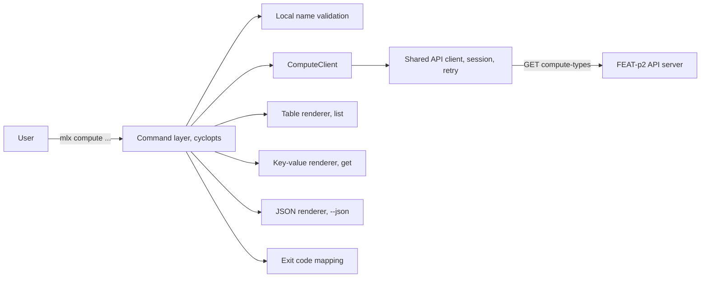
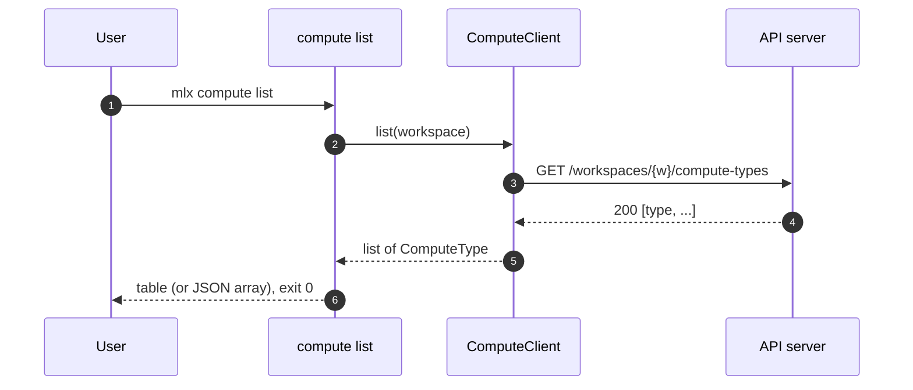
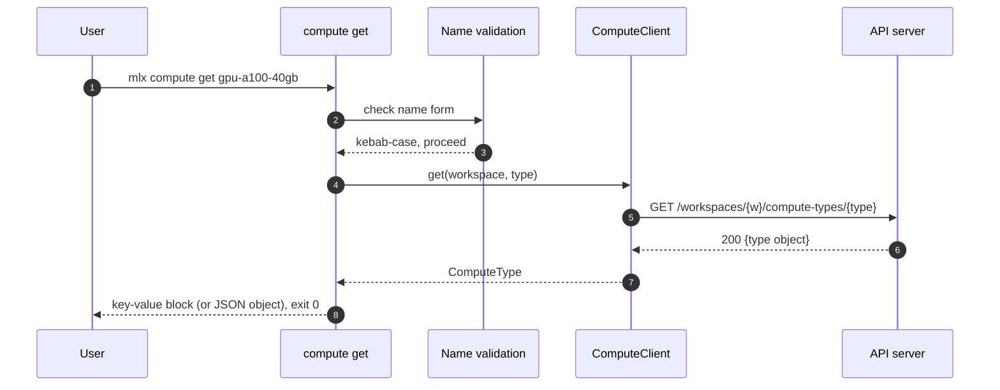
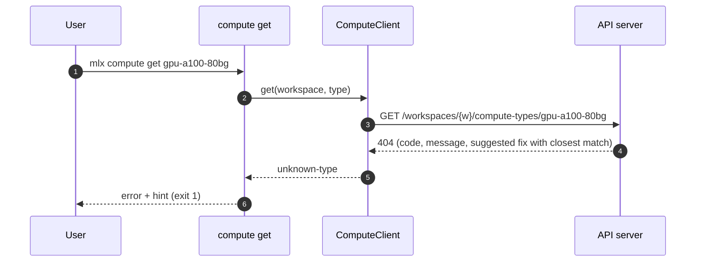
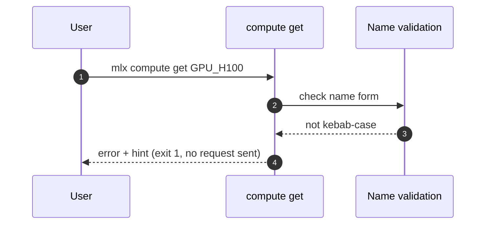
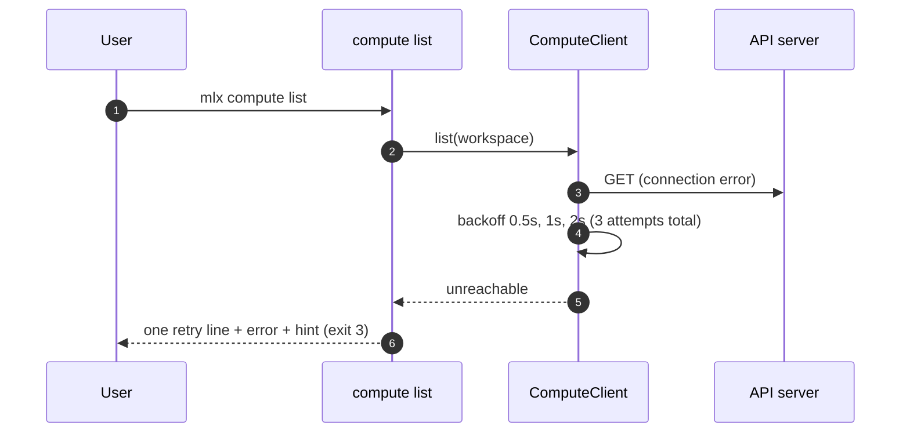

# Specification: mlx compute command

## Overview

The `mlx compute` group is a client-side feature built on cyclopts: a command layer (`list`, `get`), a `ComputeClient` that is a thin typed wrapper over two GET endpoints of the FEAT-p2 API server, and a renderer layer (table, key-value block, JSON).
The design goal is a read-only group with no local state: the server is the single source of type names, resources, and quota, and every failure path maps onto the shared exit code scheme.

## Architecture

| Component | Responsibility |
|---|---|
| Command layer | Argument parsing, output-mode selection, exit codes; no business rules beyond name validation |
| Local name validation | Kebab-case check on `<type>` before any network call; rejects malformed names with a usage error |
| ComputeClient | Typed wrapper returning `ComputeType` objects; translates transport and status outcomes into group outcomes (render, unknown-type, unreachable) |
| Shared API client | Bearer-token session, retry with backoff; the FEAT-p1 Phase 2 seam, not rebuilt here |
| Renderers | TTY-aware table, key-value block, and single-document JSON; identical content piped or redirected |

## Data Models

### ComputeType (in-memory and JSON model)

| Field | Type | Constraints | Description |
|---|---|---|---|
| type | string | kebab-case, not null | Machine type name, the user-facing identifier |
| gpu_model | string | nullable | GPU model name; null for CPU-only types |
| gpu_count | integer | >= 0, not null | Number of GPUs; 0 for CPU-only types |
| memory_gib | number | > 0, not null | Host memory in GiB |
| quota.remaining | integer | >= 0, not null | Units remaining for the workspace for this type |
| quota.limit | integer | >= 0, optional | Total units granted; absent when the contract reports remaining only |
| quota.used | integer | >= 0, optional | Units in use; absent when the contract reports remaining only |

Forward compatibility: the client ignores unrecognized fields in each type object, renders `gpu_model: null, gpu_count: 0` as `cpu` in the human table, and never hard-fails on unseen values.
The JSON output reproduces the fields above additively; adding optional fields later is not a breaking change.

### Consumed endpoints (owned by FEAT-p2)

| Field | Expectation |
|---|---|
| List path | `GET /workspaces/{workspace}/compute-types` (expected), returning the types the workspace can use |
| Get path | `GET /workspaces/{workspace}/compute-types/{type}` (expected), returning one type |
| Pagination | Cursor-style when present; expected cardinality is small (tens) |
| Error model | Shared error model: code, message, likely cause, suggested fix; the 404 suggested fix carries the closest matching type |

The exact paths and schemas are a tracked dependency (Risks and Unknowns 1); the stub used by tests mirrors whatever FEAT-p2 settles on.

## API Contracts

This feature defines no API surface; `api.yaml` is therefore not written here.
The group consumes the compute-type endpoints of the FEAT-p2 contract, whose normative definition lives with FEAT-p2 (`api.yaml` there).

| Method | Path (expected) | Purpose |
|---|---|---|
| GET | /workspaces/{workspace}/compute-types | Machine types available to the workspace, with quota |
| GET | /workspaces/{workspace}/compute-types/{type} | One machine type's resources and quota |

Status codes consumed and their group-level mapping:

| Status | Meaning in compute terms | CLI behavior |
|---|---|---|
| 200 | Types (or one type) returned | Render (table, key-value block, or JSON), exit 0; an empty list is a valid result |
| 401 | Session invalid or expired | Exit 2 with the inherited authentication error and hint |
| 404 | Unknown type name (well-formed) | Exit 1 with the server's closest-match suggestion |
| 5xx / connection error | Transient or unreachable | Retry with backoff, then exit 3 |

## Sequences

### List (happy path)

### Get (happy path)

### Get (unknown type)

### Get (malformed name, no server call)

### List (unreachable server)

## Technical Decisions

| Decision | Choice | Rationale |
|---|---|---|
| Shared API client, not a bespoke one | `ComputeClient` wraps the FEAT-p1 Phase 2 client (session, retry, backoff) | Retry, auth, and redaction behavior stay identical across command groups; contract drift stays a one-file change |
| Unknown-but-well-formed type name maps to exit 1 | 404 is rendered as a usage-class error with the server's closest match | The value is a bad argument even though detection is server-side; scripts get a stable, distinct-from-server-failure code (preserves the requirements review note) |
| Local validation is format-only | Kebab-case regex `^[a-z0-9]+(-[a-z0-9]+)*$` before any request | Fast failure for typos in form; no local catalog to check existence against, keeping the server authoritative |
| Pagination followed transparently | If the list response carries a cursor, the client fetches next pages until exhausted, bounded by a 100-page guard that fails with exit 3 | One table always; removes requirements Open Question 2 at the expected cardinality (tens of types) |
| Listing scope equals the quota-bearing set | The list endpoint returns exactly the types the workspace can use, including zero-remaining ones; `get` resolves against the same set | A type outside the set is unknown (404 path) rather than a third "exists but unavailable" state, keeping two outcomes instead of three |
| Quota rendering | Human output shows remaining as `X of Y` when `limit` is present, else `X`; JSON emits `quota.remaining` plus optional `limit` and `used` verbatim | Satisfies FR-1/FR-2's remaining-quota wording while tolerating a remaining-only contract (requirements Open Question 3, partially resolved; display only) |
| CPU-only types | `gpu_model` null and `gpu_count` 0 render as `cpu` in the table | Avoids a null cell in human output without inventing a sentinel model name |
| Empty listing | Exit 0 with an empty table (human) or empty array (JSON) | Absence of quota is a valid state, not an error |

## Risks and Unknowns

1. The FEAT-p2 compute-type endpoints (paths, schemas, quota fields, closest-match carrier) are being specified concurrently; the stub and this client must be reconciled against the final `api.yaml` before FEAT-p1 Phase 3 lands.
2. The closest-match suggestion is assumed to arrive in the shared error model's suggested-fix field; if the contract drops it, the fallback is a client-side closest match over the list results, at the cost of one extra round trip on the error path.
3. The quota unit (machines, GPUs, or credits) is contract-owned; this specification deliberately renders it opaquely so a unit change needs no CLI change.

## Out of Scope

- Defining the server-side API contract (owned by FEAT-p2; no `api.yaml` here).
- Quota limit administration (owned by the `quota` group, FEAT-p1-FR-21).
- Cluster and machine browsing (owned by the `infra` group, FEAT-p1-FR-22).
- List filters such as GPU-only (requirements Open Question 1; deferred pending demand).
