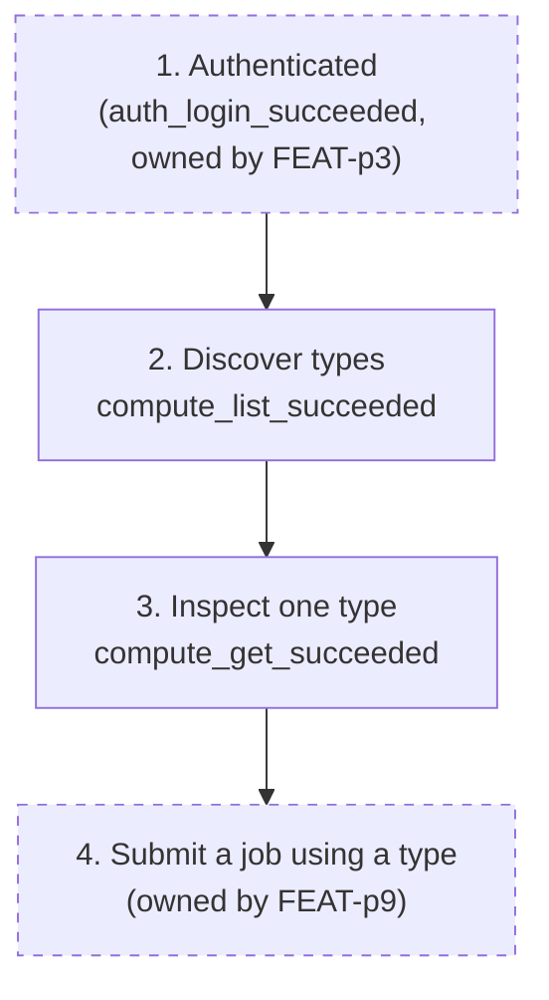

# Telemetry: mlx compute command

## Overview

Compute discovery is the pre-submission step for job authors: users who know their workspace's types and remaining quota write job specs that schedule, while users who do not generate "why will my job not run" support load.
This plan instruments both compute commands with anonymous, opt-out events (no identity, no server URL, no type names) and defines discovery-adoption metrics that feed the goals.md onboarding funnel.

## Success Metrics

| Metric | Target | Measurement Method | Timeframe |
|---|---|---|---|
| Discovery before first job | 50% or more of install_ids with a first job submission ran `compute list` or `compute get` before it | Sequence check per install_id: any compute success event before the first job submission event (job events owned by FEAT-p9) | First 30 days after each release |
| Compute command success rate | 95% or higher | `compute_list_succeeded` + `compute_get_succeeded` over all compute command events | Weekly |
| Unknown-type error share | Under 10% of `compute get` runs | `compute_get_failed` with reason `unknown-type` over all `compute get` events | Weekly |

## User Funnel

Steps 2 and 3 are owned by this feature; steps 1 and 4 are dashed because their marking events belong to FEAT-p3 and FEAT-p9.

| Step | Event | Entry Criteria | Exit Criteria |
|---|---|---|---|
| 1. Authenticated | `auth_login_succeeded` (FEAT-p3) | Session stored | The user runs a compute command |
| 2. Discover types | `compute_list_succeeded` | First successful `compute list` for the install_id | The user inspects a type or submits a job |
| 3. Inspect one type | `compute_get_succeeded` | First successful `compute get` | The user submits a job |
| 4. Submit a job using a type | (owned by FEAT-p9) | A job submission referencing a compute selection | End of funnel (goals.md key result) |

## Analytics Events

All events carry `source: "cli"`, the anonymous `install_id`, and the CLI version (`cli_version`); those shared properties are listed once here and not repeated per event.
No event carries the type name, user identity, server URL, or profile name.
Type names stay out because they fingerprint an organization's hardware fleet; counts and booleans carry the same signal.

### compute_list_succeeded

**Trigger:** `compute list` finishes rendering a result (including an empty listing).
**Location:** `compute list` command handler, after rendering.

| Property | Type | Required | Description |
|---|---|---|---|
| result_count | number | Yes | Number of types rendered (0 for an empty listing) |
| gpu_type_present | boolean | Yes | Whether at least one type has GPUs |
| followed_pages | boolean | Yes | Whether the transparent pagination follow engaged |
| duration_ms | number | Yes | Wall time of the command |
| json_mode | boolean | Yes | Whether `--json` was passed |

### compute_list_failed

**Trigger:** A `compute list` attempt ends without rendering.
**Location:** `compute list` error paths.

| Property | Type | Required | Description |
|---|---|---|---|
| reason | string | Yes | `auth`, `unreachable`, or `server` (maps to exit codes 2, 3, 3) |
| duration_ms | number | Yes | Wall time from command start to failure |

### compute_get_succeeded

**Trigger:** `compute get` finishes rendering one type.
**Location:** `compute get` command handler, after rendering.

| Property | Type | Required | Description |
|---|---|---|---|
| gpu_type | boolean | Yes | Whether the inspected type has GPUs |
| had_quota_limit | boolean | Yes | Whether the contract reported a limit alongside remaining |
| zero_remaining | boolean | Yes | Whether the workspace's remaining quota for the type is 0 |
| duration_ms | number | Yes | Wall time of the command |
| json_mode | boolean | Yes | Whether `--json` was passed |

### compute_get_failed

**Trigger:** A `compute get` attempt ends without rendering.
**Location:** `compute get` error paths.

| Property | Type | Required | Description |
|---|---|---|---|
| reason | string | Yes | `malformed-name`, `unknown-type`, `auth`, `unreachable`, or `server` (maps to exit codes 1, 1, 2, 3, 3) |
| duration_ms | number | Yes | Wall time from command start to failure |

## Counter Metrics

| Metric | Concern | Threshold |
|---|---|---|
| Unknown-type share of `compute get` runs | Type names not discoverable, or closest-match hint not rendered | Above 20% in a week |
| Zero-remaining share of successful `compute get` | Users inspecting types they cannot use; quota exhaustion communicated too late | Above 60% in a week |
| Unreachable share of compute attempts | Server reachability or wrong stored server URL | Above 5% in a week |

## Telemetry Requirements

| Requirement | Type | Notes |
|---|---|---|
| Shared anonymous install_id (UUID v4, user-only file) | Event | Reuses the `cli_first_run` install_id defined by FEAT-p3; one join key across command groups |
| Opt-out before first emission | Infrastructure | `MLX_TELEMETRY=off` env var or `telemetry.enabled = false` in the config file; checked before any event leaves the process |
| Local buffer, deferred destination | Infrastructure | Events append to the local file buffer defined by FEAT-p3; no network destination is decided yet, so nothing is sent |
| Redaction by construction | Event | Type names, identity, server URL, and profile name never enter the event pipeline; counts and booleans only |

## Dashboards and Alerts

- **Dashboard:** add a "Compute discovery" panel to the auth-and-onboarding dashboard (created when a destination exists): funnel from `compute_list_succeeded` to `compute_get_succeeded`, discovery-before-first-job share, success rate, failure mix by reason, zero-remaining share.
- **Alerts:** unknown-type share above 20% for a week (discoverability regression); unreachable share above 5% for a week (possible server-side incident, shared with FEAT-p3's alert).

## Out of Scope

- Server-side compute and quota metrics (FEAT-p2's observability scope).
- Job submission events (owned by FEAT-p9); the funnel's step 4 only sequences against them.
- Type-name-level analytics and per-workspace quota analytics (fingerprinting risk, no decision needs them yet).
- Any telemetry that is on by default with no opt-out, or that includes type names, identity, or server URL fields.
