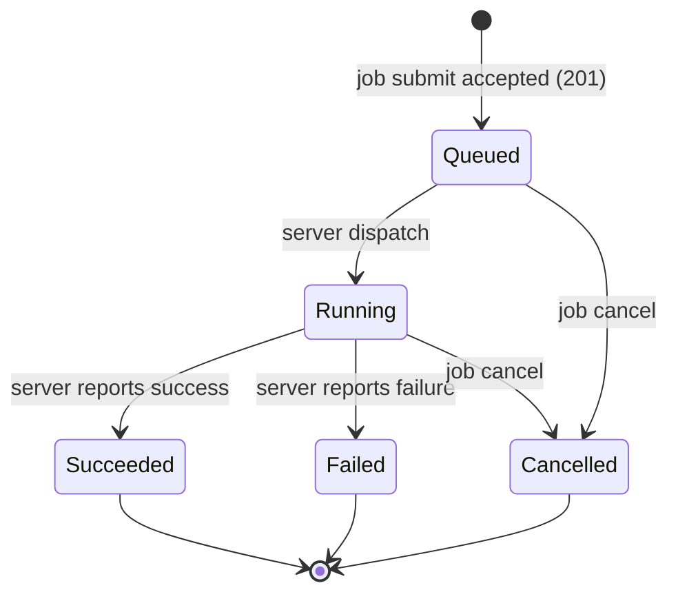

# Lifecycle: mlx job command

## Overview

The job group tracks one resource with a meaningful lifecycle: the Job (one shared lifecycle for `processing`, `training`, and `batch-inference`).
The state machine itself is owned and executed server-side (FEAT-p2; `architecture.md` notes all three job types share one lifecycle), so this document fixes the client's observation and interaction contract: which states the CLI renders, how each subcommand behaves per observed state, the one user-triggered transition (`job cancel`), and the guards the CLI enforces locally.
It is the client view; where the two could drift, the FEAT-p2 state machine wins.

## Resources

| Resource | Description | Lifecycle Type | Spec Ref |
|---|---|---|---|
| Job | Server-owned execution of processing, training, or batch inference work, observed via `job list`/`job get`/`job logs` and terminated via `job cancel` | Linear (client view of a server-owned state machine) | specification.md, Job resource |

The job spec file (the other data model in the specification) is a user-authored input read once per submission; it is not a managed resource and has no lifecycle entry.

## State Diagrams

### Job (client-observed contract)

The server may add transitions the CLI does not model (for example queued to failed on a dispatch error); the CLI tolerates them by rendering the reported state verbatim (open-on-read rule, specification.md).

## States

### Job

| State | Description | Entry Condition | Exit Condition | Spec Ref |
|---|---|---|---|---|
| Queued | Accepted by the server, not yet running | 201 response to `job submit` | Server dispatch, cancellation, or a server-side failure path | FR-1; specification.md, API Contracts |
| Running | Executing on compute, producing logs | Server dispatch | Succeeded, Failed, or Cancelled | FR-6 |
| Succeeded | Completed; outputs registered server-side (datasets, model version) | Server reports success | Terminal: no exit | FR-6; architecture.md data flows |
| Failed | Completed unsuccessfully | Server reports failure | Terminal: no exit | NFR-1 (error surfacing) |
| Cancelled | Terminated by a cancel request; no further logs are produced | `job cancel` accepted | Terminal: no exit | FR-7 |

Terminal-state command behavior: `job get` prints the state, `job logs` prints accumulated lines and exits 0 (follow mode ends), and `job cancel` is refused with an error naming the state.

## Transitions

### Job

| From | To | Trigger | Actor | Side Effects | Guard Conditions | Spec Ref |
|---|---|---|---|---|---|---|
| (none) | Queued | `job submit` | User | Local validation, POST with one `Idempotency-Key`, job id reported, `job_submit_succeeded` | Spec passes local validation; references confirmed server-side | FR-1, FR-2, FR-3 |
| (none) | (none) | Submission attempt fails | User or system | Nothing created; error plus hint; `job_submit_failed` | Validation failure (exit 1), reference failure (exit 1), auth failure (exit 2), unreachable (exit 3) | FR-2, FR-3, NFR-1, NFR-2 |
| Queued, Running | Cancelled | `job cancel` | User | POST cancel, confirmation line, server stops the workload and log production, `job_cancelled` | Job exists; observed state non-terminal (server enforces authoritatively; CLI surfaces the 409 naming the state) | FR-7 |
| Queued | Running | Server dispatch | Server | None client-side; the next `job list`/`job get` shows running | Placement succeeded server-side | Observed only |
| Running | Succeeded | Server completion | Server | Follow streams end; outputs registered server-side | Server-side | FR-6; Observed only |
| Running | Failed | Server failure | Server | Follow streams end | Server-side | Observed only |
| any | (unchanged) | `job list`, `job get`, `job logs` | User | Read-only; no job state is mutated | Job exists | FR-4, FR-5, FR-6 |

Racing transitions: a cancel issued while the server is completing the job resolves server-side; the CLI surfaces whichever outcome the server returns (a cancel accepted just before completion reports Cancelled, a cancel after Succeeded returns the 409 naming the state).
The CLI never adjudicates the race itself.

## Invariants

| Resource | Invariant | Enforced By | Violation Handling |
|---|---|---|---|
| Job | The CLI never derives or writes job state; it renders the server-reported state verbatim, including unknown state values | Read-only command handlers plus output tests | A command that mutates or rejects an unknown state fails review and tests |
| Job | `job cancel` mutates state only through the server's cancel endpoint; the CLI applies no local state gate beyond surfacing the server's refusal | Single cancel handler; error mapping table | A client-side bypass attempt fails review |
| Job | A follow stream ends by the terminal state at the latest, and no log line is produced after Cancelled | Streaming handler closes on terminal event; follow tests | Test failure blocks merge |
| Job | One submission invocation carries exactly one `Idempotency-Key`, reused across retries | Client core key handling; retry tests | A second key on retry fails tests (would create duplicate jobs, FR-10) |
| Job | Secret values never transit the CLI: specs carry names, output shows names | Redaction by construction in output tests (NFR-3) | Test failure blocks merge |

## Retention and Expiry

| Resource | Retention Policy | Expiry Trigger | Cleanup Action | Spec Ref |
|---|---|---|---|---|
| Job (client side) | The CLI holds no job state between invocations; the id is reported once at submission and re-discoverable via `job list` | Process exit | Nothing to clean up; job retention itself is server-side (FEAT-p2) | FR-1, FR-4 |

## Event Emissions

The CLI emits no cross-system events in v1; the observable surface is command output and exit codes.
Product analytics events (opt-out, anonymous install_id, no secret or identity fields) align with the transitions above and are specified in telemetry.md.

| Transition | Event | Payload | Consumer | Spec Ref |
|---|---|---|---|---|
| (none) to Queued | `job_submit_succeeded` | install_id, job_type, duration_ms | Product analytics (opt-out) | telemetry.md |
| submission attempt fails | `job_submit_failed` | install_id, job_type, reason (usage, references, auth, unreachable) | Product analytics (opt-out) | telemetry.md |
| Queued/Running to Cancelled | `job_cancelled` | install_id, job_type | Product analytics (opt-out) | telemetry.md |
| terminal state observed via `job get` | `job_state_reported` | install_id, job_type, state | Product analytics (opt-out) | telemetry.md |

## Out of Scope

- The server-side state machine, its transitions, reconciliation, and retention (owned by FEAT-p2, dispatch and contract concerns).
- The `batch` fast path (FEAT-p10); it inherits this client view for batch-inference jobs and adds no states.
- Experiment and run states (owned by FEAT-p11); `experiment` is only a spec reference submitted here.
- Model version and output dataset registration on success (server-side effects of Succeeded, owned by FEAT-p2 with FEAT-p1-FR-7 and FR-20).
