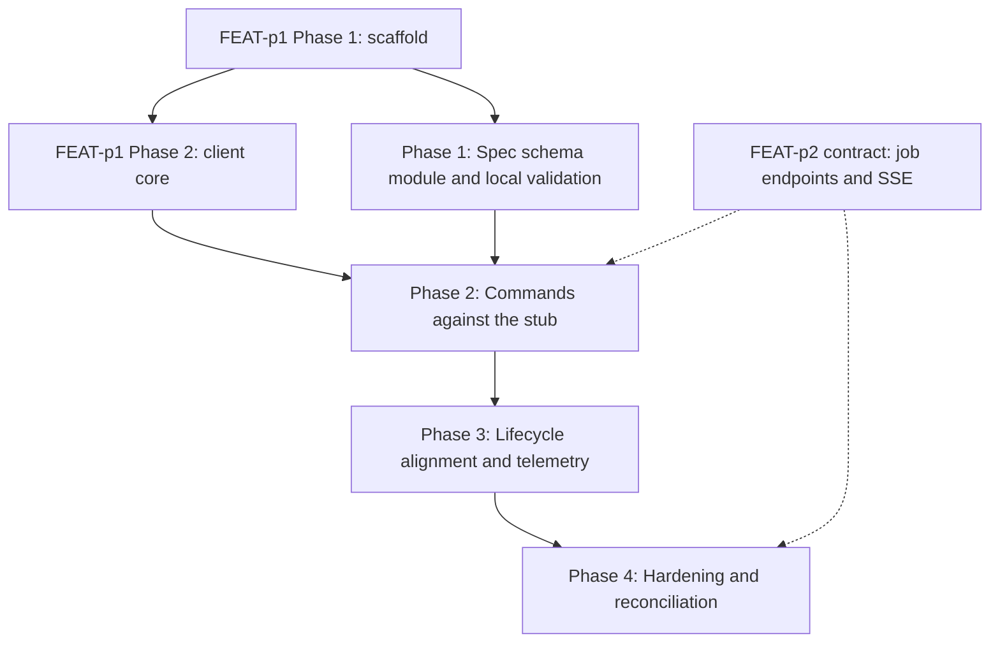

# Implementation Plan: mlx job command

## Goal

Deliver the `mlx job` command group (submit, list, get, logs, cancel) inside the unified CLI, implementing FEAT-p1-FR-4, FR-6, FR-8, FR-11, and FR-14 to the letter of `requirements.md`, `specification.md`, `lifecycle.md`, and `telemetry.md`.
The plan is unified (`plan.md`, not a split `plan/` set): the work spans a single concern (one CLI command group composing the shared client core plus the normative job spec schema), so a split would add files without adding clarity.
It is the delegated slice of FEAT-p1's Phase 3 job-submission deliverable and Phase 4 job-lifecycle deliverables, and it produces the schema module FEAT-p10 (`mlx batch`) consumes.

## Phases

### Phase 1: Spec schema module and local validation

**Goal:** The normative job spec schema is fully specified in code and every validation rule from the specification is enforced with actionable errors, with no server involvement and a stable interface for FEAT-p10.
**Effort:** 3 person-days
**Depends on:** FEAT-p1 Phase 1 (scaffold with the stubbed `job` group)

**Deliverables:**
- [ ] Typed spec models (common fields plus the `processing`, `training`, and `batch-inference` per-type sets) with the deterministic validation order from the specification (file exists, parse, `type`, common required, per-type required, `compute.type` form, reference forms)
- [ ] CLI constants: the closed `type` enum, kebab-case and `name:version` patterns, recognized URI schemes, default `compute.count` of 1
- [ ] Edge rules implemented: `env` scalar coercion with nested rejection naming the key, `hyperparameters` scalars and nested maps of scalars with array rejection, unknown fields ignored with a warning, `inputs`/`outputs` minimum one entry
- [ ] Validation errors naming the field, likely cause, and fix; the `type` error lists accepted values; exit 1 on every validation failure; no server call
- [ ] Unit tests covering every FR-2 acceptance criterion plus the edge rules
- [ ] Schema module interface documented for FEAT-p10 import (FR-8)

### Phase 2: Commands against the stub

**Goal:** All five subcommands work end to end against the contract-conformant stub, with the error mapping, output modes, and log streaming complete.
**Effort:** 4 person-days
**Depends on:** Phase 1; FEAT-p1 Phase 2 (client core: auth token, workspace scoping, retry with backoff, JSON mode)

**Deliverables:**
- [ ] SSE streaming spike first: prove a follow stream through the shared client, or record the fallback decision (risk 3)
- [ ] `job submit`: one `Idempotency-Key` per invocation reused across retries, 201 handled (submitted line; JSON with id, name, type, state), 400 reference codes surfaced naming the reference (FR-1, FR-3, FR-10)
- [ ] `job list`: `--type` and `--state` local enum checks, cursor following to exhaustion, ID/NAME/TYPE/STATE table, empty result exits 0 (FR-4)
- [ ] `job get`: key-value block with compute and type-specific fields, `env` keys only, secrets as names, 404 naming the id (FR-5, FR-9)
- [ ] `job logs`: non-follow prints accumulated lines and exits 0 (empty allowed); `--follow` streams with per-line flush, ends at terminal state, interrupt exits 0; `--json` emits one array without `--follow` and rejects the combination with `--follow` (FR-6)
- [ ] `job cancel`: POST, confirmation line, 409 surfaced naming the current state, 404 naming the id (FR-7)
- [ ] Error mapping table implemented (400 to exit 1, 401 to exit 2, 404 and 409 to exit 1, 5xx and unreachable retried then exit 3)
- [ ] `--json` output mode for all five subcommands per the specification's shapes
- [ ] Stub job endpoints: submit (with reference validation), list (filters plus cursor), get, cancel (terminal refusal), and an SSE log stream that closes on terminal state
- [ ] Acceptance criteria from `requirements.md` mapped to pytest scenarios passing against the stub

### Phase 3: Lifecycle alignment and telemetry instrumentation

**Goal:** The lifecycle invariants hold under test and the telemetry events fire per the plan, with opt-out honored before first emission.
**Effort:** 2 person-days
**Depends on:** Phase 2

**Deliverables:**
- [ ] Read-only rendering guaranteed: unknown state values render verbatim, and no command mutates job state locally (lifecycle invariants, with output tests)
- [ ] Single cancel handler verified against the terminal-state refusal; follow streams close at terminal state with no post-cancel lines (invariants)
- [ ] Telemetry events implemented: `job_submit_succeeded`, `job_submit_failed`, `job_list_completed`, `job_state_reported` (get only), `job_cancelled`, `job_logs_completed`, with `source`, `install_id`, and `cli_version` on every event
- [ ] Opt-out (`MLX_TELEMETRY=off`, config flag) checked before any event leaves the process; local buffer written when enabled
- [ ] Redaction by construction: no spec contents, resource names, token, or identity fields enter the event pipeline (verified by tests)

### Phase 4: Hardening and reconciliation

**Goal:** NFR acceptance criteria pass, the toolchain gates are green, and the client view is reconciled with the published FEAT-p2 job contract.
**Effort:** 1 person-day
**Depends on:** Phase 3

**Deliverables:**
- [ ] Error-message audit: cause plus fix on every failure path (NFR-1)
- [ ] Render budget verified: `job list` and `job get` render in under 500 ms warm (NFR-4)
- [ ] Argument-surface coverage complete for all five subcommands and both filter flags (NFR-5)
- [ ] `uv run ruff check .`, `uv run ruff format --check .`, `uv run ty check .`, and `uv run pytest` all green (NFR-5)
- [ ] Reconcile the reference-error codes, the 409 terminal-cancel code, the SSE contract details, and the job id shape with the published FEAT-p2 contract, or record the remaining gaps
- [ ] FR-10 retry safety verified end to end against the stub's replay semantics

## Phase Dependencies

Solid edges are hard sequencing; dashed edges are external dependencies (the stub stands in for FEAT-p2 until the contract and server land).
Phase 1 needs only the scaffold, so it can start as soon as FEAT-p1 Phase 1 completes and run while the client core is still being built.

## Milestones

| Milestone | Phase | Success Criteria |
|---|---|---|
| M1: Schema correct locally | Phase 1 | Every FR-2 acceptance criterion passes with no server participant; FEAT-p10 can import the module |
| M2: Full group on the stub | Phase 2 | All FR-1, FR-3 through FR-7, FR-9, and FR-10 acceptance criteria pass against the stub |
| M3: Invariant-safe and instrumented | Phase 3 | Lifecycle invariants hold under test; telemetry events fire per plan with opt-out honored |
| M4: Shippable slice | Phase 4 | All NFR acceptance criteria pass; four toolchain gates green; contract reconciliation done or gap recorded |

## Dependencies

| Dependency | Type | Owner | Risk if Delayed |
|---|---|---|---|
| FEAT-p1 Phase 1 scaffold (command tree with stubbed `job` group) | External | FEAT-p1 implementors | Blocks Phase 1 |
| FEAT-p1 Phase 2 client core (auth, workspace, retry, JSON mode, idempotency-key support) | External | FEAT-p1 implementors | Blocks Phase 2; Phase 1 proceeds meanwhile |
| FEAT-p2 job contract (endpoints, error codes, SSE stream, job id shape) | External | FEAT-p2 implementors | Phase 2 codes against the stub; Phase 4 reconciliation slips or records a gap |
| Stub server job endpoints including the SSE stream | Internal | This feature | Blocks automated acceptance testing in Phase 2 |
| Schema module interface (Phase 1 output) | Internal | This feature | FEAT-p10's submission work blocks until it lands |

## Risk Register

| Risk | Likelihood | Impact | Mitigation |
|---|---|---|---|
| Client core (FEAT-p1 Phase 2) lands late | Medium | High | Phase 1 is pure local validation with no client dependency; it absorbs the slip |
| FEAT-p2 publishes job schemas that differ from this feature's consumer view | Medium | Medium | Consumer view cites the normative owner; Phase 4 reconciliation catches drift; constants and error mapping are single-place |
| SSE follow streaming is harder than expected through the shared client or the stub | Medium | Medium | Spike scheduled first in Phase 2; fallback is a simplified stub stream that still exercises the client contract, with the gap recorded |
| Idempotency replay semantics differ from the FEAT-p2 sketch | Low | Medium | FR-10 degrades to at-most-once submission with a clear retry warning; the handler is single-place |
| An open-question default flips (env echo, hyperparameters values, cancel prompt, interrupt exit code) | Low | Low | Each default is isolated behind a single handler or decision row; the change is local |
| Job id shape turns out locally unvalidatable | Low | Low | Ids stay opaque in v1 (no local form check); only the non-empty check remains |
| Stub drifts from the real contract | Medium | Medium | Stub assertions derive from the specification's consumer view; Phase 4 reconciles against the published contract |

## Assumptions

- The FEAT-p1 client core (auth, workspace scoping, retry, JSON mode, idempotency-key support) is available before Phase 2 starts.
- The consumer-side contract view in `specification.md` matches what FEAT-p2 publishes for the job endpoints (the stub encodes this view).
- SSE streaming through the shared client is viable (validated by the Phase 2 spike before the rest of Phase 2 proceeds).
- The recorded defaults hold: env keys only in `job get`, hyperparameters scalars and nested maps, no cancel confirmation, follow interrupt exits 0.
- The telemetry infrastructure posture (anonymous install_id, opt-out, local buffer, deferred destination) matches what the p3 plan settles for the CLI.

Note: per this run's write scope (feature directory only), these assumptions were not promoted to `.sdlc/knowledge/assumptions/`; the SSE viability and client-core timing assumptions are the first candidates when that path is writable (the stub-target dependency is already covered by parent assumption 1).

## Timeline

No calendar committed (team capacity unknown); duration-only.

| Phase | Duration |
|---|---|
| Phase 1: Spec schema module and local validation | 3 days |
| Phase 2: Commands against the stub | 4 days |
| Phase 3: Lifecycle alignment and telemetry | 2 days |
| Phase 4: Hardening and reconciliation | 1 day |
| Total | ~10 working days |
