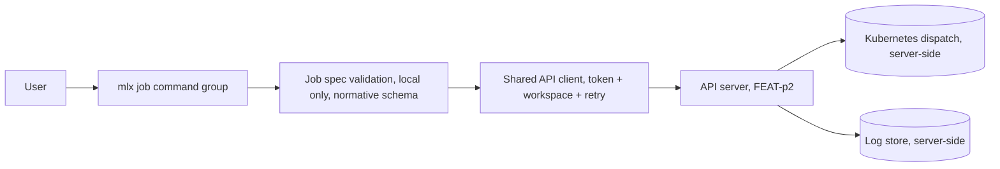
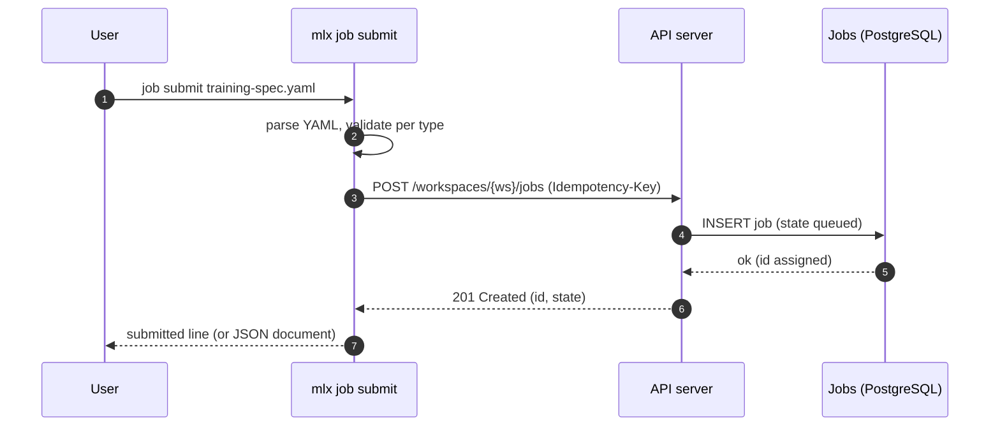
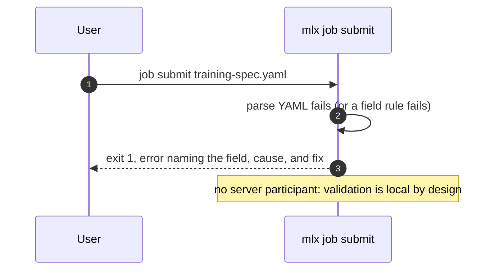
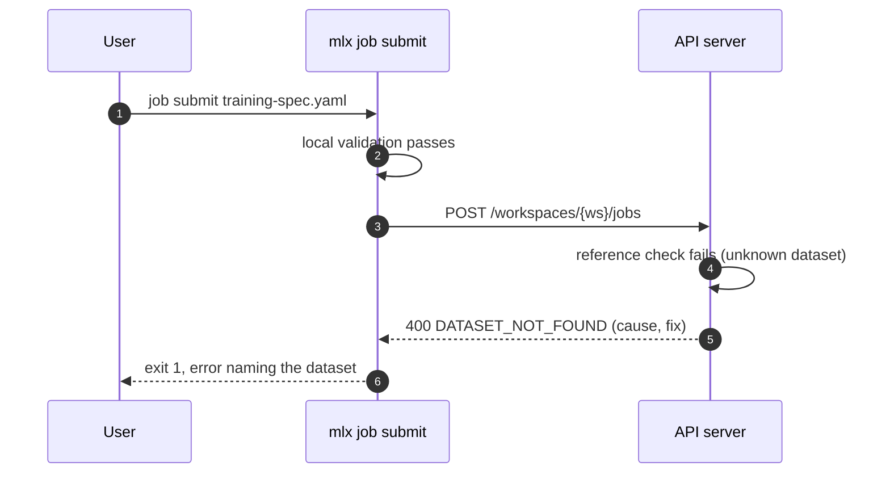
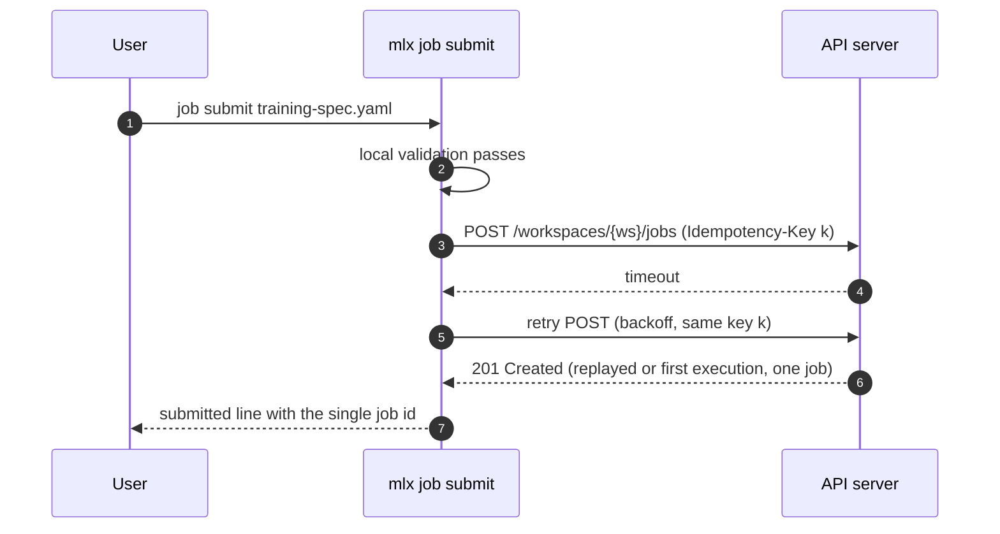
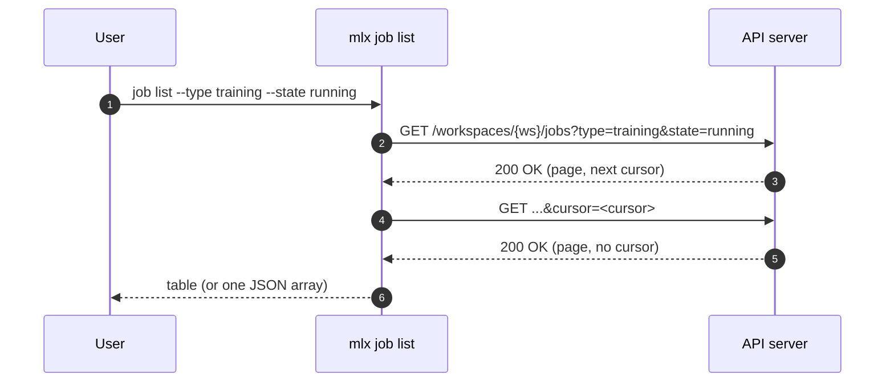
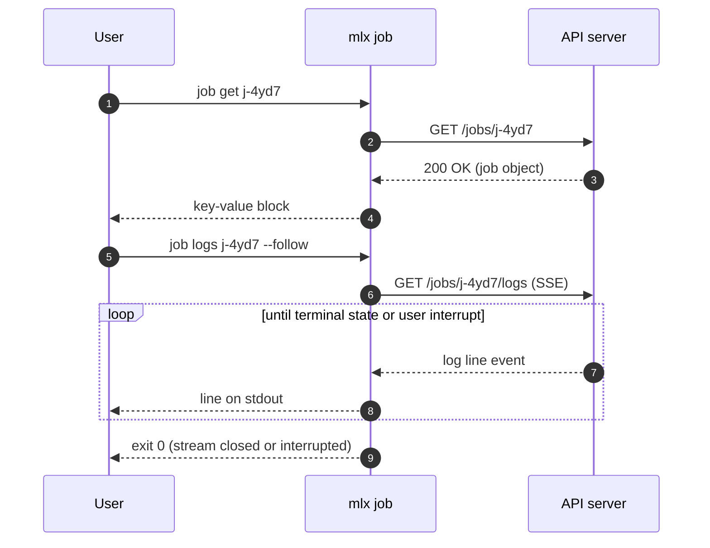
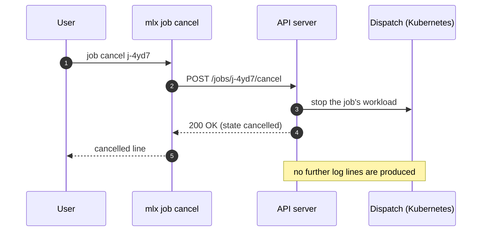

# Specification: mlx job command

## Overview

The `job` group is a cyclopts command group inside the `mlx` CLI package: five subcommands (`submit`, `list`, `get`, `logs`, `cancel`) backed by a local spec-validation module and the shared API client (auth token, workspace scoping, retry) from the FEAT-p1 client core.
The CLI is a pure consumer of the job endpoints owned by the FEAT-p2 contract; this specification fixes the client-side contract view, the normative job spec file format (shared with FEAT-p10), and the error and output behavior of each subcommand.

## Architecture

The command group adds no new layers; it composes the FEAT-p1 client core with a job spec-validation module (the normative schema FEAT-p10 consumes) and command handlers.
The streaming path (`job logs --follow`) holds one long-lived read connection; placement, dispatch, and log retention stay server-side.

## Data Models

### Job spec file (input, owned by this feature, normative for FEAT-p10)

One YAML file per `job submit` invocation, discriminated by `type`.

Common fields (all types):

| Field | Type | Required | Constraints | Description |
|---|---|---|---|---|
| name | string | Yes | Kebab-case (`^[a-z0-9]+(-[a-z0-9]+)*$`) | User-visible job name shown in listings |
| type | string | Yes | One of `processing`, `training`, `batch-inference` (closed set held as a CLI constant in v1) | Selects the per-type field set and the server dispatch path |
| compute.type | string | Yes | Kebab-case form validated locally; existence confirmed server-side (a type from `mlx compute list`) | Machine type the job runs on |
| compute.count | integer | No | Integer 1 or greater; defaults to 1 when omitted | Number of machines of that type |
| description | string | No | Free-form; not parsed, not shown in listings | Human context for the job |
| secrets | string list | No | Each entry kebab-case, a name from `mlx secret list`; values never appear anywhere | Credentials injected into the job server-side |
| env | string map | No | Keys non-empty without `=`; scalar values (string, number, boolean) coerced to their string form, nested structures rejected naming the key | Environment variables for the job |

`type: processing` fields (FEAT-p1-FR-4):

| Field | Type | Required | Constraints | Description |
|---|---|---|---|---|
| inputs | list | Yes | At least one entry | Input datasets the job reads |
| inputs[].dataset | string | Yes | Kebab-case catalog name; existence confirmed server-side | Dataset catalog name |
| inputs[].mount | string | No | Path; semantics owned by the server contract (Open Question 2), passed through verbatim | Path the job reads the input from |
| outputs | list | Yes | At least one entry | Output datasets registered on success |
| outputs[].name | string | Yes | Kebab-case | Dataset name registered in the catalog on success |
| outputs[].location | string | No | URI with a recognized scheme (`s3://`, `gs://`, `file://` in v1; CLI constant, extensible); generated server-side when omitted | Explicit destination URI |
| code.image | string | Yes | Container image reference (for example `ghcr.io/acme/ctr-trainer:1.4`) | Container image to run |
| code.entrypoint | string | No | Non-empty string | Overrides the image entrypoint |
| code.args | string list | No | May be empty | Arguments passed to the entrypoint |

`type: training` fields (FEAT-p1-FR-6):

| Field | Type | Required | Constraints | Description |
|---|---|---|---|---|
| code.image, code.entrypoint, code.args | | image Yes, rest No | Same rules as processing | Container code the job runs |
| dataset | string | Yes | Kebab-case catalog name; existence confirmed server-side | Dataset the job trains on |
| experiment | string | No | Kebab-case; existence confirmed server-side | Experiment the run attaches to (FEAT-p1-FR-19) |
| model.name | string | No | Kebab-case | Registers the trained artifact under this name (FEAT-p1-FR-7) |
| hyperparameters | map | No | Scalar values (string, number, boolean) and nested maps of scalars; arrays rejected naming the key (Open Question 3) | Passed through to the training code |

`type: batch-inference` fields (FEAT-p1-FR-8):

| Field | Type | Required | Constraints | Description |
|---|---|---|---|---|
| model | string | Yes | `name:version` (`^[a-z0-9]+(-[a-z0-9]+)*:[0-9]+$`); existence confirmed server-side | Registered model the job scores with (FEAT-p1-FR-7) |
| inputs | list | Yes | At least one entry | Input datasets the model scores |
| inputs[].dataset | string | Yes | Kebab-case catalog name; existence confirmed server-side | Dataset catalog name |
| output.dataset | string | Yes | Kebab-case | Output dataset name registered on success |
| output.location | string | No | URI with a recognized scheme; generated server-side when omitted | Explicit destination URI |

Unknown fields in the spec file are ignored with a warning, never rejected (forward compatibility).
Validation order is fixed so the first failure is deterministic: file exists, YAML parses, `type` present and valid, required common fields in table order, required per-type fields in table order, `compute.type` form, structural reference forms (model `name:version`, kebab-case names, env and hyperparameter value rules).
Every validation failure exits 1 with an error naming the field and the fix (for `type`, the error lists the accepted values), and no server call is made.

### Job resource (client view; resource owned by FEAT-p2)

| Field | Type | Constraints | Description |
|---|---|---|---|
| id | string | Server-assigned, opaque | Job identifier used by get, logs, cancel |
| name | string | Kebab-case | Echoes the spec's name |
| type | string | `processing`, `training`, or `batch-inference` | Job type |
| state | string | Open on read: the v1 values are `queued`, `running`, `succeeded`, `failed`, `cancelled`, and unknown values render verbatim rather than failing | Current lifecycle state (transitions owned server-side) |
| compute | object | `{type, count}` | Compute selection as submitted |
| created_at | string | ISO timestamp when the contract provides it | Submission time |
| secrets | string list | Names only | Referenced secrets |
| env | object | Keys only in v1 (Open Question 6) | Submitted environment keys |
| type-specific fields | varies | `inputs`/`outputs`, `dataset`, `model`, `experiment` as per the spec | Echo of the submitted spec |

The client tolerates unknown response fields (a future `finished_at`, for example) and ignores them rather than failing.
The list endpoint returns job summaries (`id`, `name`, `type`, `state`).

## API Contracts

This feature defines no API surface of its own; no `api.yaml` is written.
The normative job contract is owned by FEAT-p2 (`.sdlc/features/p2-api-server/plan/contract.md`, FEAT-p1 CLI mapping table).
The table below is the consumer-side view this feature codes against; if the two drift, the FEAT-p2 document wins.

| Method | Path | Purpose |
|---|---|---|
| POST | `/workspaces/{workspace}/jobs` | Submit a job (type declared by the spec); `Idempotency-Key` header |
| GET | `/workspaces/{workspace}/jobs?type=<type>&state=<state>&cursor=<cursor>` | List jobs in the workspace (cursor-paginated per FEAT-p2-FR-14) |
| GET | `/jobs/{job}` | Fetch one job |
| GET | `/jobs/{job}/logs` | Read accumulated logs (SSE stream; gRPC `JobLogs.Stream` reserved) |
| POST | `/jobs/{job}/cancel` | Request cancellation |

Bearer-token auth, the cursor pagination convention, the error model (code, message, likely cause, suggested fix), and the `Idempotency-Key` header on POST are inherited from the FEAT-p2 contract conventions and are implemented once in the shared client, not per command.

List pagination behavior: `job list` follows the cursor until exhausted in both human and JSON modes, and the JSON document is then the complete array of job summaries.
The render budget (NFR-4) covers local startup and rendering; wall-clock adds one round trip per page.

Error mapping (server status to CLI behavior; exit codes inherited from the FEAT-p1 plan):

| Status | Server code | CLI behavior |
|---|---|---|
| 400 | INVALID_INPUT | Exit 1, print the server's cause and fix |
| 400 | reference codes (`DATASET_NOT_FOUND`, `MODEL_NOT_FOUND`, `SECRET_NOT_FOUND`, `COMPUTE_TYPE_NOT_FOUND`; consumer-side request, see Risks) | Exit 1, error naming the unknown reference |
| 401 | UNAUTHENTICATED | Exit 2, prompt re-authentication hint |
| 404 | JOB_NOT_FOUND | Exit 1, error naming the missing job |
| 409 | INVALID_STATE (cancel of a terminal job; consumer-side request, see Risks) | Exit 1, error naming the job and its current state |
| 5xx or unreachable | any | Retry with backoff (NFR-2), then exit 3 with a clear server-unreachable or server-error message |

## Sequences

### job submit (happy path, training)

### job submit (local validation failure, no server call)

### job submit (unknown reference confirmed server-side)

### job submit (transient failure retried, no duplicate)

### job list (filtered, cursor followed)

### job get and job logs --follow

### job cancel

## Technical Decisions

| Decision | Choice | Rationale |
|---|---|---|
| Contract ownership | No local `api.yaml`; code against the FEAT-p2 contract mapping | One normative source for the job endpoints avoids drift; FEAT-p2 publishes the contract the CLI consumes |
| Spec parsing | PyYAML with a typed field-by-field validation module | Mature parser; field-by-field errors satisfy the actionable-error rule (FEAT-p1-NFR-1) better than schema-exception dumps |
| Schema sharing | Single validation module; FEAT-p10 imports it (FR-8) | The batch fast path validates the same document; one module means zero drift by construction |
| Unknown spec fields | Ignore with a warning | Additive spec evolution does not break older CLI versions |
| `type` enum | Closed CLI constant (`processing`, `training`, `batch-inference`) | The discriminator selects local validation; the error lists accepted values offline; drift risk tracked below |
| `state` enum | Open on read: v1 values rendered, unknown values rendered verbatim | A new server state (a future `pausing`) must not crash older clients; listings degrade gracefully |
| `compute.type` | Local form check only; existence confirmed server-side | The CLI has no authoritative compute catalog; `mlx compute list` (FEAT-p8) is the discovery surface |
| Idempotency | One `Idempotency-Key` (UUID v4) per submission invocation, reused across retries (FR-10) | Makes NFR-2 retries safe; matches the FEAT-p2 Phase 1 convention |
| Log streaming transport | SSE over the shared REST client in v1; gRPC reserved | The shared client is REST-based; the contract sketches both; final choice tracked as Open Question 4 |
| `--json` with `--follow` | Usage error | The global JSON contract requires exactly one document; an unbounded stream cannot provide it; NDJSON via a parent-surface change if demanded |
| Follow interrupt | Exit 0, stream closed cleanly | Interrupting a follow stream is the documented way to stop reading; a running job is unaffected |
| `env` values | Scalars coerced to strings; nested structures rejected naming the key | Keeps `lr: 0.001`-style values working while blocking ambiguous structures |
| `hyperparameters` values | Scalars and nested maps of scalars; arrays rejected naming the key | Pending Open Question 3; the strict-but-predictable default |
| `env` echo in `job get` | Keys only in v1 | Values may embed credentials; safe default pending Open Question 6, reversible locally |
| Output | Human tables and key-value blocks by default; single JSON document under the parent's `--json` (array of lines for non-follow logs) | Inherited FEAT-p1-FR-12 convention, with the streaming exception above |
| Log rendering | Lines written to stdout verbatim, flushed per line | Streaming correctness over batching; stderr stays diagnostics-only |
| Interactive budget | `list` and `get` render in under 500 ms warm (NFR-4); `logs --follow` excluded | Keeps the inherited performance target measurable while allowing an open-ended stream |
| Testing posture | All commands run against the contract-conformant stub; the job argument surface gets pytest coverage (NFR-5) | Matches the parent constraint until the FEAT-p2 server exists |

## Risks and Unknowns

1. The log streaming transport depends on FEAT-p2 contract Phase 3 (SSE endpoint schema plus gRPC sketch); this specification assumes SSE, and a gRPC-only decision would rework the streaming handler.
2. The terminal-state cancel refusal assumes a 409 `INVALID_STATE` error; the code is a consumer-side request until the contract lands.
3. The reference-confirmation error codes (`DATASET_NOT_FOUND` and siblings) are consumer-side assumptions; reconcile when the FEAT-p2 job schemas land.
4. The closed `type` constant can drift from the server's accepted job types; unknown types fail locally with the accepted-values error, so drift surfaces as a clear error rather than silence.
5. Mount path semantics (Open Question 2) are undefined; `inputs[].mount` passes through verbatim, and a later contract decision may add local validation.
6. No server exists yet; every sequence is exercised against a contract-conformant stub (parent assumption 1, `.sdlc/knowledge/assumptions/1-cli-target-server.md`).
7. Idempotent replay depends on the FEAT-p2 Phase 1 convention landing with replay semantics as sketched; without it, FR-10 degrades to at-most-once submission with a clear retry warning.

## Out of Scope

- The `batch` fast-path commands (owned by FEAT-p10); this feature provides only the shared spec schema module.
- Server-side job persistence, scheduling, placement, dispatch, quota enforcement, and log retention (FEAT-p2).
- Experiment creation and run metrics views (FEAT-p11); this feature only submits the `experiment` reference.
- Dataset catalog management (FEAT-p5), secret management (FEAT-p7), compute type listing (FEAT-p8), and model registration (FEAT-p13).
- Log download to a file, time filtering, and tail limits; add flags only on demand via a parent-surface change.
