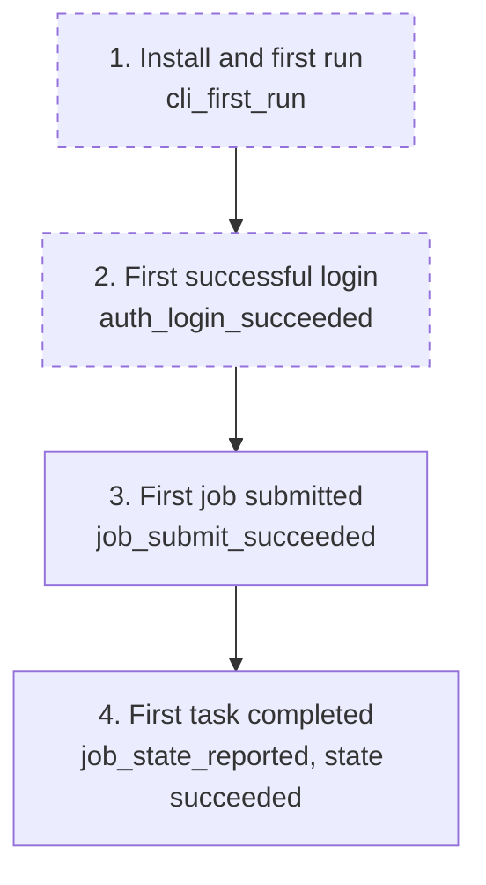

# Telemetry: mlx job command

## Overview

The job group is where the platform's core value lands: processing, training, and batch inference are the tasks users came for.
goals.md's key result "under 1 hour from install to first successful task" completes here: p3's funnel ends at first login, and the first successful task is a submitted job observed reaching a terminal state.
This plan instruments the submission flows with anonymous, opt-out events (no token, no identity, no server URL, no spec contents, no resource names) and defines the job health metrics that detect validation friction, reference-guessing, and streaming instability early.

## Success Metrics

| Metric | Target | Measurement Method | Timeframe |
|---|---|---|---|
| Time to first job submission | Median under 20 minutes from `auth_login_succeeded` to first `job_submit_succeeded` per install_id | Funnel over `auth_login_succeeded` and `job_submit_succeeded` | First 7 days after each release |
| Time to first completed task | Median under 60 minutes from `cli_first_run` to the first observed succeeded state (goals.md key result) | Funnel over `cli_first_run`, `auth_login_succeeded`, `job_submit_succeeded`, `job_state_reported` with state succeeded | First 7 days after each release |
| Job submission success rate | 90% or higher | `job_submit_succeeded` / (`job_submit_succeeded` + `job_submit_failed`) | Weekly |
| Submission failure mix | No single `reason` above 60% of `job_submit_failed` | Group `job_submit_failed` by `reason` | Weekly |

## User Funnel

Steps 1 and 2 are owned by the CLI bootstrap and the auth group (p3 telemetry); they are dashed because their marking events belong elsewhere.
Step 4 measures an observed success: the CLI can only mark completion when the user looks (`job get`), so the true completion time is an upper bound; the bias is noted rather than hidden.

| Step | Event | Entry Criteria | Exit Criteria |
|---|---|---|---|
| 1. Install and first run | `cli_first_run` | The CLI creates a fresh install_id at first run | The user attempts or completes a login |
| 2. First successful login | `auth_login_succeeded` | First `auth_login_succeeded` for the install_id | The user runs an operation command |
| 3. First job submitted | `job_submit_succeeded` | First `job_submit_succeeded` for the install_id | The user observes the job's state |
| 4. First task completed | `job_state_reported` with state succeeded | First `job_state_reported` carrying state succeeded | End of funnel (goals.md key result) |

## Analytics Events

All events carry `source: "cli"`, the anonymous `install_id`, and the CLI version (`cli_version`); those shared properties are listed once here and not repeated per event.
No event carries the token, user identity, server URL, profile name, job name, or any spec contents (dataset, model, secret, and compute names are user content and stay out).

### job_submit_succeeded

**Trigger:** The server accepts the submission and the job id is reported.
**Location:** `job submit` command handler, after the submitted line prints.

| Property | Type | Required | Description |
|---|---|---|---|
| job_type | string | Yes | `processing`, `training`, or `batch-inference` |
| duration_ms | number | Yes | Wall time from command start to the submitted line |
| retried | boolean | Yes | Whether at least one retry was needed (NFR-2, FR-10) |

### job_submit_failed

**Trigger:** A submission attempt ends without a job id.
**Location:** `job submit` error paths, local and server.

| Property | Type | Required | Description |
|---|---|---|---|
| job_type | string | No | Present when the spec parsed far enough to read `type` |
| reason | string | Yes | `usage` (local validation), `references` (server 400 reference codes), `auth`, or `unreachable` (maps to exit codes 1, 1, 2, 3) |
| duration_ms | number | Yes | Wall time from command start to failure |

### job_cancelled

**Trigger:** The server accepts a cancellation request.
**Location:** `job cancel` command handler.

| Property | Type | Required | Description |
|---|---|---|---|
| job_type | string | Yes | Type of the cancelled job |

### job_state_reported

**Trigger:** `job get` finishes rendering one job's state.
**Location:** `job get` command handler only; `job list` does not fire it (cardinality), and `job logs` does not fire it.

| Property | Type | Required | Description |
|---|---|---|---|
| job_type | string | Yes | Type of the inspected job |
| state | string | Yes | The rendered state (`queued`, `running`, `succeeded`, `failed`, `cancelled`, or a server-added value rendered verbatim) |
| duration_ms | number | Yes | Wall time of the command (feeds the NFR-4 budget watch) |

### job_list_completed

**Trigger:** `job list` finishes rendering the (possibly filtered) listing.
**Location:** `job list` command handler, after the table or JSON document prints.

| Property | Type | Required | Description |
|---|---|---|---|
| filter_type | string | No | The `--type` value when one was passed |
| filter_state | string | No | The `--state` value when one was passed |
| duration_ms | number | Yes | Wall time of the command (feeds the NFR-4 budget watch) |

### job_logs_completed

**Trigger:** A `job logs` session ends, with or without `--follow`.
**Location:** `job logs` command handler, at stream end.

| Property | Type | Required | Description |
|---|---|---|---|
| follow | boolean | Yes | Whether `--follow` was used |
| end | string | Yes | `stream_end` (job reached terminal state), `interrupt` (user interrupted), or `error` |
| duration_ms | number | Yes | Wall time of the session |

The `via` question for the `batch` fast path (FEAT-p10 reusing these events) is deferred to that feature and listed under Out of Scope.

## Counter Metrics

| Metric | Concern | Threshold |
|---|---|---|
| Local validation share of submit failures | Spec rules or error messages not self-explanatory (NFR-1) | `usage` reason above 40% of `job_submit_failed` in a week |
| Reference failure share | Users guessing dataset, model, secret, or compute names (catalog discoverability) | `references` reason above 20% of `job_submit_failed` in a week |
| Unreachable share of submit attempts | Server reachability incidents | Above 5% of attempts in a week |
| Streaming error share | Log stream instability | `end` value error above 5% of `job_logs_completed` with follow true in a week |

## Telemetry Requirements

| Requirement | Type | Notes |
|---|---|---|
| Anonymous install_id (UUID v4, user-only file) | Event | Shared with the p3 bootstrap; generated once at first run; the join key for onboarding funnels |
| Opt-out before first emission | Infrastructure | `MLX_TELEMETRY=off` env var or `telemetry.enabled = false` in the config file; checked before any event leaves the process |
| Local buffer, deferred destination | Infrastructure | Events append to a local file when telemetry is enabled; no network destination is decided yet, so nothing is sent until one is chosen (same posture and decision record as the p3 telemetry plan) |
| Redaction by construction | Event | The token, identity fields, and all spec contents and resource names never enter the event pipeline (NFR-3); enforced by the same structlog redaction processor family as the logs |

## Dashboards and Alerts

- **Dashboard:** "Job operations" (to be created when a destination exists): funnel `cli_first_run` to `job_submit_succeeded` to observed success, submission success rate, failure mix by reason, cancel counts, streaming end mix, `job get` duration p95.
- **Alerts:** unreachable share above 5% for a week (possible server incident); usage share above 40% (error message regression); references share above 20% (catalog discoverability problem); streaming error share above 5% (streaming instability).

## Out of Scope

- Server-side job metrics: queue depth, dispatch latency, state transition rates (FEAT-p2's observability scope).
- Events for the `batch` fast path (FEAT-p10); it either reuses these events with its own `via` property or defines its own, decided in that feature.
- Spec contents, job names, dataset, model, secret, and compute names as event properties: user content, excluded wholesale.
- Session-level user tracking: no user identity, no cross-machine correlation; install_id is per machine.
- Any telemetry that is on by default with no opt-out.
