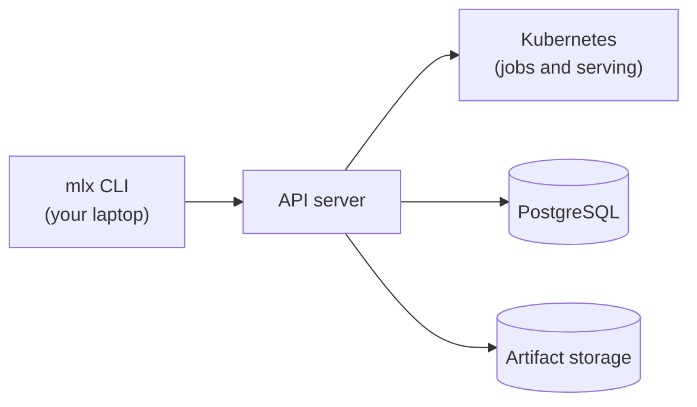

# What is ml-platform?

ml-platform is a unified interface for doing machine learning at commercial scale.
It lets one person process data, copy it between locations, train models, score datasets in batch, and serve models online, all through a single command-line tool: `mlx`.

You describe what you want in small YAML specs, submit them from your laptop, and the platform runs the work on the compute it manages.
You never manage servers, clusters, or job queues yourself.

> ml-platform is in active development.
> This documentation describes the v1 interface as it is being built.

## What can you do with it?

| Operation family | What it covers | Where to read |
|---|---|---|
| Data processing | Transform datasets into new datasets on compute | [Jobs](concepts/jobs.md) |
| Data transfer | Copy data from a source to a destination, with resume | [Data transfers](concepts/transfers.md) |
| Training | Train models on GPUs, track runs and checkpoints | [Train a model](guides/train-a-model.md) |
| Batch inference | Run a registered model over a dataset | [Score a dataset](guides/score-a-dataset.md) |
| Online inference | Serve a model behind an endpoint, with scaling | [Deploy a model](guides/deploy-a-model.md) |

## How does it work?

ml-platform has two parts:

- The `mlx` CLI, which you install and run locally.
- The API server, which your platform team operates.

The CLI is a thin client.
Every operation goes over an authenticated API to the server, which validates it, persists it, and dispatches the actual work to Kubernetes.
Logs, checkpoints, and model artifacts come back through the same path.

This split has two consequences worth knowing:

- The CLI never talks to compute infrastructure directly, so it stays fast and needs no cloud credentials.
- All durable state lives server-side, so you can close your laptop mid-training and come back to it.

### Install the CLI

The CLI installs with uv, directly from the platform's GitHub repository.
See [Installation](installation.md).

### Authenticate

Run `mlx auth login` once, point it at your API server, and paste your token.
See [Quickstart](quickstart.md).

### Define specs

Jobs, datasets, experiments, and clusters are each described by a small YAML file.
See [Specs](reference/specs/index.md).

### Submit

`mlx job submit`, `mlx batch submit`, `mlx deploy create`, and `mlx data copy` send your intent to the server, which executes it.
The rest of the CLI (`job logs`, `deploy get`, `model list`, ...) lets you watch and manage what you started.

## Where to start?

1. [Install](installation.md) the CLI.
2. Walk through the [Quickstart](quickstart.md): train a model, then deploy it.
3. Browse the [Concepts](concepts/index.md) section for the mental model.
4. Keep the [CLI reference](reference/cli/index.md) at hand for the full command surface.
